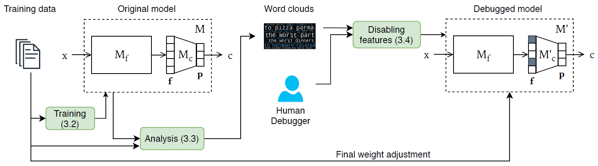

# FIND: Human-in-the-loop Debugging Deep Text Classifiers. EMNLP 2020

**Authors**: [Piyawat Lertvittayakumjorn](https://www.doc.ic.ac.uk/~pl1515/), [Lucia Specia](http://www.imperial.ac.uk/people/l.specia), and [Francesca Toni](https://www.doc.ic.ac.uk/~ft/) (Department of Computing, Imperial College London)

**Paper links**: ArXiv (Available soon), ACL Anthology (Available soon)

**Contact**: Piyawat Lertvittayakumjorn (pl1515 [at] imperial [dot] ac [dot] uk)

## Description

*Overview of the debugging framework, FIND. The numbers in the green boxes refer to the
corresponding Sections in the paper.*

**FIND** (**F**eature **I**nvestigation a**N**d **D**isabling) is a framework for debugging deep text classifiers with human-in-the-loop (as shown in the above figure). Generally, deep text classifiers (**M**) can be divided into two parts.

- The first part (<b>Mf</b>) performs **feature extraction**, transforming an input text into a dense vector (i.e., a feature vector **f**) which represents the input. There are several alternatives to implement this part such as using convolutional layers, recurrent layers, and transformer layers. 
- The second part (<b>Mc</b>) performs **classification** passing the feature vector through a dense layer with softmax activation to get predicted probability of the classes.

As the full name suggests, FIND debugs a deep text classifier by allowing humans to (i) investigate the patterns which each learned feature detects or focuses on (using [layerwise relevance propagation](https://arxiv.org/pdf/1606.07298.pdf) and word clouds) and then (ii) disable features that are irrelevant or harmful to the classification task (by not using them in the second part of the model). After the features are disabled, the model needs to be fine-tuned on the original dataset again to fully exploit the remaining features.

**Currently, FIND in this repository supports _1D Convolutional neural networks (1D CNNs)_ [(Kim, 2014)](https://arxiv.org/pdf/1408.5882.pdf). We provide two jupyter notebook examples ([debugging_20Newsgroups.ipynb](debugging_20Newsgroups.ipynb) and [debugging_biosbias.ipynb](debugging_biosbias.ipynb)) in which you may use FIND together with your judgements to debug CNNs.** In the future, we plan to support bidirectional LSTMs and possibly some recent transformer-based models.

## Requirements
- [Python 3.6](https://www.python.org/downloads/release/python-360/)
- Standard machine learning and deep learning modules
	- [tensorflow](https://www.tensorflow.org/)==1.9.0
	- [keras](https://keras.io/)==2.2.4
	- [numpy](https://numpy.org/)==1.18.4
	- [sklearn](https://scikit-learn.org/stable/)==0.21.3
- Interpretability, visualization, and interaction modules
	- [matplotlib](https://matplotlib.org/)==3.2.1
	- [innvestigate](https://github.com/albermax/innvestigate)==1.0.8
	- [wordcloud](https://github.com/amueller/word_cloud)==1.7.0
	- [ipywidgets](https://github.com/jupyter-widgets/ipywidgets)==7.5.1
- NLP module and word embeddings
	- [spacy](https://spacy.io/)==2.2.4 (en)
	- [GloVe.6B](http://nlp.stanford.edu/data/glove.6B.zip) (300 dimensions)

## Datasets
The datasets used in this paper can be downloaded [here](https://imperialcollegelondon.box.com/s/yph60lp41vxtr5bwea0pyfx2e65q8ked) as a single zip file. Some of the datasets are already in this github repository under the [`preprocessed_data`](https://github.com/plkumjorn/FIND/tree/master/preprocessed_data) folder with the data structure. For the other datasets, please download and extract the zip file and put them together in the `preprocessed_data` folder. 

|Experiment|Dataset|#Classes|Train / Dev / Test|
|-----|-----|-----|-----|
|1|Yelp|2|500 / 100 / 38000|
||Amazon Products|4|100 / 100 / 20000|
|2|Biosbias|2|3832 / 1277 / 1278|
||Waseem|2|10144 / 3381 / 3382|
||Wikitoxic|2|- / - / 18965|
|3|20Newsgroups|2|863 / 216 / 717|
||Religion|2| - / - / 1819|
||Amazon Clothes|2| 3000 / 300 / 10000|
||Amazon Music|2| - / - / 8302|
||Amazon Mixed|2| - / - / 100000|

Additionally, we will share the trained models, word clouds, and their annotations of the experiments in the paper soon to enable future comparisons.

## Paper
**Title**: FIND: Human-in-the-loop Debugging Deep Text Classifiers

**Authors**: Piyawat Lertvittayakumjorn, Lucia Specia, and Francesca Toni

**Venue**: [The 2020 Conference on Empirical Methods in Natural Language Processing (EMNLP 2020)](https://2020.emnlp.org/)

**Abstract**: Since obtaining a perfect training dataset (i.e., a dataset which is considerably large, unbiased, and well-representative of unseen cases) is hardly possible, many real-world text classifiers are trained on the available, yet imperfect, datasets. These classifiers are thus likely to have undesirable properties. For instance, they may have biases against some sub-populations or may not work effectively in the wild due to overfitting. In this paper, we propose **FIND** -- a framework which enables humans to debug deep learning text classifiers by disabling irrelevant hidden features. Experiments show that by using FIND, humans can improve CNN text classifiers which were trained under different types of imperfect datasets (including datasets with biases and datasets with dissimilar train-test distributions).

**Paper links**: ArXiv (Available soon), ACL Anthology (Available soon)

**Please cite**: TODO
	
