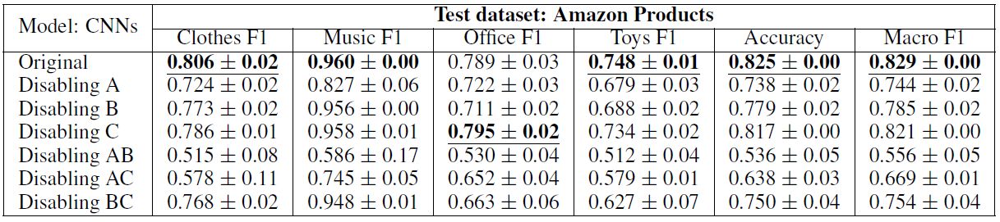

[*<< Back to the main page*](https://plkumjorn.github.io/FIND)

# Experiment 1: Amazon Products

## Basic information
- **Task**: Product classification (of product reviews)
- **Dataset**: Amazon Products
- **Classes**: Clothing Shoes and Jewelry, Digital Music, Office Products, Toys and Games (4 classes)
- **Train/Dev/Test examples**: 100 / 100 / 20000
- **Problem**: The training data is very small.
- For more details, please see section 5 in the paper.

## Word Clouds & Annotations

### Model 1: AmazonProductsSmall_CNN_20200510185541

<table><tbody><tr class="center-row"><td><b>Feature 0</b></td><td><b>Feature 1</b></td><td><b>Feature 2</b></td><td><b>Feature 3</b></td><td><b>Feature 4</b></td><td><b>Feature 5</b></td><td><b>Feature 6</b></td><td><b>Feature 7</b></td><td><b>Feature 8</b></td><td><b>Feature 9</b></td><td><b>Feature 10</b></td><td><b>Feature 11</b></td><td><b>Feature 12</b></td><td><b>Feature 13</b></td><td><b>Feature 14</b></td><td><b>Feature 15</b></td><td><b>Feature 16</b></td><td><b>Feature 17</b></td><td><b>Feature 18</b></td><td><b>Feature 19</b></td><td><b>Feature 20</b></td><td><b>Feature 21</b></td><td><b>Feature 22</b></td><td><b>Feature 23</b></td><td><b>Feature 24</b></td><td><b>Feature 25</b></td><td><b>Feature 26</b></td><td><b>Feature 27</b></td><td><b>Feature 28</b></td><td><b>Feature 29</b></td></tr><tr><td></td><td></td><td></td><td></td><td></td><td></td><td></td><td></td><td></td><td></td><td></td><td></td><td></td><td></td><td></td><td></td><td></td><td></td><td></td><td></td><td></td><td></td><td></td><td></td><td></td><td></td><td></td><td></td><td></td><td></td></tr><tr><td>&emsp;&emsp;<b>Model weights</b>:
&emsp;&emsp;&emsp;- Clothing Shoes and Jewelry = -0.150
&emsp;&emsp;&emsp;- Digital Music = -0.052
&emsp;&emsp;&emsp;- Office Products = -0.408
<b>&emsp;&emsp;&emsp;- Toys and Games = 0.261</b></td><td>&emsp;&emsp;<b>Model weights</b>:
<b>&emsp;&emsp;&emsp;- Clothing Shoes and Jewelry = 0.447</b>
&emsp;&emsp;&emsp;- Digital Music = 0.147
&emsp;&emsp;&emsp;- Office Products = 0.173
&emsp;&emsp;&emsp;- Toys and Games = -0.267</td><td>&emsp;&emsp;<b>Model weights</b>:
&emsp;&emsp;&emsp;- Clothing Shoes and Jewelry = 0.018
&emsp;&emsp;&emsp;- Digital Music = 0.392
&emsp;&emsp;&emsp;- Office Products = 0.373
<b>&emsp;&emsp;&emsp;- Toys and Games = 0.411</b></td><td>&emsp;&emsp;<b>Model weights</b>:
&emsp;&emsp;&emsp;- Clothing Shoes and Jewelry = -0.295
&emsp;&emsp;&emsp;- Digital Music = -0.160
&emsp;&emsp;&emsp;- Office Products = 0.049
<b>&emsp;&emsp;&emsp;- Toys and Games = 0.266</b></td><td>&emsp;&emsp;<b>Model weights</b>:
<b>&emsp;&emsp;&emsp;- Clothing Shoes and Jewelry = 0.001</b>
&emsp;&emsp;&emsp;- Digital Music = -0.195
&emsp;&emsp;&emsp;- Office Products = -0.309
&emsp;&emsp;&emsp;- Toys and Games = -0.430</td><td>&emsp;&emsp;<b>Model weights</b>:
&emsp;&emsp;&emsp;- Clothing Shoes and Jewelry = -0.380
&emsp;&emsp;&emsp;- Digital Music = -0.140
<b>&emsp;&emsp;&emsp;- Office Products = 0.018</b>
&emsp;&emsp;&emsp;- Toys and Games = -0.157</td><td>&emsp;&emsp;<b>Model weights</b>:
&emsp;&emsp;&emsp;- Clothing Shoes and Jewelry = -0.493
&emsp;&emsp;&emsp;- Digital Music = 0.230
&emsp;&emsp;&emsp;- Office Products = 0.395
<b>&emsp;&emsp;&emsp;- Toys and Games = 0.401</b></td><td>&emsp;&emsp;<b>Model weights</b>:
<b>&emsp;&emsp;&emsp;- Clothing Shoes and Jewelry = 0.193</b>
&emsp;&emsp;&emsp;- Digital Music = -0.019
&emsp;&emsp;&emsp;- Office Products = 0.130
&emsp;&emsp;&emsp;- Toys and Games = -0.223</td><td>&emsp;&emsp;<b>Model weights</b>:
&emsp;&emsp;&emsp;- Clothing Shoes and Jewelry = 0.242
&emsp;&emsp;&emsp;- Digital Music = 0.140
<b>&emsp;&emsp;&emsp;- Office Products = 0.368</b>
&emsp;&emsp;&emsp;- Toys and Games = 0.268</td><td>&emsp;&emsp;<b>Model weights</b>:
<b>&emsp;&emsp;&emsp;- Clothing Shoes and Jewelry = 0.180</b>
&emsp;&emsp;&emsp;- Digital Music = -0.468
&emsp;&emsp;&emsp;- Office Products = -0.138
&emsp;&emsp;&emsp;- Toys and Games = -0.328</td><td>&emsp;&emsp;<b>Model weights</b>:
&emsp;&emsp;&emsp;- Clothing Shoes and Jewelry = 0.301
&emsp;&emsp;&emsp;- Digital Music = -0.022
<b>&emsp;&emsp;&emsp;- Office Products = 0.442</b>
&emsp;&emsp;&emsp;- Toys and Games = -0.314</td><td>&emsp;&emsp;<b>Model weights</b>:
&emsp;&emsp;&emsp;- Clothing Shoes and Jewelry = -0.347
&emsp;&emsp;&emsp;- Digital Music = -0.180
&emsp;&emsp;&emsp;- Office Products = -0.063
<b>&emsp;&emsp;&emsp;- Toys and Games = 0.311</b></td><td>&emsp;&emsp;<b>Model weights</b>:
&emsp;&emsp;&emsp;- Clothing Shoes and Jewelry = 0.416
&emsp;&emsp;&emsp;- Digital Music = 0.019
&emsp;&emsp;&emsp;- Office Products = -0.085
<b>&emsp;&emsp;&emsp;- Toys and Games = 0.460</b></td><td>&emsp;&emsp;<b>Model weights</b>:
&emsp;&emsp;&emsp;- Clothing Shoes and Jewelry = 0.090
<b>&emsp;&emsp;&emsp;- Digital Music = 0.284</b>
&emsp;&emsp;&emsp;- Office Products = -0.106
&emsp;&emsp;&emsp;- Toys and Games = 0.164</td><td>&emsp;&emsp;<b>Model weights</b>:
&emsp;&emsp;&emsp;- Clothing Shoes and Jewelry = -0.305
<b>&emsp;&emsp;&emsp;- Digital Music = 0.398</b>
&emsp;&emsp;&emsp;- Office Products = 0.333
&emsp;&emsp;&emsp;- Toys and Games = 0.112</td><td>&emsp;&emsp;<b>Model weights</b>:
<b>&emsp;&emsp;&emsp;- Clothing Shoes and Jewelry = 0.337</b>
&emsp;&emsp;&emsp;- Digital Music = 0.119
&emsp;&emsp;&emsp;- Office Products = -0.286
&emsp;&emsp;&emsp;- Toys and Games = 0.171</td><td>&emsp;&emsp;<b>Model weights</b>:
&emsp;&emsp;&emsp;- Clothing Shoes and Jewelry = 0.054
<b>&emsp;&emsp;&emsp;- Digital Music = 0.305</b>
&emsp;&emsp;&emsp;- Office Products = 0.111
&emsp;&emsp;&emsp;- Toys and Games = -0.415</td><td>&emsp;&emsp;<b>Model weights</b>:
&emsp;&emsp;&emsp;- Clothing Shoes and Jewelry = -0.063
&emsp;&emsp;&emsp;- Digital Music = -0.265
&emsp;&emsp;&emsp;- Office Products = -0.081
<b>&emsp;&emsp;&emsp;- Toys and Games = 0.398</b></td><td>&emsp;&emsp;<b>Model weights</b>:
&emsp;&emsp;&emsp;- Clothing Shoes and Jewelry = -0.025
<b>&emsp;&emsp;&emsp;- Digital Music = 0.121</b>
&emsp;&emsp;&emsp;- Office Products = -0.251
&emsp;&emsp;&emsp;- Toys and Games = -0.335</td><td>&emsp;&emsp;<b>Model weights</b>:
&emsp;&emsp;&emsp;- Clothing Shoes and Jewelry = 0.242
<b>&emsp;&emsp;&emsp;- Digital Music = 0.446</b>
&emsp;&emsp;&emsp;- Office Products = -0.119
&emsp;&emsp;&emsp;- Toys and Games = 0.160</td><td>&emsp;&emsp;<b>Model weights</b>:
&emsp;&emsp;&emsp;- Clothing Shoes and Jewelry = -0.091
<b>&emsp;&emsp;&emsp;- Digital Music = 0.116</b>
&emsp;&emsp;&emsp;- Office Products = -0.062
&emsp;&emsp;&emsp;- Toys and Games = -0.129</td><td>&emsp;&emsp;<b>Model weights</b>:
&emsp;&emsp;&emsp;- Clothing Shoes and Jewelry = -0.492
&emsp;&emsp;&emsp;- Digital Music = 0.096
<b>&emsp;&emsp;&emsp;- Office Products = 0.122</b>
&emsp;&emsp;&emsp;- Toys and Games = -0.327</td><td>&emsp;&emsp;<b>Model weights</b>:
&emsp;&emsp;&emsp;- Clothing Shoes and Jewelry = -0.118
&emsp;&emsp;&emsp;- Digital Music = -0.098
&emsp;&emsp;&emsp;- Office Products = 0.225
<b>&emsp;&emsp;&emsp;- Toys and Games = 0.305</b></td><td>&emsp;&emsp;<b>Model weights</b>:
<b>&emsp;&emsp;&emsp;- Clothing Shoes and Jewelry = 0.434</b>
&emsp;&emsp;&emsp;- Digital Music = 0.023
&emsp;&emsp;&emsp;- Office Products = -0.160
&emsp;&emsp;&emsp;- Toys and Games = 0.222</td><td>&emsp;&emsp;<b>Model weights</b>:
&emsp;&emsp;&emsp;- Clothing Shoes and Jewelry = 0.257
&emsp;&emsp;&emsp;- Digital Music = -0.267
<b>&emsp;&emsp;&emsp;- Office Products = 0.331</b>
&emsp;&emsp;&emsp;- Toys and Games = -0.412</td><td>&emsp;&emsp;<b>Model weights</b>:
&emsp;&emsp;&emsp;- Clothing Shoes and Jewelry = -0.280
<b>&emsp;&emsp;&emsp;- Digital Music = 0.428</b>
&emsp;&emsp;&emsp;- Office Products = -0.102
&emsp;&emsp;&emsp;- Toys and Games = -0.402</td><td>&emsp;&emsp;<b>Model weights</b>:
&emsp;&emsp;&emsp;- Clothing Shoes and Jewelry = -0.287
&emsp;&emsp;&emsp;- Digital Music = -0.470
<b>&emsp;&emsp;&emsp;- Office Products = 0.488</b>
&emsp;&emsp;&emsp;- Toys and Games = 0.262</td><td>&emsp;&emsp;<b>Model weights</b>:
<b>&emsp;&emsp;&emsp;- Clothing Shoes and Jewelry = 0.345</b>
&emsp;&emsp;&emsp;- Digital Music = -0.428
&emsp;&emsp;&emsp;- Office Products = -0.191
&emsp;&emsp;&emsp;- Toys and Games = -0.437</td><td>&emsp;&emsp;<b>Model weights</b>:
<b>&emsp;&emsp;&emsp;- Clothing Shoes and Jewelry = 0.389</b>
&emsp;&emsp;&emsp;- Digital Music = 0.364
&emsp;&emsp;&emsp;- Office Products = -0.078
&emsp;&emsp;&emsp;- Toys and Games = -0.417</td><td>&emsp;&emsp;<b>Model weights</b>:
&emsp;&emsp;&emsp;- Clothing Shoes and Jewelry = -0.430
<b>&emsp;&emsp;&emsp;- Digital Music = -0.039</b>
&emsp;&emsp;&emsp;- Office Products = -0.144
&emsp;&emsp;&emsp;- Toys and Games = -0.370</td></tr><tr><td><b>&emsp;&emsp;Human answers</b>:
&emsp;&emsp;&emsp;- Clothing Shoes and Jewelry = 0
&emsp;&emsp;&emsp;- Digital Music = 4
&emsp;&emsp;&emsp;- Office Products = 1
&emsp;&emsp;&emsp;- Toys and Games = 0
<b>&emsp;&emsp;&emsp;- None = 5</b></td><td><b>&emsp;&emsp;Human answers</b>:
<b>&emsp;&emsp;&emsp;- Clothing Shoes and Jewelry = 9</b>
&emsp;&emsp;&emsp;- Digital Music = 0
&emsp;&emsp;&emsp;- Office Products = 0
&emsp;&emsp;&emsp;- Toys and Games = 1
&emsp;&emsp;&emsp;- None = 0</td><td><b>&emsp;&emsp;Human answers</b>:
&emsp;&emsp;&emsp;- Clothing Shoes and Jewelry = 0
&emsp;&emsp;&emsp;- Digital Music = 2
&emsp;&emsp;&emsp;- Office Products = 0
&emsp;&emsp;&emsp;- Toys and Games = 2
<b>&emsp;&emsp;&emsp;- None = 6</b></td><td><b>&emsp;&emsp;Human answers</b>:
&emsp;&emsp;&emsp;- Clothing Shoes and Jewelry = 0
&emsp;&emsp;&emsp;- Digital Music = 0
&emsp;&emsp;&emsp;- Office Products = 1
&emsp;&emsp;&emsp;- Toys and Games = 0
<b>&emsp;&emsp;&emsp;- None = 9</b></td><td><b>&emsp;&emsp;Human answers</b>:
<b>&emsp;&emsp;&emsp;- Clothing Shoes and Jewelry = 6</b>
&emsp;&emsp;&emsp;- Digital Music = 0
&emsp;&emsp;&emsp;- Office Products = 0
&emsp;&emsp;&emsp;- Toys and Games = 1
&emsp;&emsp;&emsp;- None = 3</td><td><b>&emsp;&emsp;Human answers</b>:
&emsp;&emsp;&emsp;- Clothing Shoes and Jewelry = 0
&emsp;&emsp;&emsp;- Digital Music = 1
<b>&emsp;&emsp;&emsp;- Office Products = 9</b>
&emsp;&emsp;&emsp;- Toys and Games = 0
&emsp;&emsp;&emsp;- None = 0</td><td><b>&emsp;&emsp;Human answers</b>:
&emsp;&emsp;&emsp;- Clothing Shoes and Jewelry = 0
&emsp;&emsp;&emsp;- Digital Music = 2
<b>&emsp;&emsp;&emsp;- Office Products = 6</b>
&emsp;&emsp;&emsp;- Toys and Games = 0
&emsp;&emsp;&emsp;- None = 2</td><td><b>&emsp;&emsp;Human answers</b>:
&emsp;&emsp;&emsp;- Clothing Shoes and Jewelry = 2
&emsp;&emsp;&emsp;- Digital Music = 0
&emsp;&emsp;&emsp;- Office Products = 1
&emsp;&emsp;&emsp;- Toys and Games = 1
<b>&emsp;&emsp;&emsp;- None = 6</b></td><td><b>&emsp;&emsp;Human answers</b>:
&emsp;&emsp;&emsp;- Clothing Shoes and Jewelry = 0
&emsp;&emsp;&emsp;- Digital Music = 0
<b>&emsp;&emsp;&emsp;- Office Products = 10</b>
&emsp;&emsp;&emsp;- Toys and Games = 0
&emsp;&emsp;&emsp;- None = 0</td><td><b>&emsp;&emsp;Human answers</b>:
<b>&emsp;&emsp;&emsp;- Clothing Shoes and Jewelry = 10</b>
&emsp;&emsp;&emsp;- Digital Music = 0
&emsp;&emsp;&emsp;- Office Products = 0
&emsp;&emsp;&emsp;- Toys and Games = 0
&emsp;&emsp;&emsp;- None = 0</td><td><b>&emsp;&emsp;Human answers</b>:
&emsp;&emsp;&emsp;- Clothing Shoes and Jewelry = 1
&emsp;&emsp;&emsp;- Digital Music = 0
<b>&emsp;&emsp;&emsp;- Office Products = 8</b>
&emsp;&emsp;&emsp;- Toys and Games = 0
&emsp;&emsp;&emsp;- None = 1</td><td><b>&emsp;&emsp;Human answers</b>:
&emsp;&emsp;&emsp;- Clothing Shoes and Jewelry = 0
&emsp;&emsp;&emsp;- Digital Music = 0
&emsp;&emsp;&emsp;- Office Products = 0
&emsp;&emsp;&emsp;- Toys and Games = 2
<b>&emsp;&emsp;&emsp;- None = 8</b></td><td><b>&emsp;&emsp;Human answers</b>:
&emsp;&emsp;&emsp;- Clothing Shoes and Jewelry = 2
&emsp;&emsp;&emsp;- Digital Music = 0
&emsp;&emsp;&emsp;- Office Products = 0
<b>&emsp;&emsp;&emsp;- Toys and Games = 6</b>
&emsp;&emsp;&emsp;- None = 2</td><td><b>&emsp;&emsp;Human answers</b>:
&emsp;&emsp;&emsp;- Clothing Shoes and Jewelry = 0
<b>&emsp;&emsp;&emsp;- Digital Music = 10</b>
&emsp;&emsp;&emsp;- Office Products = 0
&emsp;&emsp;&emsp;- Toys and Games = 0
&emsp;&emsp;&emsp;- None = 0</td><td><b>&emsp;&emsp;Human answers</b>:
&emsp;&emsp;&emsp;- Clothing Shoes and Jewelry = 0
&emsp;&emsp;&emsp;- Digital Music = 0
<b>&emsp;&emsp;&emsp;- Office Products = 10</b>
&emsp;&emsp;&emsp;- Toys and Games = 0
&emsp;&emsp;&emsp;- None = 0</td><td><b>&emsp;&emsp;Human answers</b>:
&emsp;&emsp;&emsp;- Clothing Shoes and Jewelry = 2
&emsp;&emsp;&emsp;- Digital Music = 2
&emsp;&emsp;&emsp;- Office Products = 0
<b>&emsp;&emsp;&emsp;- Toys and Games = 4</b>
&emsp;&emsp;&emsp;- None = 2</td><td><b>&emsp;&emsp;Human answers</b>:
&emsp;&emsp;&emsp;- Clothing Shoes and Jewelry = 0
<b>&emsp;&emsp;&emsp;- Digital Music = 9</b>
&emsp;&emsp;&emsp;- Office Products = 0
&emsp;&emsp;&emsp;- Toys and Games = 0
&emsp;&emsp;&emsp;- None = 1</td><td><b>&emsp;&emsp;Human answers</b>:
&emsp;&emsp;&emsp;- Clothing Shoes and Jewelry = 0
&emsp;&emsp;&emsp;- Digital Music = 4
&emsp;&emsp;&emsp;- Office Products = 0
&emsp;&emsp;&emsp;- Toys and Games = 0
<b>&emsp;&emsp;&emsp;- None = 6</b></td><td><b>&emsp;&emsp;Human answers</b>:
&emsp;&emsp;&emsp;- Clothing Shoes and Jewelry = 0
<b>&emsp;&emsp;&emsp;- Digital Music = 10</b>
&emsp;&emsp;&emsp;- Office Products = 0
&emsp;&emsp;&emsp;- Toys and Games = 0
&emsp;&emsp;&emsp;- None = 0</td><td><b>&emsp;&emsp;Human answers</b>:
&emsp;&emsp;&emsp;- Clothing Shoes and Jewelry = 0
<b>&emsp;&emsp;&emsp;- Digital Music = 10</b>
&emsp;&emsp;&emsp;- Office Products = 0
&emsp;&emsp;&emsp;- Toys and Games = 0
&emsp;&emsp;&emsp;- None = 0</td><td><b>&emsp;&emsp;Human answers</b>:
&emsp;&emsp;&emsp;- Clothing Shoes and Jewelry = 0
<b>&emsp;&emsp;&emsp;- Digital Music = 10</b>
&emsp;&emsp;&emsp;- Office Products = 0
&emsp;&emsp;&emsp;- Toys and Games = 0
&emsp;&emsp;&emsp;- None = 0</td><td><b>&emsp;&emsp;Human answers</b>:
&emsp;&emsp;&emsp;- Clothing Shoes and Jewelry = 0
&emsp;&emsp;&emsp;- Digital Music = 0
<b>&emsp;&emsp;&emsp;- Office Products = 6</b>
&emsp;&emsp;&emsp;- Toys and Games = 1
&emsp;&emsp;&emsp;- None = 3</td><td><b>&emsp;&emsp;Human answers</b>:
&emsp;&emsp;&emsp;- Clothing Shoes and Jewelry = 0
&emsp;&emsp;&emsp;- Digital Music = 2
<b>&emsp;&emsp;&emsp;- Office Products = 5</b>
&emsp;&emsp;&emsp;- Toys and Games = 1
&emsp;&emsp;&emsp;- None = 2</td><td><b>&emsp;&emsp;Human answers</b>:
<b>&emsp;&emsp;&emsp;- Clothing Shoes and Jewelry = 9</b>
&emsp;&emsp;&emsp;- Digital Music = 0
&emsp;&emsp;&emsp;- Office Products = 0
&emsp;&emsp;&emsp;- Toys and Games = 0
&emsp;&emsp;&emsp;- None = 1</td><td><b>&emsp;&emsp;Human answers</b>:
&emsp;&emsp;&emsp;- Clothing Shoes and Jewelry = 1
&emsp;&emsp;&emsp;- Digital Music = 0
&emsp;&emsp;&emsp;- Office Products = 4
&emsp;&emsp;&emsp;- Toys and Games = 0
<b>&emsp;&emsp;&emsp;- None = 5</b></td><td><b>&emsp;&emsp;Human answers</b>:
&emsp;&emsp;&emsp;- Clothing Shoes and Jewelry = 0
<b>&emsp;&emsp;&emsp;- Digital Music = 10</b>
&emsp;&emsp;&emsp;- Office Products = 0
&emsp;&emsp;&emsp;- Toys and Games = 0
&emsp;&emsp;&emsp;- None = 0</td><td><b>&emsp;&emsp;Human answers</b>:
&emsp;&emsp;&emsp;- Clothing Shoes and Jewelry = 2
&emsp;&emsp;&emsp;- Digital Music = 0
<b>&emsp;&emsp;&emsp;- Office Products = 4</b>
&emsp;&emsp;&emsp;- Toys and Games = 0
<b>&emsp;&emsp;&emsp;- None = 4</b></td><td><b>&emsp;&emsp;Human answers</b>:
<b>&emsp;&emsp;&emsp;- Clothing Shoes and Jewelry = 10</b>
&emsp;&emsp;&emsp;- Digital Music = 0
&emsp;&emsp;&emsp;- Office Products = 0
&emsp;&emsp;&emsp;- Toys and Games = 0
&emsp;&emsp;&emsp;- None = 0</td><td><b>&emsp;&emsp;Human answers</b>:
&emsp;&emsp;&emsp;- Clothing Shoes and Jewelry = 3
<b>&emsp;&emsp;&emsp;- Digital Music = 5</b>
&emsp;&emsp;&emsp;- Office Products = 0
&emsp;&emsp;&emsp;- Toys and Games = 0
&emsp;&emsp;&emsp;- None = 2</td><td><b>&emsp;&emsp;Human answers</b>:
&emsp;&emsp;&emsp;- Clothing Shoes and Jewelry = 0
<b>&emsp;&emsp;&emsp;- Digital Music = 10</b>
&emsp;&emsp;&emsp;- Office Products = 0
&emsp;&emsp;&emsp;- Toys and Games = 0
&emsp;&emsp;&emsp;- None = 0</td></tr><tr><td>&emsp;&emsp;<b>Summary:</b>
&emsp;&emsp;&emsp;- Average score: 0.213
&emsp;&emsp;&emsp;- <b>Rank: C</b></td><td>&emsp;&emsp;<b>Summary:</b>
&emsp;&emsp;&emsp;- Average score: 0.900
&emsp;&emsp;&emsp;- <b>Rank: B</b></td><td>&emsp;&emsp;<b>Summary:</b>
&emsp;&emsp;&emsp;- Average score: 0.391
&emsp;&emsp;&emsp;- <b>Rank: C</b></td><td>&emsp;&emsp;<b>Summary:</b>
&emsp;&emsp;&emsp;- Average score: 0.061
&emsp;&emsp;&emsp;- <b>Rank: C</b></td><td>&emsp;&emsp;<b>Summary:</b>
&emsp;&emsp;&emsp;- Average score: 0.600
&emsp;&emsp;&emsp;- <b>Rank: C</b></td><td>&emsp;&emsp;<b>Summary:</b>
&emsp;&emsp;&emsp;- Average score: 0.960
&emsp;&emsp;&emsp;- <b>Rank: A</b></td><td>&emsp;&emsp;<b>Summary:</b>
&emsp;&emsp;&emsp;- Average score: 0.758
&emsp;&emsp;&emsp;- <b>Rank: B</b></td><td>&emsp;&emsp;<b>Summary:</b>
&emsp;&emsp;&emsp;- Average score: 0.285
&emsp;&emsp;&emsp;- <b>Rank: C</b></td><td>&emsp;&emsp;<b>Summary:</b>
&emsp;&emsp;&emsp;- Average score: 1.000
&emsp;&emsp;&emsp;- <b>Rank: A</b></td><td>&emsp;&emsp;<b>Summary:</b>
&emsp;&emsp;&emsp;- Average score: 1.000
&emsp;&emsp;&emsp;- <b>Rank: A</b></td><td>&emsp;&emsp;<b>Summary:</b>
&emsp;&emsp;&emsp;- Average score: 0.881
&emsp;&emsp;&emsp;- <b>Rank: B</b></td><td>&emsp;&emsp;<b>Summary:</b>
&emsp;&emsp;&emsp;- Average score: 0.200
&emsp;&emsp;&emsp;- <b>Rank: C</b></td><td>&emsp;&emsp;<b>Summary:</b>
&emsp;&emsp;&emsp;- Average score: 0.784
&emsp;&emsp;&emsp;- <b>Rank: B</b></td><td>&emsp;&emsp;<b>Summary:</b>
&emsp;&emsp;&emsp;- Average score: 1.000
&emsp;&emsp;&emsp;- <b>Rank: A</b></td><td>&emsp;&emsp;<b>Summary:</b>
&emsp;&emsp;&emsp;- Average score: 0.907
&emsp;&emsp;&emsp;- <b>Rank: B</b></td><td>&emsp;&emsp;<b>Summary:</b>
&emsp;&emsp;&emsp;- Average score: 0.624
&emsp;&emsp;&emsp;- <b>Rank: B</b></td><td>&emsp;&emsp;<b>Summary:</b>
&emsp;&emsp;&emsp;- Average score: 0.900
&emsp;&emsp;&emsp;- <b>Rank: B</b></td><td>&emsp;&emsp;<b>Summary:</b>
&emsp;&emsp;&emsp;- Average score: 0.000
&emsp;&emsp;&emsp;- <b>Rank: C</b></td><td>&emsp;&emsp;<b>Summary:</b>
&emsp;&emsp;&emsp;- Average score: 1.000
&emsp;&emsp;&emsp;- <b>Rank: A</b></td><td>&emsp;&emsp;<b>Summary:</b>
&emsp;&emsp;&emsp;- Average score: 1.000
&emsp;&emsp;&emsp;- <b>Rank: A</b></td><td>&emsp;&emsp;<b>Summary:</b>
&emsp;&emsp;&emsp;- Average score: 1.000
&emsp;&emsp;&emsp;- <b>Rank: A</b></td><td>&emsp;&emsp;<b>Summary:</b>
&emsp;&emsp;&emsp;- Average score: 0.627
&emsp;&emsp;&emsp;- <b>Rank: B</b></td><td>&emsp;&emsp;<b>Summary:</b>
&emsp;&emsp;&emsp;- Average score: 0.515
&emsp;&emsp;&emsp;- <b>Rank: C</b></td><td>&emsp;&emsp;<b>Summary:</b>
&emsp;&emsp;&emsp;- Average score: 0.900
&emsp;&emsp;&emsp;- <b>Rank: B</b></td><td>&emsp;&emsp;<b>Summary:</b>
&emsp;&emsp;&emsp;- Average score: 0.490
&emsp;&emsp;&emsp;- <b>Rank: C</b></td><td>&emsp;&emsp;<b>Summary:</b>
&emsp;&emsp;&emsp;- Average score: 1.000
&emsp;&emsp;&emsp;- <b>Rank: A</b></td><td>&emsp;&emsp;<b>Summary:</b>
&emsp;&emsp;&emsp;- Average score: 0.438
&emsp;&emsp;&emsp;- <b>Rank: C</b></td><td>&emsp;&emsp;<b>Summary:</b>
&emsp;&emsp;&emsp;- Average score: 1.000
&emsp;&emsp;&emsp;- <b>Rank: A</b></td><td>&emsp;&emsp;<b>Summary:</b>
&emsp;&emsp;&emsp;- Average score: 0.784
&emsp;&emsp;&emsp;- <b>Rank: B</b></td><td>&emsp;&emsp;<b>Summary:</b>
&emsp;&emsp;&emsp;- Average score: 1.000
&emsp;&emsp;&emsp;- <b>Rank: A</b></td></tr></tbody></table>

### Model 2: AmazonProductsSmall_CNN_20200510191020

<table><tbody><tr class="center-row"><td><b>Feature 0</b></td><td><b>Feature 1</b></td><td><b>Feature 2</b></td><td><b>Feature 3</b></td><td><b>Feature 4</b></td><td><b>Feature 5</b></td><td><b>Feature 6</b></td><td><b>Feature 7</b></td><td><b>Feature 8</b></td><td><b>Feature 9</b></td><td><b>Feature 10</b></td><td><b>Feature 11</b></td><td><b>Feature 12</b></td><td><b>Feature 13</b></td><td><b>Feature 14</b></td><td><b>Feature 15</b></td><td><b>Feature 16</b></td><td><b>Feature 17</b></td><td><b>Feature 18</b></td><td><b>Feature 19</b></td><td><b>Feature 20</b></td><td><b>Feature 21</b></td><td><b>Feature 22</b></td><td><b>Feature 23</b></td><td><b>Feature 24</b></td><td><b>Feature 25</b></td><td><b>Feature 26</b></td><td><b>Feature 27</b></td><td><b>Feature 28</b></td><td><b>Feature 29</b></td></tr><tr><td></td><td></td><td></td><td></td><td></td><td></td><td></td><td></td><td></td><td></td><td></td><td></td><td></td><td></td><td></td><td></td><td></td><td></td><td></td><td></td><td></td><td></td><td></td><td></td><td></td><td></td><td></td><td></td><td></td><td></td></tr><tr><td>&emsp;&emsp;<b>Model weights</b>:
&emsp;&emsp;&emsp;- Clothing Shoes and Jewelry = 0.015
<b>&emsp;&emsp;&emsp;- Digital Music = 0.345</b>
&emsp;&emsp;&emsp;- Office Products = 0.018
&emsp;&emsp;&emsp;- Toys and Games = -0.206</td><td>&emsp;&emsp;<b>Model weights</b>:
&emsp;&emsp;&emsp;- Clothing Shoes and Jewelry = 0.243
&emsp;&emsp;&emsp;- Digital Music = -0.188
<b>&emsp;&emsp;&emsp;- Office Products = 0.471</b>
&emsp;&emsp;&emsp;- Toys and Games = 0.040</td><td>&emsp;&emsp;<b>Model weights</b>:
&emsp;&emsp;&emsp;- Clothing Shoes and Jewelry = -0.099
&emsp;&emsp;&emsp;- Digital Music = -0.253
&emsp;&emsp;&emsp;- Office Products = -0.419
<b>&emsp;&emsp;&emsp;- Toys and Games = 0.249</b></td><td>&emsp;&emsp;<b>Model weights</b>:
&emsp;&emsp;&emsp;- Clothing Shoes and Jewelry = -0.345
&emsp;&emsp;&emsp;- Digital Music = -0.200
<b>&emsp;&emsp;&emsp;- Office Products = 0.013</b>
&emsp;&emsp;&emsp;- Toys and Games = -0.105</td><td>&emsp;&emsp;<b>Model weights</b>:
&emsp;&emsp;&emsp;- Clothing Shoes and Jewelry = -0.220
&emsp;&emsp;&emsp;- Digital Music = 0.148
&emsp;&emsp;&emsp;- Office Products = -0.306
<b>&emsp;&emsp;&emsp;- Toys and Games = 0.435</b></td><td>&emsp;&emsp;<b>Model weights</b>:
<b>&emsp;&emsp;&emsp;- Clothing Shoes and Jewelry = 0.220</b>
&emsp;&emsp;&emsp;- Digital Music = -0.245
&emsp;&emsp;&emsp;- Office Products = -0.302
&emsp;&emsp;&emsp;- Toys and Games = -0.264</td><td>&emsp;&emsp;<b>Model weights</b>:
&emsp;&emsp;&emsp;- Clothing Shoes and Jewelry = 0.274
&emsp;&emsp;&emsp;- Digital Music = -0.326
<b>&emsp;&emsp;&emsp;- Office Products = 0.476</b>
&emsp;&emsp;&emsp;- Toys and Games = 0.205</td><td>&emsp;&emsp;<b>Model weights</b>:
&emsp;&emsp;&emsp;- Clothing Shoes and Jewelry = -0.220
&emsp;&emsp;&emsp;- Digital Music = 0.087
&emsp;&emsp;&emsp;- Office Products = 0.106
<b>&emsp;&emsp;&emsp;- Toys and Games = 0.238</b></td><td>&emsp;&emsp;<b>Model weights</b>:
&emsp;&emsp;&emsp;- Clothing Shoes and Jewelry = -0.170
&emsp;&emsp;&emsp;- Digital Music = 0.228
<b>&emsp;&emsp;&emsp;- Office Products = 0.431</b>
&emsp;&emsp;&emsp;- Toys and Games = -0.107</td><td>&emsp;&emsp;<b>Model weights</b>:
<b>&emsp;&emsp;&emsp;- Clothing Shoes and Jewelry = 0.406</b>
&emsp;&emsp;&emsp;- Digital Music = 0.233
&emsp;&emsp;&emsp;- Office Products = -0.412
&emsp;&emsp;&emsp;- Toys and Games = -0.226</td><td>&emsp;&emsp;<b>Model weights</b>:
&emsp;&emsp;&emsp;- Clothing Shoes and Jewelry = -0.115
<b>&emsp;&emsp;&emsp;- Digital Music = 0.369</b>
&emsp;&emsp;&emsp;- Office Products = -0.139
&emsp;&emsp;&emsp;- Toys and Games = -0.238</td><td>&emsp;&emsp;<b>Model weights</b>:
&emsp;&emsp;&emsp;- Clothing Shoes and Jewelry = 0.319
<b>&emsp;&emsp;&emsp;- Digital Music = 0.392</b>
&emsp;&emsp;&emsp;- Office Products = 0.009
&emsp;&emsp;&emsp;- Toys and Games = -0.075</td><td>&emsp;&emsp;<b>Model weights</b>:
&emsp;&emsp;&emsp;- Clothing Shoes and Jewelry = 0.166
<b>&emsp;&emsp;&emsp;- Digital Music = 0.428</b>
&emsp;&emsp;&emsp;- Office Products = -0.192
&emsp;&emsp;&emsp;- Toys and Games = 0.127</td><td>&emsp;&emsp;<b>Model weights</b>:
&emsp;&emsp;&emsp;- Clothing Shoes and Jewelry = -0.391
<b>&emsp;&emsp;&emsp;- Digital Music = 0.163</b>
&emsp;&emsp;&emsp;- Office Products = -0.462
&emsp;&emsp;&emsp;- Toys and Games = -0.111</td><td>&emsp;&emsp;<b>Model weights</b>:
<b>&emsp;&emsp;&emsp;- Clothing Shoes and Jewelry = 0.277</b>
&emsp;&emsp;&emsp;- Digital Music = -0.320
&emsp;&emsp;&emsp;- Office Products = -0.102
&emsp;&emsp;&emsp;- Toys and Games = 0.144</td><td>&emsp;&emsp;<b>Model weights</b>:
&emsp;&emsp;&emsp;- Clothing Shoes and Jewelry = -0.440
<b>&emsp;&emsp;&emsp;- Digital Music = 0.456</b>
&emsp;&emsp;&emsp;- Office Products = 0.436
&emsp;&emsp;&emsp;- Toys and Games = 0.372</td><td>&emsp;&emsp;<b>Model weights</b>:
<b>&emsp;&emsp;&emsp;- Clothing Shoes and Jewelry = 0.345</b>
&emsp;&emsp;&emsp;- Digital Music = -0.323
&emsp;&emsp;&emsp;- Office Products = -0.497
&emsp;&emsp;&emsp;- Toys and Games = 0.155</td><td>&emsp;&emsp;<b>Model weights</b>:
&emsp;&emsp;&emsp;- Clothing Shoes and Jewelry = -0.003
&emsp;&emsp;&emsp;- Digital Music = -0.149
<b>&emsp;&emsp;&emsp;- Office Products = 0.375</b>
&emsp;&emsp;&emsp;- Toys and Games = -0.198</td><td>&emsp;&emsp;<b>Model weights</b>:
&emsp;&emsp;&emsp;- Clothing Shoes and Jewelry = -0.058
&emsp;&emsp;&emsp;- Digital Music = -0.238
&emsp;&emsp;&emsp;- Office Products = 0.264
<b>&emsp;&emsp;&emsp;- Toys and Games = 0.301</b></td><td>&emsp;&emsp;<b>Model weights</b>:
&emsp;&emsp;&emsp;- Clothing Shoes and Jewelry = 0.157
&emsp;&emsp;&emsp;- Digital Music = -0.053
&emsp;&emsp;&emsp;- Office Products = -0.189
<b>&emsp;&emsp;&emsp;- Toys and Games = 0.322</b></td><td>&emsp;&emsp;<b>Model weights</b>:
&emsp;&emsp;&emsp;- Clothing Shoes and Jewelry = 0.386
&emsp;&emsp;&emsp;- Digital Music = 0.150
<b>&emsp;&emsp;&emsp;- Office Products = 0.457</b>
&emsp;&emsp;&emsp;- Toys and Games = 0.167</td><td>&emsp;&emsp;<b>Model weights</b>:
&emsp;&emsp;&emsp;- Clothing Shoes and Jewelry = -0.047
<b>&emsp;&emsp;&emsp;- Digital Music = 0.369</b>
&emsp;&emsp;&emsp;- Office Products = 0.335
&emsp;&emsp;&emsp;- Toys and Games = 0.006</td><td>&emsp;&emsp;<b>Model weights</b>:
<b>&emsp;&emsp;&emsp;- Clothing Shoes and Jewelry = 0.355</b>
&emsp;&emsp;&emsp;- Digital Music = -0.323
&emsp;&emsp;&emsp;- Office Products = 0.217
&emsp;&emsp;&emsp;- Toys and Games = -0.194</td><td>&emsp;&emsp;<b>Model weights</b>:
&emsp;&emsp;&emsp;- Clothing Shoes and Jewelry = -0.356
&emsp;&emsp;&emsp;- Digital Music = -0.494
&emsp;&emsp;&emsp;- Office Products = -0.336
<b>&emsp;&emsp;&emsp;- Toys and Games = 0.050</b></td><td>&emsp;&emsp;<b>Model weights</b>:
&emsp;&emsp;&emsp;- Clothing Shoes and Jewelry = -0.226
&emsp;&emsp;&emsp;- Digital Music = 0.340
<b>&emsp;&emsp;&emsp;- Office Products = 0.390</b>
&emsp;&emsp;&emsp;- Toys and Games = 0.071</td><td>&emsp;&emsp;<b>Model weights</b>:
<b>&emsp;&emsp;&emsp;- Clothing Shoes and Jewelry = 0.232</b>
&emsp;&emsp;&emsp;- Digital Music = 0.161
&emsp;&emsp;&emsp;- Office Products = -0.202
&emsp;&emsp;&emsp;- Toys and Games = -0.086</td><td>&emsp;&emsp;<b>Model weights</b>:
&emsp;&emsp;&emsp;- Clothing Shoes and Jewelry = -0.364
&emsp;&emsp;&emsp;- Digital Music = 0.009
&emsp;&emsp;&emsp;- Office Products = -0.238
<b>&emsp;&emsp;&emsp;- Toys and Games = 0.122</b></td><td>&emsp;&emsp;<b>Model weights</b>:
&emsp;&emsp;&emsp;- Clothing Shoes and Jewelry = -0.309
&emsp;&emsp;&emsp;- Digital Music = -0.016
<b>&emsp;&emsp;&emsp;- Office Products = 0.266</b>
&emsp;&emsp;&emsp;- Toys and Games = -0.248</td><td>&emsp;&emsp;<b>Model weights</b>:
&emsp;&emsp;&emsp;- Clothing Shoes and Jewelry = -0.183
&emsp;&emsp;&emsp;- Digital Music = -0.358
<b>&emsp;&emsp;&emsp;- Office Products = 0.502</b>
&emsp;&emsp;&emsp;- Toys and Games = -0.429</td><td>&emsp;&emsp;<b>Model weights</b>:
<b>&emsp;&emsp;&emsp;- Clothing Shoes and Jewelry = 0.347</b>
&emsp;&emsp;&emsp;- Digital Music = -0.268
&emsp;&emsp;&emsp;- Office Products = -0.473
&emsp;&emsp;&emsp;- Toys and Games = -0.198</td></tr><tr><td><b>&emsp;&emsp;Human answers</b>:
&emsp;&emsp;&emsp;- Clothing Shoes and Jewelry = 1
<b>&emsp;&emsp;&emsp;- Digital Music = 4</b>
&emsp;&emsp;&emsp;- Office Products = 1
&emsp;&emsp;&emsp;- Toys and Games = 0
<b>&emsp;&emsp;&emsp;- None = 4</b></td><td><b>&emsp;&emsp;Human answers</b>:
<b>&emsp;&emsp;&emsp;- Clothing Shoes and Jewelry = 6</b>
&emsp;&emsp;&emsp;- Digital Music = 0
&emsp;&emsp;&emsp;- Office Products = 2
&emsp;&emsp;&emsp;- Toys and Games = 0
&emsp;&emsp;&emsp;- None = 2</td><td><b>&emsp;&emsp;Human answers</b>:
&emsp;&emsp;&emsp;- Clothing Shoes and Jewelry = 0
<b>&emsp;&emsp;&emsp;- Digital Music = 5</b>
&emsp;&emsp;&emsp;- Office Products = 0
&emsp;&emsp;&emsp;- Toys and Games = 0
<b>&emsp;&emsp;&emsp;- None = 5</b></td><td><b>&emsp;&emsp;Human answers</b>:
&emsp;&emsp;&emsp;- Clothing Shoes and Jewelry = 1
&emsp;&emsp;&emsp;- Digital Music = 0
<b>&emsp;&emsp;&emsp;- Office Products = 8</b>
&emsp;&emsp;&emsp;- Toys and Games = 0
&emsp;&emsp;&emsp;- None = 1</td><td><b>&emsp;&emsp;Human answers</b>:
&emsp;&emsp;&emsp;- Clothing Shoes and Jewelry = 0
&emsp;&emsp;&emsp;- Digital Music = 2
&emsp;&emsp;&emsp;- Office Products = 0
&emsp;&emsp;&emsp;- Toys and Games = 3
<b>&emsp;&emsp;&emsp;- None = 5</b></td><td><b>&emsp;&emsp;Human answers</b>:
&emsp;&emsp;&emsp;- Clothing Shoes and Jewelry = 4
&emsp;&emsp;&emsp;- Digital Music = 0
&emsp;&emsp;&emsp;- Office Products = 0
&emsp;&emsp;&emsp;- Toys and Games = 0
<b>&emsp;&emsp;&emsp;- None = 6</b></td><td><b>&emsp;&emsp;Human answers</b>:
&emsp;&emsp;&emsp;- Clothing Shoes and Jewelry = 0
&emsp;&emsp;&emsp;- Digital Music = 0
<b>&emsp;&emsp;&emsp;- Office Products = 9</b>
&emsp;&emsp;&emsp;- Toys and Games = 0
&emsp;&emsp;&emsp;- None = 1</td><td><b>&emsp;&emsp;Human answers</b>:
&emsp;&emsp;&emsp;- Clothing Shoes and Jewelry = 0
&emsp;&emsp;&emsp;- Digital Music = 1
&emsp;&emsp;&emsp;- Office Products = 0
<b>&emsp;&emsp;&emsp;- Toys and Games = 9</b>
&emsp;&emsp;&emsp;- None = 0</td><td><b>&emsp;&emsp;Human answers</b>:
&emsp;&emsp;&emsp;- Clothing Shoes and Jewelry = 0
<b>&emsp;&emsp;&emsp;- Digital Music = 10</b>
&emsp;&emsp;&emsp;- Office Products = 0
&emsp;&emsp;&emsp;- Toys and Games = 0
&emsp;&emsp;&emsp;- None = 0</td><td><b>&emsp;&emsp;Human answers</b>:
<b>&emsp;&emsp;&emsp;- Clothing Shoes and Jewelry = 10</b>
&emsp;&emsp;&emsp;- Digital Music = 0
&emsp;&emsp;&emsp;- Office Products = 0
&emsp;&emsp;&emsp;- Toys and Games = 0
&emsp;&emsp;&emsp;- None = 0</td><td><b>&emsp;&emsp;Human answers</b>:
&emsp;&emsp;&emsp;- Clothing Shoes and Jewelry = 0
<b>&emsp;&emsp;&emsp;- Digital Music = 10</b>
&emsp;&emsp;&emsp;- Office Products = 0
&emsp;&emsp;&emsp;- Toys and Games = 0
&emsp;&emsp;&emsp;- None = 0</td><td><b>&emsp;&emsp;Human answers</b>:
&emsp;&emsp;&emsp;- Clothing Shoes and Jewelry = 1
&emsp;&emsp;&emsp;- Digital Music = 2
&emsp;&emsp;&emsp;- Office Products = 1
&emsp;&emsp;&emsp;- Toys and Games = 0
<b>&emsp;&emsp;&emsp;- None = 6</b></td><td><b>&emsp;&emsp;Human answers</b>:
&emsp;&emsp;&emsp;- Clothing Shoes and Jewelry = 0
<b>&emsp;&emsp;&emsp;- Digital Music = 8</b>
&emsp;&emsp;&emsp;- Office Products = 0
&emsp;&emsp;&emsp;- Toys and Games = 0
&emsp;&emsp;&emsp;- None = 2</td><td><b>&emsp;&emsp;Human answers</b>:
&emsp;&emsp;&emsp;- Clothing Shoes and Jewelry = 0
<b>&emsp;&emsp;&emsp;- Digital Music = 10</b>
&emsp;&emsp;&emsp;- Office Products = 0
&emsp;&emsp;&emsp;- Toys and Games = 0
&emsp;&emsp;&emsp;- None = 0</td><td><b>&emsp;&emsp;Human answers</b>:
<b>&emsp;&emsp;&emsp;- Clothing Shoes and Jewelry = 8</b>
&emsp;&emsp;&emsp;- Digital Music = 0
&emsp;&emsp;&emsp;- Office Products = 0
&emsp;&emsp;&emsp;- Toys and Games = 0
&emsp;&emsp;&emsp;- None = 2</td><td><b>&emsp;&emsp;Human answers</b>:
&emsp;&emsp;&emsp;- Clothing Shoes and Jewelry = 0
<b>&emsp;&emsp;&emsp;- Digital Music = 6</b>
&emsp;&emsp;&emsp;- Office Products = 3
&emsp;&emsp;&emsp;- Toys and Games = 0
&emsp;&emsp;&emsp;- None = 1</td><td><b>&emsp;&emsp;Human answers</b>:
&emsp;&emsp;&emsp;- Clothing Shoes and Jewelry = 0
&emsp;&emsp;&emsp;- Digital Music = 0
&emsp;&emsp;&emsp;- Office Products = 0
<b>&emsp;&emsp;&emsp;- Toys and Games = 7</b>
&emsp;&emsp;&emsp;- None = 3</td><td><b>&emsp;&emsp;Human answers</b>:
&emsp;&emsp;&emsp;- Clothing Shoes and Jewelry = 1
&emsp;&emsp;&emsp;- Digital Music = 0
<b>&emsp;&emsp;&emsp;- Office Products = 5</b>
&emsp;&emsp;&emsp;- Toys and Games = 0
&emsp;&emsp;&emsp;- None = 4</td><td><b>&emsp;&emsp;Human answers</b>:
&emsp;&emsp;&emsp;- Clothing Shoes and Jewelry = 0
&emsp;&emsp;&emsp;- Digital Music = 0
&emsp;&emsp;&emsp;- Office Products = 0
<b>&emsp;&emsp;&emsp;- Toys and Games = 5</b>
<b>&emsp;&emsp;&emsp;- None = 5</b></td><td><b>&emsp;&emsp;Human answers</b>:
&emsp;&emsp;&emsp;- Clothing Shoes and Jewelry = 0
&emsp;&emsp;&emsp;- Digital Music = 0
&emsp;&emsp;&emsp;- Office Products = 0
<b>&emsp;&emsp;&emsp;- Toys and Games = 9</b>
&emsp;&emsp;&emsp;- None = 1</td><td><b>&emsp;&emsp;Human answers</b>:
&emsp;&emsp;&emsp;- Clothing Shoes and Jewelry = 4
&emsp;&emsp;&emsp;- Digital Music = 0
<b>&emsp;&emsp;&emsp;- Office Products = 5</b>
&emsp;&emsp;&emsp;- Toys and Games = 0
&emsp;&emsp;&emsp;- None = 1</td><td><b>&emsp;&emsp;Human answers</b>:
&emsp;&emsp;&emsp;- Clothing Shoes and Jewelry = 0
<b>&emsp;&emsp;&emsp;- Digital Music = 7</b>
&emsp;&emsp;&emsp;- Office Products = 0
&emsp;&emsp;&emsp;- Toys and Games = 0
&emsp;&emsp;&emsp;- None = 3</td><td><b>&emsp;&emsp;Human answers</b>:
<b>&emsp;&emsp;&emsp;- Clothing Shoes and Jewelry = 6</b>
&emsp;&emsp;&emsp;- Digital Music = 0
&emsp;&emsp;&emsp;- Office Products = 0
&emsp;&emsp;&emsp;- Toys and Games = 0
&emsp;&emsp;&emsp;- None = 4</td><td><b>&emsp;&emsp;Human answers</b>:
&emsp;&emsp;&emsp;- Clothing Shoes and Jewelry = 0
&emsp;&emsp;&emsp;- Digital Music = 0
&emsp;&emsp;&emsp;- Office Products = 0
<b>&emsp;&emsp;&emsp;- Toys and Games = 5</b>
<b>&emsp;&emsp;&emsp;- None = 5</b></td><td><b>&emsp;&emsp;Human answers</b>:
&emsp;&emsp;&emsp;- Clothing Shoes and Jewelry = 0
&emsp;&emsp;&emsp;- Digital Music = 2
<b>&emsp;&emsp;&emsp;- Office Products = 6</b>
&emsp;&emsp;&emsp;- Toys and Games = 0
&emsp;&emsp;&emsp;- None = 2</td><td><b>&emsp;&emsp;Human answers</b>:
&emsp;&emsp;&emsp;- Clothing Shoes and Jewelry = 0
<b>&emsp;&emsp;&emsp;- Digital Music = 10</b>
&emsp;&emsp;&emsp;- Office Products = 0
&emsp;&emsp;&emsp;- Toys and Games = 0
&emsp;&emsp;&emsp;- None = 0</td><td><b>&emsp;&emsp;Human answers</b>:
&emsp;&emsp;&emsp;- Clothing Shoes and Jewelry = 0
&emsp;&emsp;&emsp;- Digital Music = 1
&emsp;&emsp;&emsp;- Office Products = 0
&emsp;&emsp;&emsp;- Toys and Games = 4
<b>&emsp;&emsp;&emsp;- None = 5</b></td><td><b>&emsp;&emsp;Human answers</b>:
&emsp;&emsp;&emsp;- Clothing Shoes and Jewelry = 0
&emsp;&emsp;&emsp;- Digital Music = 1
<b>&emsp;&emsp;&emsp;- Office Products = 7</b>
&emsp;&emsp;&emsp;- Toys and Games = 0
&emsp;&emsp;&emsp;- None = 2</td><td><b>&emsp;&emsp;Human answers</b>:
&emsp;&emsp;&emsp;- Clothing Shoes and Jewelry = 0
&emsp;&emsp;&emsp;- Digital Music = 1
<b>&emsp;&emsp;&emsp;- Office Products = 6</b>
&emsp;&emsp;&emsp;- Toys and Games = 1
&emsp;&emsp;&emsp;- None = 2</td><td><b>&emsp;&emsp;Human answers</b>:
<b>&emsp;&emsp;&emsp;- Clothing Shoes and Jewelry = 8</b>
&emsp;&emsp;&emsp;- Digital Music = 0
&emsp;&emsp;&emsp;- Office Products = 0
&emsp;&emsp;&emsp;- Toys and Games = 0
&emsp;&emsp;&emsp;- None = 2</td></tr><tr><td>&emsp;&emsp;<b>Summary:</b>
&emsp;&emsp;&emsp;- Average score: 0.481
&emsp;&emsp;&emsp;- <b>Rank: C</b></td><td>&emsp;&emsp;<b>Summary:</b>
&emsp;&emsp;&emsp;- Average score: 0.592
&emsp;&emsp;&emsp;- <b>Rank: B</b></td><td>&emsp;&emsp;<b>Summary:</b>
&emsp;&emsp;&emsp;- Average score: 0.125
&emsp;&emsp;&emsp;- <b>Rank: C</b></td><td>&emsp;&emsp;<b>Summary:</b>
&emsp;&emsp;&emsp;- Average score: 0.800
&emsp;&emsp;&emsp;- <b>Rank: A</b></td><td>&emsp;&emsp;<b>Summary:</b>
&emsp;&emsp;&emsp;- Average score: 0.422
&emsp;&emsp;&emsp;- <b>Rank: C</b></td><td>&emsp;&emsp;<b>Summary:</b>
&emsp;&emsp;&emsp;- Average score: 0.400
&emsp;&emsp;&emsp;- <b>Rank: C</b></td><td>&emsp;&emsp;<b>Summary:</b>
&emsp;&emsp;&emsp;- Average score: 0.900
&emsp;&emsp;&emsp;- <b>Rank: A</b></td><td>&emsp;&emsp;<b>Summary:</b>
&emsp;&emsp;&emsp;- Average score: 0.967
&emsp;&emsp;&emsp;- <b>Rank: A</b></td><td>&emsp;&emsp;<b>Summary:</b>
&emsp;&emsp;&emsp;- Average score: 0.662
&emsp;&emsp;&emsp;- <b>Rank: B</b></td><td>&emsp;&emsp;<b>Summary:</b>
&emsp;&emsp;&emsp;- Average score: 1.000
&emsp;&emsp;&emsp;- <b>Rank: A</b></td><td>&emsp;&emsp;<b>Summary:</b>
&emsp;&emsp;&emsp;- Average score: 1.000
&emsp;&emsp;&emsp;- <b>Rank: A</b></td><td>&emsp;&emsp;<b>Summary:</b>
&emsp;&emsp;&emsp;- Average score: 0.302
&emsp;&emsp;&emsp;- <b>Rank: C</b></td><td>&emsp;&emsp;<b>Summary:</b>
&emsp;&emsp;&emsp;- Average score: 0.800
&emsp;&emsp;&emsp;- <b>Rank: B</b></td><td>&emsp;&emsp;<b>Summary:</b>
&emsp;&emsp;&emsp;- Average score: 1.000
&emsp;&emsp;&emsp;- <b>Rank: A</b></td><td>&emsp;&emsp;<b>Summary:</b>
&emsp;&emsp;&emsp;- Average score: 0.800
&emsp;&emsp;&emsp;- <b>Rank: B</b></td><td>&emsp;&emsp;<b>Summary:</b>
&emsp;&emsp;&emsp;- Average score: 0.893
&emsp;&emsp;&emsp;- <b>Rank: A</b></td><td>&emsp;&emsp;<b>Summary:</b>
&emsp;&emsp;&emsp;- Average score: 0.541
&emsp;&emsp;&emsp;- <b>Rank: C</b></td><td>&emsp;&emsp;<b>Summary:</b>
&emsp;&emsp;&emsp;- Average score: 0.534
&emsp;&emsp;&emsp;- <b>Rank: C</b></td><td>&emsp;&emsp;<b>Summary:</b>
&emsp;&emsp;&emsp;- Average score: 0.500
&emsp;&emsp;&emsp;- <b>Rank: C</b></td><td>&emsp;&emsp;<b>Summary:</b>
&emsp;&emsp;&emsp;- Average score: 0.900
&emsp;&emsp;&emsp;- <b>Rank: A</b></td><td>&emsp;&emsp;<b>Summary:</b>
&emsp;&emsp;&emsp;- Average score: 0.808
&emsp;&emsp;&emsp;- <b>Rank: A</b></td><td>&emsp;&emsp;<b>Summary:</b>
&emsp;&emsp;&emsp;- Average score: 0.700
&emsp;&emsp;&emsp;- <b>Rank: B</b></td><td>&emsp;&emsp;<b>Summary:</b>
&emsp;&emsp;&emsp;- Average score: 0.600
&emsp;&emsp;&emsp;- <b>Rank: B</b></td><td>&emsp;&emsp;<b>Summary:</b>
&emsp;&emsp;&emsp;- Average score: 0.500
&emsp;&emsp;&emsp;- <b>Rank: C</b></td><td>&emsp;&emsp;<b>Summary:</b>
&emsp;&emsp;&emsp;- Average score: 0.784
&emsp;&emsp;&emsp;- <b>Rank: B</b></td><td>&emsp;&emsp;<b>Summary:</b>
&emsp;&emsp;&emsp;- Average score: 0.837
&emsp;&emsp;&emsp;- <b>Rank: A</b></td><td>&emsp;&emsp;<b>Summary:</b>
&emsp;&emsp;&emsp;- Average score: 0.477
&emsp;&emsp;&emsp;- <b>Rank: C</b></td><td>&emsp;&emsp;<b>Summary:</b>
&emsp;&emsp;&emsp;- Average score: 0.751
&emsp;&emsp;&emsp;- <b>Rank: B</b></td><td>&emsp;&emsp;<b>Summary:</b>
&emsp;&emsp;&emsp;- Average score: 0.608
&emsp;&emsp;&emsp;- <b>Rank: B</b></td><td>&emsp;&emsp;<b>Summary:</b>
&emsp;&emsp;&emsp;- Average score: 0.800
&emsp;&emsp;&emsp;- <b>Rank: B</b></td></tr></tbody></table>

### Model 3: AmazonProductsSmall_CNN_20200510192541

<table><tbody><tr class="center-row"><td><b>Feature 0</b></td><td><b>Feature 1</b></td><td><b>Feature 2</b></td><td><b>Feature 3</b></td><td><b>Feature 4</b></td><td><b>Feature 5</b></td><td><b>Feature 6</b></td><td><b>Feature 7</b></td><td><b>Feature 8</b></td><td><b>Feature 9</b></td><td><b>Feature 10</b></td><td><b>Feature 11</b></td><td><b>Feature 12</b></td><td><b>Feature 13</b></td><td><b>Feature 14</b></td><td><b>Feature 15</b></td><td><b>Feature 16</b></td><td><b>Feature 17</b></td><td><b>Feature 18</b></td><td><b>Feature 19</b></td><td><b>Feature 20</b></td><td><b>Feature 21</b></td><td><b>Feature 22</b></td><td><b>Feature 23</b></td><td><b>Feature 24</b></td><td><b>Feature 25</b></td><td><b>Feature 26</b></td><td><b>Feature 27</b></td><td><b>Feature 28</b></td><td><b>Feature 29</b></td></tr><tr><td></td><td></td><td></td><td></td><td></td><td></td><td></td><td></td><td></td><td></td><td></td><td></td><td></td><td></td><td></td><td></td><td></td><td></td><td></td><td></td><td></td><td></td><td></td><td></td><td></td><td></td><td></td><td></td><td></td><td></td></tr><tr><td>&emsp;&emsp;<b>Model weights</b>:
&emsp;&emsp;&emsp;- Clothing Shoes and Jewelry = -0.088
&emsp;&emsp;&emsp;- Digital Music = -0.160
<b>&emsp;&emsp;&emsp;- Office Products = 0.255</b>
&emsp;&emsp;&emsp;- Toys and Games = -0.043</td><td>&emsp;&emsp;<b>Model weights</b>:
&emsp;&emsp;&emsp;- Clothing Shoes and Jewelry = -0.328
<b>&emsp;&emsp;&emsp;- Digital Music = 0.332</b>
&emsp;&emsp;&emsp;- Office Products = 0.327
&emsp;&emsp;&emsp;- Toys and Games = -0.360</td><td>&emsp;&emsp;<b>Model weights</b>:
&emsp;&emsp;&emsp;- Clothing Shoes and Jewelry = 0.123
<b>&emsp;&emsp;&emsp;- Digital Music = 0.370</b>
&emsp;&emsp;&emsp;- Office Products = 0.211
&emsp;&emsp;&emsp;- Toys and Games = -0.421</td><td>&emsp;&emsp;<b>Model weights</b>:
&emsp;&emsp;&emsp;- Clothing Shoes and Jewelry = -0.177
&emsp;&emsp;&emsp;- Digital Music = -0.377
<b>&emsp;&emsp;&emsp;- Office Products = 0.294</b>
&emsp;&emsp;&emsp;- Toys and Games = -0.237</td><td>&emsp;&emsp;<b>Model weights</b>:
&emsp;&emsp;&emsp;- Clothing Shoes and Jewelry = 0.282
<b>&emsp;&emsp;&emsp;- Digital Music = 0.331</b>
&emsp;&emsp;&emsp;- Office Products = -0.318
&emsp;&emsp;&emsp;- Toys and Games = 0.272</td><td>&emsp;&emsp;<b>Model weights</b>:
&emsp;&emsp;&emsp;- Clothing Shoes and Jewelry = -0.111
<b>&emsp;&emsp;&emsp;- Digital Music = 0.114</b>
&emsp;&emsp;&emsp;- Office Products = -0.272
&emsp;&emsp;&emsp;- Toys and Games = -0.023</td><td>&emsp;&emsp;<b>Model weights</b>:
&emsp;&emsp;&emsp;- Clothing Shoes and Jewelry = -0.030
&emsp;&emsp;&emsp;- Digital Music = -0.325
<b>&emsp;&emsp;&emsp;- Office Products = 0.120</b>
&emsp;&emsp;&emsp;- Toys and Games = 0.055</td><td>&emsp;&emsp;<b>Model weights</b>:
&emsp;&emsp;&emsp;- Clothing Shoes and Jewelry = 0.003
<b>&emsp;&emsp;&emsp;- Digital Music = 0.281</b>
&emsp;&emsp;&emsp;- Office Products = -0.291
&emsp;&emsp;&emsp;- Toys and Games = 0.220</td><td>&emsp;&emsp;<b>Model weights</b>:
&emsp;&emsp;&emsp;- Clothing Shoes and Jewelry = 0.261
&emsp;&emsp;&emsp;- Digital Music = -0.383
<b>&emsp;&emsp;&emsp;- Office Products = 0.404</b>
&emsp;&emsp;&emsp;- Toys and Games = 0.288</td><td>&emsp;&emsp;<b>Model weights</b>:
<b>&emsp;&emsp;&emsp;- Clothing Shoes and Jewelry = 0.171</b>
&emsp;&emsp;&emsp;- Digital Music = -0.359
&emsp;&emsp;&emsp;- Office Products = -0.131
&emsp;&emsp;&emsp;- Toys and Games = -0.003</td><td>&emsp;&emsp;<b>Model weights</b>:
&emsp;&emsp;&emsp;- Clothing Shoes and Jewelry = -0.195
<b>&emsp;&emsp;&emsp;- Digital Music = 0.415</b>
&emsp;&emsp;&emsp;- Office Products = 0.122
&emsp;&emsp;&emsp;- Toys and Games = -0.303</td><td>&emsp;&emsp;<b>Model weights</b>:
&emsp;&emsp;&emsp;- Clothing Shoes and Jewelry = -0.431
&emsp;&emsp;&emsp;- Digital Music = -0.356
<b>&emsp;&emsp;&emsp;- Office Products = 0.338</b>
&emsp;&emsp;&emsp;- Toys and Games = -0.370</td><td>&emsp;&emsp;<b>Model weights</b>:
&emsp;&emsp;&emsp;- Clothing Shoes and Jewelry = 0.011
&emsp;&emsp;&emsp;- Digital Music = -0.421
&emsp;&emsp;&emsp;- Office Products = -0.387
<b>&emsp;&emsp;&emsp;- Toys and Games = 0.212</b></td><td>&emsp;&emsp;<b>Model weights</b>:
&emsp;&emsp;&emsp;- Clothing Shoes and Jewelry = -0.396
<b>&emsp;&emsp;&emsp;- Digital Music = 0.273</b>
&emsp;&emsp;&emsp;- Office Products = 0.161
&emsp;&emsp;&emsp;- Toys and Games = -0.441</td><td>&emsp;&emsp;<b>Model weights</b>:
&emsp;&emsp;&emsp;- Clothing Shoes and Jewelry = 0.175
<b>&emsp;&emsp;&emsp;- Digital Music = 0.241</b>
&emsp;&emsp;&emsp;- Office Products = 0.197
&emsp;&emsp;&emsp;- Toys and Games = -0.504</td><td>&emsp;&emsp;<b>Model weights</b>:
&emsp;&emsp;&emsp;- Clothing Shoes and Jewelry = 0.091
&emsp;&emsp;&emsp;- Digital Music = 0.153
<b>&emsp;&emsp;&emsp;- Office Products = 0.411</b>
&emsp;&emsp;&emsp;- Toys and Games = -0.120</td><td>&emsp;&emsp;<b>Model weights</b>:
&emsp;&emsp;&emsp;- Clothing Shoes and Jewelry = -0.205
&emsp;&emsp;&emsp;- Digital Music = -0.436
<b>&emsp;&emsp;&emsp;- Office Products = 0.338</b>
&emsp;&emsp;&emsp;- Toys and Games = -0.177</td><td>&emsp;&emsp;<b>Model weights</b>:
&emsp;&emsp;&emsp;- Clothing Shoes and Jewelry = -0.158
&emsp;&emsp;&emsp;- Digital Music = 0.216
&emsp;&emsp;&emsp;- Office Products = -0.022
<b>&emsp;&emsp;&emsp;- Toys and Games = 0.230</b></td><td>&emsp;&emsp;<b>Model weights</b>:
&emsp;&emsp;&emsp;- Clothing Shoes and Jewelry = -0.408
&emsp;&emsp;&emsp;- Digital Music = 0.147
<b>&emsp;&emsp;&emsp;- Office Products = 0.249</b>
&emsp;&emsp;&emsp;- Toys and Games = -0.396</td><td>&emsp;&emsp;<b>Model weights</b>:
&emsp;&emsp;&emsp;- Clothing Shoes and Jewelry = 0.008
&emsp;&emsp;&emsp;- Digital Music = 0.450
&emsp;&emsp;&emsp;- Office Products = -0.329
<b>&emsp;&emsp;&emsp;- Toys and Games = 0.459</b></td><td>&emsp;&emsp;<b>Model weights</b>:
&emsp;&emsp;&emsp;- Clothing Shoes and Jewelry = -0.309
&emsp;&emsp;&emsp;- Digital Music = 0.229
&emsp;&emsp;&emsp;- Office Products = 0.246
<b>&emsp;&emsp;&emsp;- Toys and Games = 0.368</b></td><td>&emsp;&emsp;<b>Model weights</b>:
&emsp;&emsp;&emsp;- Clothing Shoes and Jewelry = -0.209
&emsp;&emsp;&emsp;- Digital Music = 0.242
&emsp;&emsp;&emsp;- Office Products = -0.208
<b>&emsp;&emsp;&emsp;- Toys and Games = 0.382</b></td><td>&emsp;&emsp;<b>Model weights</b>:
&emsp;&emsp;&emsp;- Clothing Shoes and Jewelry = -0.331
&emsp;&emsp;&emsp;- Digital Music = 0.022
&emsp;&emsp;&emsp;- Office Products = 0.030
<b>&emsp;&emsp;&emsp;- Toys and Games = 0.370</b></td><td>&emsp;&emsp;<b>Model weights</b>:
&emsp;&emsp;&emsp;- Clothing Shoes and Jewelry = -0.358
&emsp;&emsp;&emsp;- Digital Music = 0.085
&emsp;&emsp;&emsp;- Office Products = -0.369
<b>&emsp;&emsp;&emsp;- Toys and Games = 0.247</b></td><td>&emsp;&emsp;<b>Model weights</b>:
&emsp;&emsp;&emsp;- Clothing Shoes and Jewelry = -0.109
<b>&emsp;&emsp;&emsp;- Digital Music = 0.373</b>
&emsp;&emsp;&emsp;- Office Products = -0.129
&emsp;&emsp;&emsp;- Toys and Games = -0.209</td><td>&emsp;&emsp;<b>Model weights</b>:
&emsp;&emsp;&emsp;- Clothing Shoes and Jewelry = -0.177
&emsp;&emsp;&emsp;- Digital Music = 0.097
&emsp;&emsp;&emsp;- Office Products = -0.427
<b>&emsp;&emsp;&emsp;- Toys and Games = 0.281</b></td><td>&emsp;&emsp;<b>Model weights</b>:
&emsp;&emsp;&emsp;- Clothing Shoes and Jewelry = -0.206
&emsp;&emsp;&emsp;- Digital Music = -0.106
&emsp;&emsp;&emsp;- Office Products = 0.222
<b>&emsp;&emsp;&emsp;- Toys and Games = 0.478</b></td><td>&emsp;&emsp;<b>Model weights</b>:
&emsp;&emsp;&emsp;- Clothing Shoes and Jewelry = -0.263
&emsp;&emsp;&emsp;- Digital Music = -0.110
&emsp;&emsp;&emsp;- Office Products = 0.123
<b>&emsp;&emsp;&emsp;- Toys and Games = 0.439</b></td><td>&emsp;&emsp;<b>Model weights</b>:
<b>&emsp;&emsp;&emsp;- Clothing Shoes and Jewelry = 0.411</b>
&emsp;&emsp;&emsp;- Digital Music = -0.449
&emsp;&emsp;&emsp;- Office Products = -0.321
&emsp;&emsp;&emsp;- Toys and Games = -0.358</td><td>&emsp;&emsp;<b>Model weights</b>:
&emsp;&emsp;&emsp;- Clothing Shoes and Jewelry = -0.314
&emsp;&emsp;&emsp;- Digital Music = -0.414
&emsp;&emsp;&emsp;- Office Products = -0.289
<b>&emsp;&emsp;&emsp;- Toys and Games = 0.121</b></td></tr><tr><td><b>&emsp;&emsp;Human answers</b>:
&emsp;&emsp;&emsp;- Clothing Shoes and Jewelry = 1
&emsp;&emsp;&emsp;- Digital Music = 0
<b>&emsp;&emsp;&emsp;- Office Products = 9</b>
&emsp;&emsp;&emsp;- Toys and Games = 0
&emsp;&emsp;&emsp;- None = 0</td><td><b>&emsp;&emsp;Human answers</b>:
&emsp;&emsp;&emsp;- Clothing Shoes and Jewelry = 0
<b>&emsp;&emsp;&emsp;- Digital Music = 10</b>
&emsp;&emsp;&emsp;- Office Products = 0
&emsp;&emsp;&emsp;- Toys and Games = 0
&emsp;&emsp;&emsp;- None = 0</td><td><b>&emsp;&emsp;Human answers</b>:
&emsp;&emsp;&emsp;- Clothing Shoes and Jewelry = 0
&emsp;&emsp;&emsp;- Digital Music = 0
&emsp;&emsp;&emsp;- Office Products = 1
&emsp;&emsp;&emsp;- Toys and Games = 0
<b>&emsp;&emsp;&emsp;- None = 9</b></td><td><b>&emsp;&emsp;Human answers</b>:
&emsp;&emsp;&emsp;- Clothing Shoes and Jewelry = 0
&emsp;&emsp;&emsp;- Digital Music = 0
<b>&emsp;&emsp;&emsp;- Office Products = 10</b>
&emsp;&emsp;&emsp;- Toys and Games = 0
&emsp;&emsp;&emsp;- None = 0</td><td><b>&emsp;&emsp;Human answers</b>:
&emsp;&emsp;&emsp;- Clothing Shoes and Jewelry = 0
<b>&emsp;&emsp;&emsp;- Digital Music = 9</b>
&emsp;&emsp;&emsp;- Office Products = 1
&emsp;&emsp;&emsp;- Toys and Games = 0
&emsp;&emsp;&emsp;- None = 0</td><td><b>&emsp;&emsp;Human answers</b>:
&emsp;&emsp;&emsp;- Clothing Shoes and Jewelry = 1
&emsp;&emsp;&emsp;- Digital Music = 2
&emsp;&emsp;&emsp;- Office Products = 0
&emsp;&emsp;&emsp;- Toys and Games = 0
<b>&emsp;&emsp;&emsp;- None = 7</b></td><td><b>&emsp;&emsp;Human answers</b>:
&emsp;&emsp;&emsp;- Clothing Shoes and Jewelry = 1
&emsp;&emsp;&emsp;- Digital Music = 0
<b>&emsp;&emsp;&emsp;- Office Products = 5</b>
&emsp;&emsp;&emsp;- Toys and Games = 3
&emsp;&emsp;&emsp;- None = 1</td><td><b>&emsp;&emsp;Human answers</b>:
&emsp;&emsp;&emsp;- Clothing Shoes and Jewelry = 0
<b>&emsp;&emsp;&emsp;- Digital Music = 7</b>
&emsp;&emsp;&emsp;- Office Products = 0
&emsp;&emsp;&emsp;- Toys and Games = 0
&emsp;&emsp;&emsp;- None = 3</td><td><b>&emsp;&emsp;Human answers</b>:
&emsp;&emsp;&emsp;- Clothing Shoes and Jewelry = 2
&emsp;&emsp;&emsp;- Digital Music = 0
&emsp;&emsp;&emsp;- Office Products = 1
&emsp;&emsp;&emsp;- Toys and Games = 0
<b>&emsp;&emsp;&emsp;- None = 7</b></td><td><b>&emsp;&emsp;Human answers</b>:
&emsp;&emsp;&emsp;- Clothing Shoes and Jewelry = 0
&emsp;&emsp;&emsp;- Digital Music = 0
&emsp;&emsp;&emsp;- Office Products = 1
&emsp;&emsp;&emsp;- Toys and Games = 0
<b>&emsp;&emsp;&emsp;- None = 9</b></td><td><b>&emsp;&emsp;Human answers</b>:
&emsp;&emsp;&emsp;- Clothing Shoes and Jewelry = 0
<b>&emsp;&emsp;&emsp;- Digital Music = 10</b>
&emsp;&emsp;&emsp;- Office Products = 0
&emsp;&emsp;&emsp;- Toys and Games = 0
&emsp;&emsp;&emsp;- None = 0</td><td><b>&emsp;&emsp;Human answers</b>:
&emsp;&emsp;&emsp;- Clothing Shoes and Jewelry = 0
&emsp;&emsp;&emsp;- Digital Music = 0
<b>&emsp;&emsp;&emsp;- Office Products = 6</b>
&emsp;&emsp;&emsp;- Toys and Games = 0
&emsp;&emsp;&emsp;- None = 4</td><td><b>&emsp;&emsp;Human answers</b>:
<b>&emsp;&emsp;&emsp;- Clothing Shoes and Jewelry = 6</b>
&emsp;&emsp;&emsp;- Digital Music = 0
&emsp;&emsp;&emsp;- Office Products = 0
&emsp;&emsp;&emsp;- Toys and Games = 2
&emsp;&emsp;&emsp;- None = 2</td><td><b>&emsp;&emsp;Human answers</b>:
&emsp;&emsp;&emsp;- Clothing Shoes and Jewelry = 0
&emsp;&emsp;&emsp;- Digital Music = 4
&emsp;&emsp;&emsp;- Office Products = 0
&emsp;&emsp;&emsp;- Toys and Games = 1
<b>&emsp;&emsp;&emsp;- None = 5</b></td><td><b>&emsp;&emsp;Human answers</b>:
&emsp;&emsp;&emsp;- Clothing Shoes and Jewelry = 0
<b>&emsp;&emsp;&emsp;- Digital Music = 5</b>
&emsp;&emsp;&emsp;- Office Products = 0
&emsp;&emsp;&emsp;- Toys and Games = 0
<b>&emsp;&emsp;&emsp;- None = 5</b></td><td><b>&emsp;&emsp;Human answers</b>:
&emsp;&emsp;&emsp;- Clothing Shoes and Jewelry = 1
&emsp;&emsp;&emsp;- Digital Music = 0
&emsp;&emsp;&emsp;- Office Products = 4
&emsp;&emsp;&emsp;- Toys and Games = 0
<b>&emsp;&emsp;&emsp;- None = 5</b></td><td><b>&emsp;&emsp;Human answers</b>:
&emsp;&emsp;&emsp;- Clothing Shoes and Jewelry = 0
&emsp;&emsp;&emsp;- Digital Music = 0
<b>&emsp;&emsp;&emsp;- Office Products = 10</b>
&emsp;&emsp;&emsp;- Toys and Games = 0
&emsp;&emsp;&emsp;- None = 0</td><td><b>&emsp;&emsp;Human answers</b>:
&emsp;&emsp;&emsp;- Clothing Shoes and Jewelry = 0
<b>&emsp;&emsp;&emsp;- Digital Music = 10</b>
&emsp;&emsp;&emsp;- Office Products = 0
&emsp;&emsp;&emsp;- Toys and Games = 0
&emsp;&emsp;&emsp;- None = 0</td><td><b>&emsp;&emsp;Human answers</b>:
&emsp;&emsp;&emsp;- Clothing Shoes and Jewelry = 0
&emsp;&emsp;&emsp;- Digital Music = 1
<b>&emsp;&emsp;&emsp;- Office Products = 5</b>
&emsp;&emsp;&emsp;- Toys and Games = 0
&emsp;&emsp;&emsp;- None = 4</td><td><b>&emsp;&emsp;Human answers</b>:
&emsp;&emsp;&emsp;- Clothing Shoes and Jewelry = 0
<b>&emsp;&emsp;&emsp;- Digital Music = 5</b>
&emsp;&emsp;&emsp;- Office Products = 0
&emsp;&emsp;&emsp;- Toys and Games = 1
&emsp;&emsp;&emsp;- None = 4</td><td><b>&emsp;&emsp;Human answers</b>:
&emsp;&emsp;&emsp;- Clothing Shoes and Jewelry = 0
&emsp;&emsp;&emsp;- Digital Music = 0
<b>&emsp;&emsp;&emsp;- Office Products = 7</b>
&emsp;&emsp;&emsp;- Toys and Games = 0
&emsp;&emsp;&emsp;- None = 3</td><td><b>&emsp;&emsp;Human answers</b>:
&emsp;&emsp;&emsp;- Clothing Shoes and Jewelry = 0
<b>&emsp;&emsp;&emsp;- Digital Music = 6</b>
&emsp;&emsp;&emsp;- Office Products = 0
&emsp;&emsp;&emsp;- Toys and Games = 3
&emsp;&emsp;&emsp;- None = 1</td><td><b>&emsp;&emsp;Human answers</b>:
&emsp;&emsp;&emsp;- Clothing Shoes and Jewelry = 0
&emsp;&emsp;&emsp;- Digital Music = 0
&emsp;&emsp;&emsp;- Office Products = 0
<b>&emsp;&emsp;&emsp;- Toys and Games = 6</b>
&emsp;&emsp;&emsp;- None = 4</td><td><b>&emsp;&emsp;Human answers</b>:
&emsp;&emsp;&emsp;- Clothing Shoes and Jewelry = 0
<b>&emsp;&emsp;&emsp;- Digital Music = 6</b>
&emsp;&emsp;&emsp;- Office Products = 0
&emsp;&emsp;&emsp;- Toys and Games = 0
&emsp;&emsp;&emsp;- None = 4</td><td><b>&emsp;&emsp;Human answers</b>:
&emsp;&emsp;&emsp;- Clothing Shoes and Jewelry = 0
<b>&emsp;&emsp;&emsp;- Digital Music = 10</b>
&emsp;&emsp;&emsp;- Office Products = 0
&emsp;&emsp;&emsp;- Toys and Games = 0
&emsp;&emsp;&emsp;- None = 0</td><td><b>&emsp;&emsp;Human answers</b>:
&emsp;&emsp;&emsp;- Clothing Shoes and Jewelry = 0
<b>&emsp;&emsp;&emsp;- Digital Music = 9</b>
&emsp;&emsp;&emsp;- Office Products = 0
&emsp;&emsp;&emsp;- Toys and Games = 0
&emsp;&emsp;&emsp;- None = 1</td><td><b>&emsp;&emsp;Human answers</b>:
&emsp;&emsp;&emsp;- Clothing Shoes and Jewelry = 0
&emsp;&emsp;&emsp;- Digital Music = 0
&emsp;&emsp;&emsp;- Office Products = 0
<b>&emsp;&emsp;&emsp;- Toys and Games = 8</b>
&emsp;&emsp;&emsp;- None = 2</td><td><b>&emsp;&emsp;Human answers</b>:
&emsp;&emsp;&emsp;- Clothing Shoes and Jewelry = 0
&emsp;&emsp;&emsp;- Digital Music = 0
&emsp;&emsp;&emsp;- Office Products = 0
<b>&emsp;&emsp;&emsp;- Toys and Games = 10</b>
&emsp;&emsp;&emsp;- None = 0</td><td><b>&emsp;&emsp;Human answers</b>:
<b>&emsp;&emsp;&emsp;- Clothing Shoes and Jewelry = 9</b>
&emsp;&emsp;&emsp;- Digital Music = 0
&emsp;&emsp;&emsp;- Office Products = 0
&emsp;&emsp;&emsp;- Toys and Games = 0
&emsp;&emsp;&emsp;- None = 1</td><td><b>&emsp;&emsp;Human answers</b>:
&emsp;&emsp;&emsp;- Clothing Shoes and Jewelry = 1
&emsp;&emsp;&emsp;- Digital Music = 0
&emsp;&emsp;&emsp;- Office Products = 0
<b>&emsp;&emsp;&emsp;- Toys and Games = 5</b>
&emsp;&emsp;&emsp;- None = 4</td></tr><tr><td>&emsp;&emsp;<b>Summary:</b>
&emsp;&emsp;&emsp;- Average score: 0.917
&emsp;&emsp;&emsp;- <b>Rank: A</b></td><td>&emsp;&emsp;<b>Summary:</b>
&emsp;&emsp;&emsp;- Average score: 1.000
&emsp;&emsp;&emsp;- <b>Rank: A</b></td><td>&emsp;&emsp;<b>Summary:</b>
&emsp;&emsp;&emsp;- Average score: 0.080
&emsp;&emsp;&emsp;- <b>Rank: C</b></td><td>&emsp;&emsp;<b>Summary:</b>
&emsp;&emsp;&emsp;- Average score: 1.000
&emsp;&emsp;&emsp;- <b>Rank: A</b></td><td>&emsp;&emsp;<b>Summary:</b>
&emsp;&emsp;&emsp;- Average score: 0.900
&emsp;&emsp;&emsp;- <b>Rank: A</b></td><td>&emsp;&emsp;<b>Summary:</b>
&emsp;&emsp;&emsp;- Average score: 0.242
&emsp;&emsp;&emsp;- <b>Rank: C</b></td><td>&emsp;&emsp;<b>Summary:</b>
&emsp;&emsp;&emsp;- Average score: 0.823
&emsp;&emsp;&emsp;- <b>Rank: B</b></td><td>&emsp;&emsp;<b>Summary:</b>
&emsp;&emsp;&emsp;- Average score: 0.700
&emsp;&emsp;&emsp;- <b>Rank: B</b></td><td>&emsp;&emsp;<b>Summary:</b>
&emsp;&emsp;&emsp;- Average score: 0.263
&emsp;&emsp;&emsp;- <b>Rank: C</b></td><td>&emsp;&emsp;<b>Summary:</b>
&emsp;&emsp;&emsp;- Average score: 0.043
&emsp;&emsp;&emsp;- <b>Rank: C</b></td><td>&emsp;&emsp;<b>Summary:</b>
&emsp;&emsp;&emsp;- Average score: 1.000
&emsp;&emsp;&emsp;- <b>Rank: A</b></td><td>&emsp;&emsp;<b>Summary:</b>
&emsp;&emsp;&emsp;- Average score: 0.600
&emsp;&emsp;&emsp;- <b>Rank: B</b></td><td>&emsp;&emsp;<b>Summary:</b>
&emsp;&emsp;&emsp;- Average score: 0.609
&emsp;&emsp;&emsp;- <b>Rank: B</b></td><td>&emsp;&emsp;<b>Summary:</b>
&emsp;&emsp;&emsp;- Average score: 0.400
&emsp;&emsp;&emsp;- <b>Rank: C</b></td><td>&emsp;&emsp;<b>Summary:</b>
&emsp;&emsp;&emsp;- Average score: 0.500
&emsp;&emsp;&emsp;- <b>Rank: C</b></td><td>&emsp;&emsp;<b>Summary:</b>
&emsp;&emsp;&emsp;- Average score: 0.440
&emsp;&emsp;&emsp;- <b>Rank: C</b></td><td>&emsp;&emsp;<b>Summary:</b>
&emsp;&emsp;&emsp;- Average score: 1.000
&emsp;&emsp;&emsp;- <b>Rank: A</b></td><td>&emsp;&emsp;<b>Summary:</b>
&emsp;&emsp;&emsp;- Average score: 0.965
&emsp;&emsp;&emsp;- <b>Rank: A</b></td><td>&emsp;&emsp;<b>Summary:</b>
&emsp;&emsp;&emsp;- Average score: 0.585
&emsp;&emsp;&emsp;- <b>Rank: B</b></td><td>&emsp;&emsp;<b>Summary:</b>
&emsp;&emsp;&emsp;- Average score: 0.595
&emsp;&emsp;&emsp;- <b>Rank: B</b></td><td>&emsp;&emsp;<b>Summary:</b>
&emsp;&emsp;&emsp;- Average score: 0.575
&emsp;&emsp;&emsp;- <b>Rank: C</b></td><td>&emsp;&emsp;<b>Summary:</b>
&emsp;&emsp;&emsp;- Average score: 0.758
&emsp;&emsp;&emsp;- <b>Rank: B</b></td><td>&emsp;&emsp;<b>Summary:</b>
&emsp;&emsp;&emsp;- Average score: 0.600
&emsp;&emsp;&emsp;- <b>Rank: B</b></td><td>&emsp;&emsp;<b>Summary:</b>
&emsp;&emsp;&emsp;- Average score: 0.442
&emsp;&emsp;&emsp;- <b>Rank: C</b></td><td>&emsp;&emsp;<b>Summary:</b>
&emsp;&emsp;&emsp;- Average score: 1.000
&emsp;&emsp;&emsp;- <b>Rank: A</b></td><td>&emsp;&emsp;<b>Summary:</b>
&emsp;&emsp;&emsp;- Average score: 0.666
&emsp;&emsp;&emsp;- <b>Rank: B</b></td><td>&emsp;&emsp;<b>Summary:</b>
&emsp;&emsp;&emsp;- Average score: 0.800
&emsp;&emsp;&emsp;- <b>Rank: B</b></td><td>&emsp;&emsp;<b>Summary:</b>
&emsp;&emsp;&emsp;- Average score: 1.000
&emsp;&emsp;&emsp;- <b>Rank: A</b></td><td>&emsp;&emsp;<b>Summary:</b>
&emsp;&emsp;&emsp;- Average score: 0.900
&emsp;&emsp;&emsp;- <b>Rank: A</b></td><td>&emsp;&emsp;<b>Summary:</b>
&emsp;&emsp;&emsp;- Average score: 0.519
&emsp;&emsp;&emsp;- <b>Rank: C</b></td></tr></tbody></table>

## Results

*Results (Average ± SD) of Experiment 1: Amazon Products, CNNs; Boldface numbers are the best scores in the columns. They are further underlined if they are significantly better than the scores of all the other models (based on approximate randomization test with α = 0.05)*

## Downloads
- Models (Available soon)
- [Wordclouds and annotations](https://drive.google.com/file/d/15yLiVRv9lzha6geR2nSzn__okQ8OTyT_/view?usp=sharing)
- The dataset of this experiment as well as other experiments can be downloaded [here](https://drive.google.com/file/d/1yKgNqbli_loWakg0NpZkmfi3jBj_N7FK/view?usp=sharing).

[*<< Back to the main page*](https://plkumjorn.github.io/FIND)