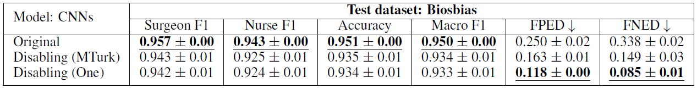

[*<< Back to the main page*](https://plkumjorn.github.io/FIND)

# Experiment 2: Biosbias

## Basic information
- **Task**: Predicting the occupation of a given bio paragraph
- **Dataset**: Biosbias
- **Classes**: Surgeon or Nurse
- **Train/Dev/Test examples**: 3832 / 1277 / 1278
- **Problem**: Due to the gender imbalance in each occupation, a classifier usually exploits gender information when making predictions. As a result, bios of female surgeons and male nurses are often misclassified.
- For more details, please see section 6 in the paper.

## Word Clouds & Annotations

### Model 1: Biosbias2_CNN_20200510171008

<table><tbody><tr class="center-row"><td><b>Feature 0</b></td><td><b>Feature 1</b></td><td><b>Feature 2</b></td><td><b>Feature 3</b></td><td><b>Feature 4</b></td><td><b>Feature 5</b></td><td><b>Feature 6</b></td><td><b>Feature 7</b></td><td><b>Feature 8</b></td><td><b>Feature 9</b></td><td><b>Feature 10</b></td><td><b>Feature 11</b></td><td><b>Feature 12</b></td><td><b>Feature 13</b></td><td><b>Feature 14</b></td><td><b>Feature 15</b></td><td><b>Feature 16</b></td><td><b>Feature 17</b></td><td><b>Feature 18</b></td><td><b>Feature 19</b></td><td><b>Feature 20</b></td><td><b>Feature 21</b></td><td><b>Feature 22</b></td><td><b>Feature 23</b></td><td><b>Feature 24</b></td><td><b>Feature 25</b></td><td><b>Feature 26</b></td><td><b>Feature 27</b></td><td><b>Feature 28</b></td><td><b>Feature 29</b></td></tr><tr><td></td><td></td><td></td><td></td><td></td><td></td><td></td><td></td><td></td><td></td><td></td><td></td><td></td><td></td><td></td><td></td><td></td><td></td><td></td><td></td><td></td><td></td><td></td><td></td><td></td><td></td><td></td><td></td><td></td><td></td></tr><tr><td>&emsp;&emsp;<b>Model weights</b>:
<b>&emsp;&emsp;&emsp;- surgeon = 0.327</b>
&emsp;&emsp;&emsp;- nurse = 0.115</td><td>&emsp;&emsp;<b>Model weights</b>:
&emsp;&emsp;&emsp;- surgeon = 0.244
<b>&emsp;&emsp;&emsp;- nurse = 0.497</b></td><td>&emsp;&emsp;<b>Model weights</b>:
&emsp;&emsp;&emsp;- surgeon = -0.290
<b>&emsp;&emsp;&emsp;- nurse = 0.226</b></td><td>&emsp;&emsp;<b>Model weights</b>:
&emsp;&emsp;&emsp;- surgeon = -0.023
<b>&emsp;&emsp;&emsp;- nurse = 0.052</b></td><td>&emsp;&emsp;<b>Model weights</b>:
<b>&emsp;&emsp;&emsp;- surgeon = -0.355</b>
&emsp;&emsp;&emsp;- nurse = -0.482</td><td>&emsp;&emsp;<b>Model weights</b>:
&emsp;&emsp;&emsp;- surgeon = -0.387
<b>&emsp;&emsp;&emsp;- nurse = 0.168</b></td><td>&emsp;&emsp;<b>Model weights</b>:
&emsp;&emsp;&emsp;- surgeon = 0.224
<b>&emsp;&emsp;&emsp;- nurse = 0.446</b></td><td>&emsp;&emsp;<b>Model weights</b>:
&emsp;&emsp;&emsp;- surgeon = -0.400
<b>&emsp;&emsp;&emsp;- nurse = 0.076</b></td><td>&emsp;&emsp;<b>Model weights</b>:
&emsp;&emsp;&emsp;- surgeon = -0.341
<b>&emsp;&emsp;&emsp;- nurse = 0.038</b></td><td>&emsp;&emsp;<b>Model weights</b>:
&emsp;&emsp;&emsp;- surgeon = -0.212
<b>&emsp;&emsp;&emsp;- nurse = 0.167</b></td><td>&emsp;&emsp;<b>Model weights</b>:
&emsp;&emsp;&emsp;- surgeon = -0.332
<b>&emsp;&emsp;&emsp;- nurse = -0.075</b></td><td>&emsp;&emsp;<b>Model weights</b>:
<b>&emsp;&emsp;&emsp;- surgeon = 0.481</b>
&emsp;&emsp;&emsp;- nurse = 0.254</td><td>&emsp;&emsp;<b>Model weights</b>:
&emsp;&emsp;&emsp;- surgeon = -0.286
<b>&emsp;&emsp;&emsp;- nurse = 0.199</b></td><td>&emsp;&emsp;<b>Model weights</b>:
<b>&emsp;&emsp;&emsp;- surgeon = 0.149</b>
&emsp;&emsp;&emsp;- nurse = -0.137</td><td>&emsp;&emsp;<b>Model weights</b>:
<b>&emsp;&emsp;&emsp;- surgeon = 0.368</b>
&emsp;&emsp;&emsp;- nurse = -0.150</td><td>&emsp;&emsp;<b>Model weights</b>:
&emsp;&emsp;&emsp;- surgeon = 0.086
<b>&emsp;&emsp;&emsp;- nurse = 0.216</b></td><td>&emsp;&emsp;<b>Model weights</b>:
<b>&emsp;&emsp;&emsp;- surgeon = 0.219</b>
&emsp;&emsp;&emsp;- nurse = -0.273</td><td>&emsp;&emsp;<b>Model weights</b>:
&emsp;&emsp;&emsp;- surgeon = -0.329
<b>&emsp;&emsp;&emsp;- nurse = 0.024</b></td><td>&emsp;&emsp;<b>Model weights</b>:
<b>&emsp;&emsp;&emsp;- surgeon = 0.233</b>
&emsp;&emsp;&emsp;- nurse = -0.195</td><td>&emsp;&emsp;<b>Model weights</b>:
&emsp;&emsp;&emsp;- surgeon = -0.346
<b>&emsp;&emsp;&emsp;- nurse = 0.155</b></td><td>&emsp;&emsp;<b>Model weights</b>:
&emsp;&emsp;&emsp;- surgeon = -0.191
<b>&emsp;&emsp;&emsp;- nurse = -0.042</b></td><td>&emsp;&emsp;<b>Model weights</b>:
&emsp;&emsp;&emsp;- surgeon = -0.272
<b>&emsp;&emsp;&emsp;- nurse = 0.232</b></td><td>&emsp;&emsp;<b>Model weights</b>:
<b>&emsp;&emsp;&emsp;- surgeon = 0.454</b>
&emsp;&emsp;&emsp;- nurse = 0.238</td><td>&emsp;&emsp;<b>Model weights</b>:
<b>&emsp;&emsp;&emsp;- surgeon = 0.451</b>
&emsp;&emsp;&emsp;- nurse = -0.029</td><td>&emsp;&emsp;<b>Model weights</b>:
&emsp;&emsp;&emsp;- surgeon = 0.094
<b>&emsp;&emsp;&emsp;- nurse = 0.374</b></td><td>&emsp;&emsp;<b>Model weights</b>:
&emsp;&emsp;&emsp;- surgeon = -0.341
<b>&emsp;&emsp;&emsp;- nurse = -0.057</b></td><td>&emsp;&emsp;<b>Model weights</b>:
&emsp;&emsp;&emsp;- surgeon = 0.124
<b>&emsp;&emsp;&emsp;- nurse = 0.449</b></td><td>&emsp;&emsp;<b>Model weights</b>:
<b>&emsp;&emsp;&emsp;- surgeon = 0.197</b>
&emsp;&emsp;&emsp;- nurse = -0.204</td><td>&emsp;&emsp;<b>Model weights</b>:
&emsp;&emsp;&emsp;- surgeon = -0.360
<b>&emsp;&emsp;&emsp;- nurse = 0.414</b></td><td>&emsp;&emsp;<b>Model weights</b>:
<b>&emsp;&emsp;&emsp;- surgeon = 0.134</b>
&emsp;&emsp;&emsp;- nurse = -0.155</td></tr><tr><td><b>&emsp;&emsp;Human answers</b>:
<b>&emsp;&emsp;&emsp;- surgeon = 5</b>
&emsp;&emsp;&emsp;- nurse = 0
<b>&emsp;&emsp;&emsp;- It could be either = 5</b></td><td><b>&emsp;&emsp;Human answers</b>:
&emsp;&emsp;&emsp;- surgeon = 0
<b>&emsp;&emsp;&emsp;- nurse = 10</b>
&emsp;&emsp;&emsp;- It could be either = 0</td><td><b>&emsp;&emsp;Human answers</b>:
&emsp;&emsp;&emsp;- surgeon = 0
&emsp;&emsp;&emsp;- nurse = 1
<b>&emsp;&emsp;&emsp;- It could be either = 9</b></td><td><b>&emsp;&emsp;Human answers</b>:
&emsp;&emsp;&emsp;- surgeon = 0
<b>&emsp;&emsp;&emsp;- nurse = 10</b>
&emsp;&emsp;&emsp;- It could be either = 0</td><td><b>&emsp;&emsp;Human answers</b>:
&emsp;&emsp;&emsp;- surgeon = 0
&emsp;&emsp;&emsp;- nurse = 1
<b>&emsp;&emsp;&emsp;- It could be either = 9</b></td><td><b>&emsp;&emsp;Human answers</b>:
&emsp;&emsp;&emsp;- surgeon = 0
&emsp;&emsp;&emsp;- nurse = 4
<b>&emsp;&emsp;&emsp;- It could be either = 6</b></td><td><b>&emsp;&emsp;Human answers</b>:
&emsp;&emsp;&emsp;- surgeon = 0
&emsp;&emsp;&emsp;- nurse = 3
<b>&emsp;&emsp;&emsp;- It could be either = 7</b></td><td><b>&emsp;&emsp;Human answers</b>:
&emsp;&emsp;&emsp;- surgeon = 0
&emsp;&emsp;&emsp;- nurse = 4
<b>&emsp;&emsp;&emsp;- It could be either = 6</b></td><td><b>&emsp;&emsp;Human answers</b>:
&emsp;&emsp;&emsp;- surgeon = 0
&emsp;&emsp;&emsp;- nurse = 1
<b>&emsp;&emsp;&emsp;- It could be either = 9</b></td><td><b>&emsp;&emsp;Human answers</b>:
&emsp;&emsp;&emsp;- surgeon = 0
<b>&emsp;&emsp;&emsp;- nurse = 10</b>
&emsp;&emsp;&emsp;- It could be either = 0</td><td><b>&emsp;&emsp;Human answers</b>:
&emsp;&emsp;&emsp;- surgeon = 0
<b>&emsp;&emsp;&emsp;- nurse = 10</b>
&emsp;&emsp;&emsp;- It could be either = 0</td><td><b>&emsp;&emsp;Human answers</b>:
<b>&emsp;&emsp;&emsp;- surgeon = 10</b>
&emsp;&emsp;&emsp;- nurse = 0
&emsp;&emsp;&emsp;- It could be either = 0</td><td><b>&emsp;&emsp;Human answers</b>:
&emsp;&emsp;&emsp;- surgeon = 0
<b>&emsp;&emsp;&emsp;- nurse = 10</b>
&emsp;&emsp;&emsp;- It could be either = 0</td><td><b>&emsp;&emsp;Human answers</b>:
<b>&emsp;&emsp;&emsp;- surgeon = 8</b>
&emsp;&emsp;&emsp;- nurse = 1
&emsp;&emsp;&emsp;- It could be either = 1</td><td><b>&emsp;&emsp;Human answers</b>:
&emsp;&emsp;&emsp;- surgeon = 0
&emsp;&emsp;&emsp;- nurse = 1
<b>&emsp;&emsp;&emsp;- It could be either = 9</b></td><td><b>&emsp;&emsp;Human answers</b>:
&emsp;&emsp;&emsp;- surgeon = 0
<b>&emsp;&emsp;&emsp;- nurse = 9</b>
&emsp;&emsp;&emsp;- It could be either = 1</td><td><b>&emsp;&emsp;Human answers</b>:
<b>&emsp;&emsp;&emsp;- surgeon = 10</b>
&emsp;&emsp;&emsp;- nurse = 0
&emsp;&emsp;&emsp;- It could be either = 0</td><td><b>&emsp;&emsp;Human answers</b>:
&emsp;&emsp;&emsp;- surgeon = 1
&emsp;&emsp;&emsp;- nurse = 3
<b>&emsp;&emsp;&emsp;- It could be either = 6</b></td><td><b>&emsp;&emsp;Human answers</b>:
<b>&emsp;&emsp;&emsp;- surgeon = 10</b>
&emsp;&emsp;&emsp;- nurse = 0
&emsp;&emsp;&emsp;- It could be either = 0</td><td><b>&emsp;&emsp;Human answers</b>:
&emsp;&emsp;&emsp;- surgeon = 0
&emsp;&emsp;&emsp;- nurse = 0
<b>&emsp;&emsp;&emsp;- It could be either = 10</b></td><td><b>&emsp;&emsp;Human answers</b>:
&emsp;&emsp;&emsp;- surgeon = 1
&emsp;&emsp;&emsp;- nurse = 4
<b>&emsp;&emsp;&emsp;- It could be either = 5</b></td><td><b>&emsp;&emsp;Human answers</b>:
&emsp;&emsp;&emsp;- surgeon = 1
&emsp;&emsp;&emsp;- nurse = 1
<b>&emsp;&emsp;&emsp;- It could be either = 8</b></td><td><b>&emsp;&emsp;Human answers</b>:
<b>&emsp;&emsp;&emsp;- surgeon = 10</b>
&emsp;&emsp;&emsp;- nurse = 0
&emsp;&emsp;&emsp;- It could be either = 0</td><td><b>&emsp;&emsp;Human answers</b>:
<b>&emsp;&emsp;&emsp;- surgeon = 9</b>
&emsp;&emsp;&emsp;- nurse = 1
&emsp;&emsp;&emsp;- It could be either = 0</td><td><b>&emsp;&emsp;Human answers</b>:
&emsp;&emsp;&emsp;- surgeon = 0
&emsp;&emsp;&emsp;- nurse = 4
<b>&emsp;&emsp;&emsp;- It could be either = 6</b></td><td><b>&emsp;&emsp;Human answers</b>:
&emsp;&emsp;&emsp;- surgeon = 0
<b>&emsp;&emsp;&emsp;- nurse = 7</b>
&emsp;&emsp;&emsp;- It could be either = 3</td><td><b>&emsp;&emsp;Human answers</b>:
&emsp;&emsp;&emsp;- surgeon = 1
&emsp;&emsp;&emsp;- nurse = 1
<b>&emsp;&emsp;&emsp;- It could be either = 8</b></td><td><b>&emsp;&emsp;Human answers</b>:
<b>&emsp;&emsp;&emsp;- surgeon = 10</b>
&emsp;&emsp;&emsp;- nurse = 0
&emsp;&emsp;&emsp;- It could be either = 0</td><td><b>&emsp;&emsp;Human answers</b>:
&emsp;&emsp;&emsp;- surgeon = 0
<b>&emsp;&emsp;&emsp;- nurse = 10</b>
&emsp;&emsp;&emsp;- It could be either = 0</td><td><b>&emsp;&emsp;Human answers</b>:
<b>&emsp;&emsp;&emsp;- surgeon = 7</b>
&emsp;&emsp;&emsp;- nurse = 0
&emsp;&emsp;&emsp;- It could be either = 3</td></tr><tr><td>&emsp;&emsp;<b>Decision:</b>
&emsp;&emsp;&emsp;<b style="color:red">- MTurk: Disabled</b>
&emsp;&emsp;&emsp;<b style="color:green">- One: Enabled</b></td><td>&emsp;&emsp;<b>Decision:</b>
&emsp;&emsp;&emsp;<b style="color:green">- MTurk: Enabled</b>
&emsp;&emsp;&emsp;<b style="color:green">- One: Enabled</b></td><td>&emsp;&emsp;<b>Decision:</b>
&emsp;&emsp;&emsp;<b style="color:red">- MTurk: Disabled</b>
&emsp;&emsp;&emsp;<b style="color:red">- One: Disabled</b></td><td>&emsp;&emsp;<b>Decision:</b>
&emsp;&emsp;&emsp;<b style="color:green">- MTurk: Enabled</b>
&emsp;&emsp;&emsp;<b style="color:green">- One: Enabled</b></td><td>&emsp;&emsp;<b>Decision:</b>
&emsp;&emsp;&emsp;<b style="color:red">- MTurk: Disabled</b>
&emsp;&emsp;&emsp;<b style="color:red">- One: Disabled</b></td><td>&emsp;&emsp;<b>Decision:</b>
&emsp;&emsp;&emsp;<b style="color:red">- MTurk: Disabled</b>
&emsp;&emsp;&emsp;<b style="color:red">- One: Disabled</b></td><td>&emsp;&emsp;<b>Decision:</b>
&emsp;&emsp;&emsp;<b style="color:red">- MTurk: Disabled</b>
&emsp;&emsp;&emsp;<b style="color:green">- One: Enabled</b></td><td>&emsp;&emsp;<b>Decision:</b>
&emsp;&emsp;&emsp;<b style="color:red">- MTurk: Disabled</b>
&emsp;&emsp;&emsp;<b style="color:green">- One: Enabled</b></td><td>&emsp;&emsp;<b>Decision:</b>
&emsp;&emsp;&emsp;<b style="color:red">- MTurk: Disabled</b>
&emsp;&emsp;&emsp;<b style="color:red">- One: Disabled</b></td><td>&emsp;&emsp;<b>Decision:</b>
&emsp;&emsp;&emsp;<b style="color:green">- MTurk: Enabled</b>
&emsp;&emsp;&emsp;<b style="color:green">- One: Enabled</b></td><td>&emsp;&emsp;<b>Decision:</b>
&emsp;&emsp;&emsp;<b style="color:green">- MTurk: Enabled</b>
&emsp;&emsp;&emsp;<b style="color:green">- One: Enabled</b></td><td>&emsp;&emsp;<b>Decision:</b>
&emsp;&emsp;&emsp;<b style="color:green">- MTurk: Enabled</b>
&emsp;&emsp;&emsp;<b style="color:red">- One: Disabled</b></td><td>&emsp;&emsp;<b>Decision:</b>
&emsp;&emsp;&emsp;<b style="color:green">- MTurk: Enabled</b>
&emsp;&emsp;&emsp;<b style="color:green">- One: Enabled</b></td><td>&emsp;&emsp;<b>Decision:</b>
&emsp;&emsp;&emsp;<b style="color:green">- MTurk: Enabled</b>
&emsp;&emsp;&emsp;<b style="color:green">- One: Enabled</b></td><td>&emsp;&emsp;<b>Decision:</b>
&emsp;&emsp;&emsp;<b style="color:red">- MTurk: Disabled</b>
&emsp;&emsp;&emsp;<b style="color:red">- One: Disabled</b></td><td>&emsp;&emsp;<b>Decision:</b>
&emsp;&emsp;&emsp;<b style="color:green">- MTurk: Enabled</b>
&emsp;&emsp;&emsp;<b style="color:green">- One: Enabled</b></td><td>&emsp;&emsp;<b>Decision:</b>
&emsp;&emsp;&emsp;<b style="color:green">- MTurk: Enabled</b>
&emsp;&emsp;&emsp;<b style="color:red">- One: Disabled</b></td><td>&emsp;&emsp;<b>Decision:</b>
&emsp;&emsp;&emsp;<b style="color:red">- MTurk: Disabled</b>
&emsp;&emsp;&emsp;<b style="color:red">- One: Disabled</b></td><td>&emsp;&emsp;<b>Decision:</b>
&emsp;&emsp;&emsp;<b style="color:green">- MTurk: Enabled</b>
&emsp;&emsp;&emsp;<b style="color:green">- One: Enabled</b></td><td>&emsp;&emsp;<b>Decision:</b>
&emsp;&emsp;&emsp;<b style="color:red">- MTurk: Disabled</b>
&emsp;&emsp;&emsp;<b style="color:red">- One: Disabled</b></td><td>&emsp;&emsp;<b>Decision:</b>
&emsp;&emsp;&emsp;<b style="color:red">- MTurk: Disabled</b>
&emsp;&emsp;&emsp;<b style="color:red">- One: Disabled</b></td><td>&emsp;&emsp;<b>Decision:</b>
&emsp;&emsp;&emsp;<b style="color:red">- MTurk: Disabled</b>
&emsp;&emsp;&emsp;<b style="color:red">- One: Disabled</b></td><td>&emsp;&emsp;<b>Decision:</b>
&emsp;&emsp;&emsp;<b style="color:green">- MTurk: Enabled</b>
&emsp;&emsp;&emsp;<b style="color:green">- One: Enabled</b></td><td>&emsp;&emsp;<b>Decision:</b>
&emsp;&emsp;&emsp;<b style="color:green">- MTurk: Enabled</b>
&emsp;&emsp;&emsp;<b style="color:green">- One: Enabled</b></td><td>&emsp;&emsp;<b>Decision:</b>
&emsp;&emsp;&emsp;<b style="color:red">- MTurk: Disabled</b>
&emsp;&emsp;&emsp;<b style="color:green">- One: Enabled</b></td><td>&emsp;&emsp;<b>Decision:</b>
&emsp;&emsp;&emsp;<b style="color:green">- MTurk: Enabled</b>
&emsp;&emsp;&emsp;<b style="color:green">- One: Enabled</b></td><td>&emsp;&emsp;<b>Decision:</b>
&emsp;&emsp;&emsp;<b style="color:red">- MTurk: Disabled</b>
&emsp;&emsp;&emsp;<b style="color:red">- One: Disabled</b></td><td>&emsp;&emsp;<b>Decision:</b>
&emsp;&emsp;&emsp;<b style="color:green">- MTurk: Enabled</b>
&emsp;&emsp;&emsp;<b style="color:green">- One: Enabled</b></td><td>&emsp;&emsp;<b>Decision:</b>
&emsp;&emsp;&emsp;<b style="color:green">- MTurk: Enabled</b>
&emsp;&emsp;&emsp;<b style="color:red">- One: Disabled</b></td><td>&emsp;&emsp;<b>Decision:</b>
&emsp;&emsp;&emsp;<b style="color:green">- MTurk: Enabled</b>
&emsp;&emsp;&emsp;<b style="color:green">- One: Enabled</b></td></tr></tbody></table>

## Model 2: Biosbias2_CNN_20200510172123

<table><tbody><tr class="center-row"><td><b>Feature 0</b></td><td><b>Feature 1</b></td><td><b>Feature 2</b></td><td><b>Feature 3</b></td><td><b>Feature 4</b></td><td><b>Feature 5</b></td><td><b>Feature 6</b></td><td><b>Feature 7</b></td><td><b>Feature 8</b></td><td><b>Feature 9</b></td><td><b>Feature 10</b></td><td><b>Feature 11</b></td><td><b>Feature 12</b></td><td><b>Feature 13</b></td><td><b>Feature 14</b></td><td><b>Feature 15</b></td><td><b>Feature 16</b></td><td><b>Feature 17</b></td><td><b>Feature 18</b></td><td><b>Feature 19</b></td><td><b>Feature 20</b></td><td><b>Feature 21</b></td><td><b>Feature 22</b></td><td><b>Feature 23</b></td><td><b>Feature 24</b></td><td><b>Feature 25</b></td><td><b>Feature 26</b></td><td><b>Feature 27</b></td><td><b>Feature 28</b></td><td><b>Feature 29</b></td></tr><tr><td></td><td></td><td></td><td></td><td></td><td></td><td></td><td></td><td></td><td></td><td></td><td></td><td></td><td></td><td></td><td></td><td></td><td></td><td></td><td></td><td></td><td></td><td></td><td></td><td></td><td></td><td></td><td></td><td></td><td></td></tr><tr><td>&emsp;&emsp;<b>Model weights</b>:
<b>&emsp;&emsp;&emsp;- surgeon = 0.220</b>
&emsp;&emsp;&emsp;- nurse = -0.444</td><td>&emsp;&emsp;<b>Model weights</b>:
<b>&emsp;&emsp;&emsp;- surgeon = 0.410</b>
&emsp;&emsp;&emsp;- nurse = -0.166</td><td>&emsp;&emsp;<b>Model weights</b>:
<b>&emsp;&emsp;&emsp;- surgeon = 0.415</b>
&emsp;&emsp;&emsp;- nurse = -0.326</td><td>&emsp;&emsp;<b>Model weights</b>:
&emsp;&emsp;&emsp;- surgeon = -0.259
<b>&emsp;&emsp;&emsp;- nurse = 0.298</b></td><td>&emsp;&emsp;<b>Model weights</b>:
<b>&emsp;&emsp;&emsp;- surgeon = 0.283</b>
&emsp;&emsp;&emsp;- nurse = -0.427</td><td>&emsp;&emsp;<b>Model weights</b>:
&emsp;&emsp;&emsp;- surgeon = -0.063
<b>&emsp;&emsp;&emsp;- nurse = 0.232</b></td><td>&emsp;&emsp;<b>Model weights</b>:
&emsp;&emsp;&emsp;- surgeon = -0.197
<b>&emsp;&emsp;&emsp;- nurse = -0.080</b></td><td>&emsp;&emsp;<b>Model weights</b>:
&emsp;&emsp;&emsp;- surgeon = -0.008
<b>&emsp;&emsp;&emsp;- nurse = 0.299</b></td><td>&emsp;&emsp;<b>Model weights</b>:
&emsp;&emsp;&emsp;- surgeon = -0.089
<b>&emsp;&emsp;&emsp;- nurse = 0.061</b></td><td>&emsp;&emsp;<b>Model weights</b>:
<b>&emsp;&emsp;&emsp;- surgeon = 0.301</b>
&emsp;&emsp;&emsp;- nurse = 0.207</td><td>&emsp;&emsp;<b>Model weights</b>:
&emsp;&emsp;&emsp;- surgeon = -0.227
<b>&emsp;&emsp;&emsp;- nurse = -0.005</b></td><td>&emsp;&emsp;<b>Model weights</b>:
&emsp;&emsp;&emsp;- surgeon = -0.464
<b>&emsp;&emsp;&emsp;- nurse = -0.270</b></td><td>&emsp;&emsp;<b>Model weights</b>:
<b>&emsp;&emsp;&emsp;- surgeon = 0.222</b>
&emsp;&emsp;&emsp;- nurse = 0.033</td><td>&emsp;&emsp;<b>Model weights</b>:
<b>&emsp;&emsp;&emsp;- surgeon = -0.033</b>
&emsp;&emsp;&emsp;- nurse = -0.162</td><td>&emsp;&emsp;<b>Model weights</b>:
&emsp;&emsp;&emsp;- surgeon = 0.188
<b>&emsp;&emsp;&emsp;- nurse = 0.432</b></td><td>&emsp;&emsp;<b>Model weights</b>:
<b>&emsp;&emsp;&emsp;- surgeon = 0.296</b>
&emsp;&emsp;&emsp;- nurse = -0.217</td><td>&emsp;&emsp;<b>Model weights</b>:
&emsp;&emsp;&emsp;- surgeon = 0.002
<b>&emsp;&emsp;&emsp;- nurse = 0.357</b></td><td>&emsp;&emsp;<b>Model weights</b>:
&emsp;&emsp;&emsp;- surgeon = -0.334
<b>&emsp;&emsp;&emsp;- nurse = 0.011</b></td><td>&emsp;&emsp;<b>Model weights</b>:
<b>&emsp;&emsp;&emsp;- surgeon = 0.434</b>
&emsp;&emsp;&emsp;- nurse = -0.263</td><td>&emsp;&emsp;<b>Model weights</b>:
&emsp;&emsp;&emsp;- surgeon = -0.098
<b>&emsp;&emsp;&emsp;- nurse = 0.216</b></td><td>&emsp;&emsp;<b>Model weights</b>:
<b>&emsp;&emsp;&emsp;- surgeon = -0.059</b>
&emsp;&emsp;&emsp;- nurse = -0.416</td><td>&emsp;&emsp;<b>Model weights</b>:
&emsp;&emsp;&emsp;- surgeon = -0.346
<b>&emsp;&emsp;&emsp;- nurse = 0.336</b></td><td>&emsp;&emsp;<b>Model weights</b>:
<b>&emsp;&emsp;&emsp;- surgeon = 0.050</b>
&emsp;&emsp;&emsp;- nurse = -0.170</td><td>&emsp;&emsp;<b>Model weights</b>:
&emsp;&emsp;&emsp;- surgeon = -0.414
<b>&emsp;&emsp;&emsp;- nurse = 0.048</b></td><td>&emsp;&emsp;<b>Model weights</b>:
<b>&emsp;&emsp;&emsp;- surgeon = -0.108</b>
&emsp;&emsp;&emsp;- nurse = -0.332</td><td>&emsp;&emsp;<b>Model weights</b>:
<b>&emsp;&emsp;&emsp;- surgeon = 0.197</b>
&emsp;&emsp;&emsp;- nurse = -0.261</td><td>&emsp;&emsp;<b>Model weights</b>:
&emsp;&emsp;&emsp;- surgeon = -0.377
<b>&emsp;&emsp;&emsp;- nurse = -0.067</b></td><td>&emsp;&emsp;<b>Model weights</b>:
&emsp;&emsp;&emsp;- surgeon = -0.034
<b>&emsp;&emsp;&emsp;- nurse = 0.356</b></td><td>&emsp;&emsp;<b>Model weights</b>:
&emsp;&emsp;&emsp;- surgeon = -0.195
<b>&emsp;&emsp;&emsp;- nurse = 0.267</b></td><td>&emsp;&emsp;<b>Model weights</b>:
<b>&emsp;&emsp;&emsp;- surgeon = 0.271</b>
&emsp;&emsp;&emsp;- nurse = -0.221</td></tr><tr><td><b>&emsp;&emsp;Human answers</b>:
<b>&emsp;&emsp;&emsp;- surgeon = 10</b>
&emsp;&emsp;&emsp;- nurse = 0
&emsp;&emsp;&emsp;- It could be either = 0</td><td><b>&emsp;&emsp;Human answers</b>:
<b>&emsp;&emsp;&emsp;- surgeon = 10</b>
&emsp;&emsp;&emsp;- nurse = 0
&emsp;&emsp;&emsp;- It could be either = 0</td><td><b>&emsp;&emsp;Human answers</b>:
&emsp;&emsp;&emsp;- surgeon = 4
&emsp;&emsp;&emsp;- nurse = 0
<b>&emsp;&emsp;&emsp;- It could be either = 6</b></td><td><b>&emsp;&emsp;Human answers</b>:
&emsp;&emsp;&emsp;- surgeon = 0
&emsp;&emsp;&emsp;- nurse = 0
<b>&emsp;&emsp;&emsp;- It could be either = 10</b></td><td><b>&emsp;&emsp;Human answers</b>:
&emsp;&emsp;&emsp;- surgeon = 1
&emsp;&emsp;&emsp;- nurse = 0
<b>&emsp;&emsp;&emsp;- It could be either = 9</b></td><td><b>&emsp;&emsp;Human answers</b>:
&emsp;&emsp;&emsp;- surgeon = 0
&emsp;&emsp;&emsp;- nurse = 2
<b>&emsp;&emsp;&emsp;- It could be either = 8</b></td><td><b>&emsp;&emsp;Human answers</b>:
&emsp;&emsp;&emsp;- surgeon = 2
&emsp;&emsp;&emsp;- nurse = 1
<b>&emsp;&emsp;&emsp;- It could be either = 7</b></td><td><b>&emsp;&emsp;Human answers</b>:
&emsp;&emsp;&emsp;- surgeon = 0
&emsp;&emsp;&emsp;- nurse = 0
<b>&emsp;&emsp;&emsp;- It could be either = 10</b></td><td><b>&emsp;&emsp;Human answers</b>:
&emsp;&emsp;&emsp;- surgeon = 0
<b>&emsp;&emsp;&emsp;- nurse = 10</b>
&emsp;&emsp;&emsp;- It could be either = 0</td><td><b>&emsp;&emsp;Human answers</b>:
<b>&emsp;&emsp;&emsp;- surgeon = 10</b>
&emsp;&emsp;&emsp;- nurse = 0
&emsp;&emsp;&emsp;- It could be either = 0</td><td><b>&emsp;&emsp;Human answers</b>:
&emsp;&emsp;&emsp;- surgeon = 0
<b>&emsp;&emsp;&emsp;- nurse = 10</b>
&emsp;&emsp;&emsp;- It could be either = 0</td><td><b>&emsp;&emsp;Human answers</b>:
&emsp;&emsp;&emsp;- surgeon = 0
<b>&emsp;&emsp;&emsp;- nurse = 9</b>
&emsp;&emsp;&emsp;- It could be either = 1</td><td><b>&emsp;&emsp;Human answers</b>:
<b>&emsp;&emsp;&emsp;- surgeon = 10</b>
&emsp;&emsp;&emsp;- nurse = 0
&emsp;&emsp;&emsp;- It could be either = 0</td><td><b>&emsp;&emsp;Human answers</b>:
<b>&emsp;&emsp;&emsp;- surgeon = 9</b>
&emsp;&emsp;&emsp;- nurse = 0
&emsp;&emsp;&emsp;- It could be either = 1</td><td><b>&emsp;&emsp;Human answers</b>:
&emsp;&emsp;&emsp;- surgeon = 0
<b>&emsp;&emsp;&emsp;- nurse = 6</b>
&emsp;&emsp;&emsp;- It could be either = 4</td><td><b>&emsp;&emsp;Human answers</b>:
<b>&emsp;&emsp;&emsp;- surgeon = 6</b>
&emsp;&emsp;&emsp;- nurse = 0
&emsp;&emsp;&emsp;- It could be either = 4</td><td><b>&emsp;&emsp;Human answers</b>:
&emsp;&emsp;&emsp;- surgeon = 0
<b>&emsp;&emsp;&emsp;- nurse = 10</b>
&emsp;&emsp;&emsp;- It could be either = 0</td><td><b>&emsp;&emsp;Human answers</b>:
&emsp;&emsp;&emsp;- surgeon = 0
<b>&emsp;&emsp;&emsp;- nurse = 9</b>
&emsp;&emsp;&emsp;- It could be either = 1</td><td><b>&emsp;&emsp;Human answers</b>:
&emsp;&emsp;&emsp;- surgeon = 4
&emsp;&emsp;&emsp;- nurse = 1
<b>&emsp;&emsp;&emsp;- It could be either = 5</b></td><td><b>&emsp;&emsp;Human answers</b>:
&emsp;&emsp;&emsp;- surgeon = 0
<b>&emsp;&emsp;&emsp;- nurse = 5</b>
<b>&emsp;&emsp;&emsp;- It could be either = 5</b></td><td><b>&emsp;&emsp;Human answers</b>:
<b>&emsp;&emsp;&emsp;- surgeon = 10</b>
&emsp;&emsp;&emsp;- nurse = 0
&emsp;&emsp;&emsp;- It could be either = 0</td><td><b>&emsp;&emsp;Human answers</b>:
&emsp;&emsp;&emsp;- surgeon = 0
<b>&emsp;&emsp;&emsp;- nurse = 10</b>
&emsp;&emsp;&emsp;- It could be either = 0</td><td><b>&emsp;&emsp;Human answers</b>:
<b>&emsp;&emsp;&emsp;- surgeon = 5</b>
&emsp;&emsp;&emsp;- nurse = 0
<b>&emsp;&emsp;&emsp;- It could be either = 5</b></td><td><b>&emsp;&emsp;Human answers</b>:
&emsp;&emsp;&emsp;- surgeon = 0
<b>&emsp;&emsp;&emsp;- nurse = 10</b>
&emsp;&emsp;&emsp;- It could be either = 0</td><td><b>&emsp;&emsp;Human answers</b>:
&emsp;&emsp;&emsp;- surgeon = 4
&emsp;&emsp;&emsp;- nurse = 0
<b>&emsp;&emsp;&emsp;- It could be either = 6</b></td><td><b>&emsp;&emsp;Human answers</b>:
<b>&emsp;&emsp;&emsp;- surgeon = 5</b>
&emsp;&emsp;&emsp;- nurse = 0
<b>&emsp;&emsp;&emsp;- It could be either = 5</b></td><td><b>&emsp;&emsp;Human answers</b>:
&emsp;&emsp;&emsp;- surgeon = 0
<b>&emsp;&emsp;&emsp;- nurse = 10</b>
&emsp;&emsp;&emsp;- It could be either = 0</td><td><b>&emsp;&emsp;Human answers</b>:
&emsp;&emsp;&emsp;- surgeon = 0
<b>&emsp;&emsp;&emsp;- nurse = 9</b>
&emsp;&emsp;&emsp;- It could be either = 1</td><td><b>&emsp;&emsp;Human answers</b>:
&emsp;&emsp;&emsp;- surgeon = 0
<b>&emsp;&emsp;&emsp;- nurse = 10</b>
&emsp;&emsp;&emsp;- It could be either = 0</td><td><b>&emsp;&emsp;Human answers</b>:
<b>&emsp;&emsp;&emsp;- surgeon = 8</b>
&emsp;&emsp;&emsp;- nurse = 0
&emsp;&emsp;&emsp;- It could be either = 2</td></tr><tr><td>&emsp;&emsp;<b>Decision:</b>
&emsp;&emsp;&emsp;<b style="color:green">- MTurk: Enabled</b>
&emsp;&emsp;&emsp;<b style="color:green">- One: Enabled</b></td><td>&emsp;&emsp;<b>Decision:</b>
&emsp;&emsp;&emsp;<b style="color:green">- MTurk: Enabled</b>
&emsp;&emsp;&emsp;<b style="color:green">- One: Enabled</b></td><td>&emsp;&emsp;<b>Decision:</b>
&emsp;&emsp;&emsp;<b style="color:red">- MTurk: Disabled</b>
&emsp;&emsp;&emsp;<b style="color:green">- One: Enabled</b></td><td>&emsp;&emsp;<b>Decision:</b>
&emsp;&emsp;&emsp;<b style="color:red">- MTurk: Disabled</b>
&emsp;&emsp;&emsp;<b style="color:red">- One: Disabled</b></td><td>&emsp;&emsp;<b>Decision:</b>
&emsp;&emsp;&emsp;<b style="color:red">- MTurk: Disabled</b>
&emsp;&emsp;&emsp;<b style="color:red">- One: Disabled</b></td><td>&emsp;&emsp;<b>Decision:</b>
&emsp;&emsp;&emsp;<b style="color:red">- MTurk: Disabled</b>
&emsp;&emsp;&emsp;<b style="color:red">- One: Disabled</b></td><td>&emsp;&emsp;<b>Decision:</b>
&emsp;&emsp;&emsp;<b style="color:red">- MTurk: Disabled</b>
&emsp;&emsp;&emsp;<b style="color:red">- One: Disabled</b></td><td>&emsp;&emsp;<b>Decision:</b>
&emsp;&emsp;&emsp;<b style="color:red">- MTurk: Disabled</b>
&emsp;&emsp;&emsp;<b style="color:red">- One: Disabled</b></td><td>&emsp;&emsp;<b>Decision:</b>
&emsp;&emsp;&emsp;<b style="color:green">- MTurk: Enabled</b>
&emsp;&emsp;&emsp;<b style="color:green">- One: Enabled</b></td><td>&emsp;&emsp;<b>Decision:</b>
&emsp;&emsp;&emsp;<b style="color:green">- MTurk: Enabled</b>
&emsp;&emsp;&emsp;<b style="color:green">- One: Enabled</b></td><td>&emsp;&emsp;<b>Decision:</b>
&emsp;&emsp;&emsp;<b style="color:green">- MTurk: Enabled</b>
&emsp;&emsp;&emsp;<b style="color:green">- One: Enabled</b></td><td>&emsp;&emsp;<b>Decision:</b>
&emsp;&emsp;&emsp;<b style="color:green">- MTurk: Enabled</b>
&emsp;&emsp;&emsp;<b style="color:red">- One: Disabled</b></td><td>&emsp;&emsp;<b>Decision:</b>
&emsp;&emsp;&emsp;<b style="color:green">- MTurk: Enabled</b>
&emsp;&emsp;&emsp;<b style="color:green">- One: Enabled</b></td><td>&emsp;&emsp;<b>Decision:</b>
&emsp;&emsp;&emsp;<b style="color:green">- MTurk: Enabled</b>
&emsp;&emsp;&emsp;<b style="color:green">- One: Enabled</b></td><td>&emsp;&emsp;<b>Decision:</b>
&emsp;&emsp;&emsp;<b style="color:green">- MTurk: Enabled</b>
&emsp;&emsp;&emsp;<b style="color:red">- One: Disabled</b></td><td>&emsp;&emsp;<b>Decision:</b>
&emsp;&emsp;&emsp;<b style="color:green">- MTurk: Enabled</b>
&emsp;&emsp;&emsp;<b style="color:red">- One: Disabled</b></td><td>&emsp;&emsp;<b>Decision:</b>
&emsp;&emsp;&emsp;<b style="color:green">- MTurk: Enabled</b>
&emsp;&emsp;&emsp;<b style="color:green">- One: Enabled</b></td><td>&emsp;&emsp;<b>Decision:</b>
&emsp;&emsp;&emsp;<b style="color:green">- MTurk: Enabled</b>
&emsp;&emsp;&emsp;<b style="color:green">- One: Enabled</b></td><td>&emsp;&emsp;<b>Decision:</b>
&emsp;&emsp;&emsp;<b style="color:red">- MTurk: Disabled</b>
&emsp;&emsp;&emsp;<b style="color:green">- One: Enabled</b></td><td>&emsp;&emsp;<b>Decision:</b>
&emsp;&emsp;&emsp;<b style="color:red">- MTurk: Disabled</b>
&emsp;&emsp;&emsp;<b style="color:red">- One: Disabled</b></td><td>&emsp;&emsp;<b>Decision:</b>
&emsp;&emsp;&emsp;<b style="color:green">- MTurk: Enabled</b>
&emsp;&emsp;&emsp;<b style="color:green">- One: Enabled</b></td><td>&emsp;&emsp;<b>Decision:</b>
&emsp;&emsp;&emsp;<b style="color:green">- MTurk: Enabled</b>
&emsp;&emsp;&emsp;<b style="color:red">- One: Disabled</b></td><td>&emsp;&emsp;<b>Decision:</b>
&emsp;&emsp;&emsp;<b style="color:red">- MTurk: Disabled</b>
&emsp;&emsp;&emsp;<b style="color:green">- One: Enabled</b></td><td>&emsp;&emsp;<b>Decision:</b>
&emsp;&emsp;&emsp;<b style="color:green">- MTurk: Enabled</b>
&emsp;&emsp;&emsp;<b style="color:red">- One: Disabled</b></td><td>&emsp;&emsp;<b>Decision:</b>
&emsp;&emsp;&emsp;<b style="color:red">- MTurk: Disabled</b>
&emsp;&emsp;&emsp;<b style="color:green">- One: Enabled</b></td><td>&emsp;&emsp;<b>Decision:</b>
&emsp;&emsp;&emsp;<b style="color:red">- MTurk: Disabled</b>
&emsp;&emsp;&emsp;<b style="color:green">- One: Enabled</b></td><td>&emsp;&emsp;<b>Decision:</b>
&emsp;&emsp;&emsp;<b style="color:green">- MTurk: Enabled</b>
&emsp;&emsp;&emsp;<b style="color:green">- One: Enabled</b></td><td>&emsp;&emsp;<b>Decision:</b>
&emsp;&emsp;&emsp;<b style="color:green">- MTurk: Enabled</b>
&emsp;&emsp;&emsp;<b style="color:green">- One: Enabled</b></td><td>&emsp;&emsp;<b>Decision:</b>
&emsp;&emsp;&emsp;<b style="color:green">- MTurk: Enabled</b>
&emsp;&emsp;&emsp;<b style="color:green">- One: Enabled</b></td><td>&emsp;&emsp;<b>Decision:</b>
&emsp;&emsp;&emsp;<b style="color:green">- MTurk: Enabled</b>
&emsp;&emsp;&emsp;<b style="color:red">- One: Disabled</b></td></tr></tbody></table>

## Model 3: Biosbias2_CNN_20200510173215

<table><tbody><tr class="center-row"><td><b>Feature 0</b></td><td><b>Feature 1</b></td><td><b>Feature 2</b></td><td><b>Feature 3</b></td><td><b>Feature 4</b></td><td><b>Feature 5</b></td><td><b>Feature 6</b></td><td><b>Feature 7</b></td><td><b>Feature 8</b></td><td><b>Feature 9</b></td><td><b>Feature 10</b></td><td><b>Feature 11</b></td><td><b>Feature 12</b></td><td><b>Feature 13</b></td><td><b>Feature 14</b></td><td><b>Feature 15</b></td><td><b>Feature 16</b></td><td><b>Feature 17</b></td><td><b>Feature 18</b></td><td><b>Feature 19</b></td><td><b>Feature 20</b></td><td><b>Feature 21</b></td><td><b>Feature 22</b></td><td><b>Feature 23</b></td><td><b>Feature 24</b></td><td><b>Feature 25</b></td><td><b>Feature 26</b></td><td><b>Feature 27</b></td><td><b>Feature 28</b></td><td><b>Feature 29</b></td></tr><tr><td></td><td></td><td></td><td></td><td></td><td></td><td></td><td></td><td></td><td></td><td></td><td></td><td></td><td></td><td></td><td></td><td></td><td></td><td></td><td></td><td></td><td></td><td></td><td></td><td></td><td></td><td></td><td></td><td></td><td></td></tr><tr><td>&emsp;&emsp;<b>Model weights</b>:
<b>&emsp;&emsp;&emsp;- surgeon = 0.076</b>
&emsp;&emsp;&emsp;- nurse = -0.178</td><td>&emsp;&emsp;<b>Model weights</b>:
<b>&emsp;&emsp;&emsp;- surgeon = 0.423</b>
&emsp;&emsp;&emsp;- nurse = -0.411</td><td>&emsp;&emsp;<b>Model weights</b>:
&emsp;&emsp;&emsp;- surgeon = -0.467
<b>&emsp;&emsp;&emsp;- nurse = -0.102</b></td><td>&emsp;&emsp;<b>Model weights</b>:
&emsp;&emsp;&emsp;- surgeon = 0.070
<b>&emsp;&emsp;&emsp;- nurse = 0.226</b></td><td>&emsp;&emsp;<b>Model weights</b>:
<b>&emsp;&emsp;&emsp;- surgeon = -0.190</b>
&emsp;&emsp;&emsp;- nurse = -0.442</td><td>&emsp;&emsp;<b>Model weights</b>:
&emsp;&emsp;&emsp;- surgeon = -0.367
<b>&emsp;&emsp;&emsp;- nurse = 0.063</b></td><td>&emsp;&emsp;<b>Model weights</b>:
&emsp;&emsp;&emsp;- surgeon = -0.352
<b>&emsp;&emsp;&emsp;- nurse = 0.018</b></td><td>&emsp;&emsp;<b>Model weights</b>:
&emsp;&emsp;&emsp;- surgeon = 0.013
<b>&emsp;&emsp;&emsp;- nurse = 0.369</b></td><td>&emsp;&emsp;<b>Model weights</b>:
&emsp;&emsp;&emsp;- surgeon = -0.435
<b>&emsp;&emsp;&emsp;- nurse = -0.108</b></td><td>&emsp;&emsp;<b>Model weights</b>:
<b>&emsp;&emsp;&emsp;- surgeon = 0.296</b>
&emsp;&emsp;&emsp;- nurse = 0.200</td><td>&emsp;&emsp;<b>Model weights</b>:
&emsp;&emsp;&emsp;- surgeon = -0.229
<b>&emsp;&emsp;&emsp;- nurse = 0.109</b></td><td>&emsp;&emsp;<b>Model weights</b>:
<b>&emsp;&emsp;&emsp;- surgeon = 0.175</b>
&emsp;&emsp;&emsp;- nurse = 0.043</td><td>&emsp;&emsp;<b>Model weights</b>:
<b>&emsp;&emsp;&emsp;- surgeon = 0.388</b>
&emsp;&emsp;&emsp;- nurse = -0.143</td><td>&emsp;&emsp;<b>Model weights</b>:
<b>&emsp;&emsp;&emsp;- surgeon = 0.426</b>
&emsp;&emsp;&emsp;- nurse = -0.235</td><td>&emsp;&emsp;<b>Model weights</b>:
<b>&emsp;&emsp;&emsp;- surgeon = 0.176</b>
&emsp;&emsp;&emsp;- nurse = -0.151</td><td>&emsp;&emsp;<b>Model weights</b>:
&emsp;&emsp;&emsp;- surgeon = -0.178
<b>&emsp;&emsp;&emsp;- nurse = 0.051</b></td><td>&emsp;&emsp;<b>Model weights</b>:
<b>&emsp;&emsp;&emsp;- surgeon = 0.201</b>
&emsp;&emsp;&emsp;- nurse = -0.256</td><td>&emsp;&emsp;<b>Model weights</b>:
<b>&emsp;&emsp;&emsp;- surgeon = -0.035</b>
&emsp;&emsp;&emsp;- nurse = -0.140</td><td>&emsp;&emsp;<b>Model weights</b>:
<b>&emsp;&emsp;&emsp;- surgeon = 0.395</b>
&emsp;&emsp;&emsp;- nurse = 0.155</td><td>&emsp;&emsp;<b>Model weights</b>:
<b>&emsp;&emsp;&emsp;- surgeon = 0.355</b>
&emsp;&emsp;&emsp;- nurse = -0.183</td><td>&emsp;&emsp;<b>Model weights</b>:
&emsp;&emsp;&emsp;- surgeon = -0.323
<b>&emsp;&emsp;&emsp;- nurse = 0.203</b></td><td>&emsp;&emsp;<b>Model weights</b>:
<b>&emsp;&emsp;&emsp;- surgeon = -0.274</b>
&emsp;&emsp;&emsp;- nurse = -0.400</td><td>&emsp;&emsp;<b>Model weights</b>:
&emsp;&emsp;&emsp;- surgeon = -0.325
<b>&emsp;&emsp;&emsp;- nurse = 0.409</b></td><td>&emsp;&emsp;<b>Model weights</b>:
<b>&emsp;&emsp;&emsp;- surgeon = 0.102</b>
&emsp;&emsp;&emsp;- nurse = -0.303</td><td>&emsp;&emsp;<b>Model weights</b>:
<b>&emsp;&emsp;&emsp;- surgeon = -0.054</b>
&emsp;&emsp;&emsp;- nurse = -0.362</td><td>&emsp;&emsp;<b>Model weights</b>:
&emsp;&emsp;&emsp;- surgeon = -0.278
<b>&emsp;&emsp;&emsp;- nurse = 0.121</b></td><td>&emsp;&emsp;<b>Model weights</b>:
<b>&emsp;&emsp;&emsp;- surgeon = 0.339</b>
&emsp;&emsp;&emsp;- nurse = -0.240</td><td>&emsp;&emsp;<b>Model weights</b>:
<b>&emsp;&emsp;&emsp;- surgeon = 0.281</b>
&emsp;&emsp;&emsp;- nurse = -0.448</td><td>&emsp;&emsp;<b>Model weights</b>:
<b>&emsp;&emsp;&emsp;- surgeon = 0.405</b>
&emsp;&emsp;&emsp;- nurse = -0.297</td><td>&emsp;&emsp;<b>Model weights</b>:
&emsp;&emsp;&emsp;- surgeon = -0.132
<b>&emsp;&emsp;&emsp;- nurse = 0.274</b></td></tr><tr><td><b>&emsp;&emsp;Human answers</b>:
<b>&emsp;&emsp;&emsp;- surgeon = 10</b>
&emsp;&emsp;&emsp;- nurse = 0
&emsp;&emsp;&emsp;- It could be either = 0</td><td><b>&emsp;&emsp;Human answers</b>:
<b>&emsp;&emsp;&emsp;- surgeon = 10</b>
&emsp;&emsp;&emsp;- nurse = 0
&emsp;&emsp;&emsp;- It could be either = 0</td><td><b>&emsp;&emsp;Human answers</b>:
&emsp;&emsp;&emsp;- surgeon = 1
&emsp;&emsp;&emsp;- nurse = 1
<b>&emsp;&emsp;&emsp;- It could be either = 8</b></td><td><b>&emsp;&emsp;Human answers</b>:
&emsp;&emsp;&emsp;- surgeon = 0
<b>&emsp;&emsp;&emsp;- nurse = 10</b>
&emsp;&emsp;&emsp;- It could be either = 0</td><td><b>&emsp;&emsp;Human answers</b>:
<b>&emsp;&emsp;&emsp;- surgeon = 10</b>
&emsp;&emsp;&emsp;- nurse = 0
&emsp;&emsp;&emsp;- It could be either = 0</td><td><b>&emsp;&emsp;Human answers</b>:
&emsp;&emsp;&emsp;- surgeon = 0
<b>&emsp;&emsp;&emsp;- nurse = 10</b>
&emsp;&emsp;&emsp;- It could be either = 0</td><td><b>&emsp;&emsp;Human answers</b>:
&emsp;&emsp;&emsp;- surgeon = 0
<b>&emsp;&emsp;&emsp;- nurse = 10</b>
&emsp;&emsp;&emsp;- It could be either = 0</td><td><b>&emsp;&emsp;Human answers</b>:
&emsp;&emsp;&emsp;- surgeon = 0
<b>&emsp;&emsp;&emsp;- nurse = 7</b>
&emsp;&emsp;&emsp;- It could be either = 3</td><td><b>&emsp;&emsp;Human answers</b>:
&emsp;&emsp;&emsp;- surgeon = 0
&emsp;&emsp;&emsp;- nurse = 2
<b>&emsp;&emsp;&emsp;- It could be either = 8</b></td><td><b>&emsp;&emsp;Human answers</b>:
&emsp;&emsp;&emsp;- surgeon = 0
&emsp;&emsp;&emsp;- nurse = 0
<b>&emsp;&emsp;&emsp;- It could be either = 10</b></td><td><b>&emsp;&emsp;Human answers</b>:
&emsp;&emsp;&emsp;- surgeon = 1
<b>&emsp;&emsp;&emsp;- nurse = 7</b>
&emsp;&emsp;&emsp;- It could be either = 2</td><td><b>&emsp;&emsp;Human answers</b>:
<b>&emsp;&emsp;&emsp;- surgeon = 10</b>
&emsp;&emsp;&emsp;- nurse = 0
&emsp;&emsp;&emsp;- It could be either = 0</td><td><b>&emsp;&emsp;Human answers</b>:
<b>&emsp;&emsp;&emsp;- surgeon = 6</b>
&emsp;&emsp;&emsp;- nurse = 0
&emsp;&emsp;&emsp;- It could be either = 4</td><td><b>&emsp;&emsp;Human answers</b>:
&emsp;&emsp;&emsp;- surgeon = 2
&emsp;&emsp;&emsp;- nurse = 0
<b>&emsp;&emsp;&emsp;- It could be either = 8</b></td><td><b>&emsp;&emsp;Human answers</b>:
&emsp;&emsp;&emsp;- surgeon = 3
&emsp;&emsp;&emsp;- nurse = 0
<b>&emsp;&emsp;&emsp;- It could be either = 7</b></td><td><b>&emsp;&emsp;Human answers</b>:
&emsp;&emsp;&emsp;- surgeon = 1
&emsp;&emsp;&emsp;- nurse = 0
<b>&emsp;&emsp;&emsp;- It could be either = 9</b></td><td><b>&emsp;&emsp;Human answers</b>:
<b>&emsp;&emsp;&emsp;- surgeon = 10</b>
&emsp;&emsp;&emsp;- nurse = 0
&emsp;&emsp;&emsp;- It could be either = 0</td><td><b>&emsp;&emsp;Human answers</b>:
<b>&emsp;&emsp;&emsp;- surgeon = 8</b>
&emsp;&emsp;&emsp;- nurse = 0
&emsp;&emsp;&emsp;- It could be either = 2</td><td><b>&emsp;&emsp;Human answers</b>:
<b>&emsp;&emsp;&emsp;- surgeon = 10</b>
&emsp;&emsp;&emsp;- nurse = 0
&emsp;&emsp;&emsp;- It could be either = 0</td><td><b>&emsp;&emsp;Human answers</b>:
<b>&emsp;&emsp;&emsp;- surgeon = 8</b>
&emsp;&emsp;&emsp;- nurse = 0
&emsp;&emsp;&emsp;- It could be either = 2</td><td><b>&emsp;&emsp;Human answers</b>:
&emsp;&emsp;&emsp;- surgeon = 1
<b>&emsp;&emsp;&emsp;- nurse = 9</b>
&emsp;&emsp;&emsp;- It could be either = 0</td><td><b>&emsp;&emsp;Human answers</b>:
<b>&emsp;&emsp;&emsp;- surgeon = 10</b>
&emsp;&emsp;&emsp;- nurse = 0
&emsp;&emsp;&emsp;- It could be either = 0</td><td><b>&emsp;&emsp;Human answers</b>:
&emsp;&emsp;&emsp;- surgeon = 0
<b>&emsp;&emsp;&emsp;- nurse = 10</b>
&emsp;&emsp;&emsp;- It could be either = 0</td><td><b>&emsp;&emsp;Human answers</b>:
<b>&emsp;&emsp;&emsp;- surgeon = 9</b>
&emsp;&emsp;&emsp;- nurse = 0
&emsp;&emsp;&emsp;- It could be either = 1</td><td><b>&emsp;&emsp;Human answers</b>:
&emsp;&emsp;&emsp;- surgeon = 3
&emsp;&emsp;&emsp;- nurse = 0
<b>&emsp;&emsp;&emsp;- It could be either = 7</b></td><td><b>&emsp;&emsp;Human answers</b>:
&emsp;&emsp;&emsp;- surgeon = 1
&emsp;&emsp;&emsp;- nurse = 2
<b>&emsp;&emsp;&emsp;- It could be either = 7</b></td><td><b>&emsp;&emsp;Human answers</b>:
&emsp;&emsp;&emsp;- surgeon = 4
&emsp;&emsp;&emsp;- nurse = 0
<b>&emsp;&emsp;&emsp;- It could be either = 6</b></td><td><b>&emsp;&emsp;Human answers</b>:
<b>&emsp;&emsp;&emsp;- surgeon = 10</b>
&emsp;&emsp;&emsp;- nurse = 0
&emsp;&emsp;&emsp;- It could be either = 0</td><td><b>&emsp;&emsp;Human answers</b>:
<b>&emsp;&emsp;&emsp;- surgeon = 10</b>
&emsp;&emsp;&emsp;- nurse = 0
&emsp;&emsp;&emsp;- It could be either = 0</td><td><b>&emsp;&emsp;Human answers</b>:
&emsp;&emsp;&emsp;- surgeon = 0
<b>&emsp;&emsp;&emsp;- nurse = 9</b>
&emsp;&emsp;&emsp;- It could be either = 1</td></tr><tr><td>&emsp;&emsp;<b>Decision:</b>
&emsp;&emsp;&emsp;<b style="color:green">- MTurk: Enabled</b>
&emsp;&emsp;&emsp;<b style="color:green">- One: Enabled</b></td><td>&emsp;&emsp;<b>Decision:</b>
&emsp;&emsp;&emsp;<b style="color:green">- MTurk: Enabled</b>
&emsp;&emsp;&emsp;<b style="color:green">- One: Enabled</b></td><td>&emsp;&emsp;<b>Decision:</b>
&emsp;&emsp;&emsp;<b style="color:red">- MTurk: Disabled</b>
&emsp;&emsp;&emsp;<b style="color:red">- One: Disabled</b></td><td>&emsp;&emsp;<b>Decision:</b>
&emsp;&emsp;&emsp;<b style="color:green">- MTurk: Enabled</b>
&emsp;&emsp;&emsp;<b style="color:green">- One: Enabled</b></td><td>&emsp;&emsp;<b>Decision:</b>
&emsp;&emsp;&emsp;<b style="color:green">- MTurk: Enabled</b>
&emsp;&emsp;&emsp;<b style="color:green">- One: Enabled</b></td><td>&emsp;&emsp;<b>Decision:</b>
&emsp;&emsp;&emsp;<b style="color:green">- MTurk: Enabled</b>
&emsp;&emsp;&emsp;<b style="color:green">- One: Enabled</b></td><td>&emsp;&emsp;<b>Decision:</b>
&emsp;&emsp;&emsp;<b style="color:green">- MTurk: Enabled</b>
&emsp;&emsp;&emsp;<b style="color:green">- One: Enabled</b></td><td>&emsp;&emsp;<b>Decision:</b>
&emsp;&emsp;&emsp;<b style="color:green">- MTurk: Enabled</b>
&emsp;&emsp;&emsp;<b style="color:red">- One: Disabled</b></td><td>&emsp;&emsp;<b>Decision:</b>
&emsp;&emsp;&emsp;<b style="color:red">- MTurk: Disabled</b>
&emsp;&emsp;&emsp;<b style="color:red">- One: Disabled</b></td><td>&emsp;&emsp;<b>Decision:</b>
&emsp;&emsp;&emsp;<b style="color:red">- MTurk: Disabled</b>
&emsp;&emsp;&emsp;<b style="color:red">- One: Disabled</b></td><td>&emsp;&emsp;<b>Decision:</b>
&emsp;&emsp;&emsp;<b style="color:green">- MTurk: Enabled</b>
&emsp;&emsp;&emsp;<b style="color:green">- One: Enabled</b></td><td>&emsp;&emsp;<b>Decision:</b>
&emsp;&emsp;&emsp;<b style="color:green">- MTurk: Enabled</b>
&emsp;&emsp;&emsp;<b style="color:green">- One: Enabled</b></td><td>&emsp;&emsp;<b>Decision:</b>
&emsp;&emsp;&emsp;<b style="color:green">- MTurk: Enabled</b>
&emsp;&emsp;&emsp;<b style="color:green">- One: Enabled</b></td><td>&emsp;&emsp;<b>Decision:</b>
&emsp;&emsp;&emsp;<b style="color:red">- MTurk: Disabled</b>
&emsp;&emsp;&emsp;<b style="color:green">- One: Enabled</b></td><td>&emsp;&emsp;<b>Decision:</b>
&emsp;&emsp;&emsp;<b style="color:red">- MTurk: Disabled</b>
&emsp;&emsp;&emsp;<b style="color:green">- One: Enabled</b></td><td>&emsp;&emsp;<b>Decision:</b>
&emsp;&emsp;&emsp;<b style="color:red">- MTurk: Disabled</b>
&emsp;&emsp;&emsp;<b style="color:red">- One: Disabled</b></td><td>&emsp;&emsp;<b>Decision:</b>
&emsp;&emsp;&emsp;<b style="color:green">- MTurk: Enabled</b>
&emsp;&emsp;&emsp;<b style="color:green">- One: Enabled</b></td><td>&emsp;&emsp;<b>Decision:</b>
&emsp;&emsp;&emsp;<b style="color:green">- MTurk: Enabled</b>
&emsp;&emsp;&emsp;<b style="color:red">- One: Disabled</b></td><td>&emsp;&emsp;<b>Decision:</b>
&emsp;&emsp;&emsp;<b style="color:green">- MTurk: Enabled</b>
&emsp;&emsp;&emsp;<b style="color:green">- One: Enabled</b></td><td>&emsp;&emsp;<b>Decision:</b>
&emsp;&emsp;&emsp;<b style="color:green">- MTurk: Enabled</b>
&emsp;&emsp;&emsp;<b style="color:red">- One: Disabled</b></td><td>&emsp;&emsp;<b>Decision:</b>
&emsp;&emsp;&emsp;<b style="color:green">- MTurk: Enabled</b>
&emsp;&emsp;&emsp;<b style="color:green">- One: Enabled</b></td><td>&emsp;&emsp;<b>Decision:</b>
&emsp;&emsp;&emsp;<b style="color:green">- MTurk: Enabled</b>
&emsp;&emsp;&emsp;<b style="color:green">- One: Enabled</b></td><td>&emsp;&emsp;<b>Decision:</b>
&emsp;&emsp;&emsp;<b style="color:green">- MTurk: Enabled</b>
&emsp;&emsp;&emsp;<b style="color:green">- One: Enabled</b></td><td>&emsp;&emsp;<b>Decision:</b>
&emsp;&emsp;&emsp;<b style="color:green">- MTurk: Enabled</b>
&emsp;&emsp;&emsp;<b style="color:green">- One: Enabled</b></td><td>&emsp;&emsp;<b>Decision:</b>
&emsp;&emsp;&emsp;<b style="color:red">- MTurk: Disabled</b>
&emsp;&emsp;&emsp;<b style="color:red">- One: Disabled</b></td><td>&emsp;&emsp;<b>Decision:</b>
&emsp;&emsp;&emsp;<b style="color:red">- MTurk: Disabled</b>
&emsp;&emsp;&emsp;<b style="color:red">- One: Disabled</b></td><td>&emsp;&emsp;<b>Decision:</b>
&emsp;&emsp;&emsp;<b style="color:red">- MTurk: Disabled</b>
&emsp;&emsp;&emsp;<b style="color:green">- One: Enabled</b></td><td>&emsp;&emsp;<b>Decision:</b>
&emsp;&emsp;&emsp;<b style="color:green">- MTurk: Enabled</b>
&emsp;&emsp;&emsp;<b style="color:green">- One: Enabled</b></td><td>&emsp;&emsp;<b>Decision:</b>
&emsp;&emsp;&emsp;<b style="color:green">- MTurk: Enabled</b>
&emsp;&emsp;&emsp;<b style="color:red">- One: Disabled</b></td><td>&emsp;&emsp;<b>Decision:</b>
&emsp;&emsp;&emsp;<b style="color:green">- MTurk: Enabled</b>
&emsp;&emsp;&emsp;<b style="color:red">- One: Disabled</b></td></tr></tbody></table>

## Results

*Results (Average ± SD) of Experiment 2: Biosbias, CNNs; Boldface numbers are the best scores in the columns. They are further underlined if they are significantly better than the scores of all the other models (based on approximate randomization test with α = 0.05)*

## Downloads
- Models (Available soon)
- [Wordclouds and annotations](https://drive.google.com/file/d/1pB_YLq5y72OVWK15I9CV11JKgVWNGTOG/view?usp=sharing)
- The dataset of this experiment as well as other experiments can be downloaded [here](https://drive.google.com/file/d/1yKgNqbli_loWakg0NpZkmfi3jBj_N7FK/view?usp=sharing).

[*<< Back to the main page*](https://plkumjorn.github.io/FIND)