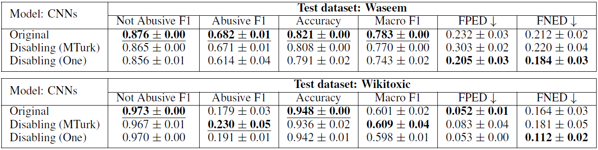

[*<< Back to the main page*](https://plkumjorn.github.io/FIND)

# Experiment 2: Waseem & Wikitoxic

## Basic information
- **Task**: Predicting whether a given text is abusive or non-abusive
- **Dataset**: Waseem
- **Classes**: Not abusive or Abusive
- **Train/Dev/Test examples**: 10144 / 3381 / 3382
- **Problem**: Previous work found that this dataset contains a strong negative bias against females. In other words, texts related to females are usually classified as abusive although the texts themselves are not abusive at all.
- **Out-of-domain test set**: Wikitoxic (18965 examples)
- For more details, please see section 6 in the paper.

## Word Clouds & Annotations

<b style="color:orange">Warning: The wordclouds may contain phrases in the training data which are offensive in nature.</b>

### Model 1: Waseem_CNN_20200507192504

<table><tbody><tr class="center-row"><td><b>Feature 0</b></td><td><b>Feature 1</b></td><td><b>Feature 2</b></td><td><b>Feature 3</b></td><td><b>Feature 4</b></td><td><b>Feature 5</b></td><td><b>Feature 6</b></td><td><b>Feature 7</b></td><td><b>Feature 8</b></td><td><b>Feature 9</b></td><td><b>Feature 10</b></td><td><b>Feature 11</b></td><td><b>Feature 12</b></td><td><b>Feature 13</b></td><td><b>Feature 14</b></td><td><b>Feature 15</b></td><td><b>Feature 16</b></td><td><b>Feature 17</b></td><td><b>Feature 18</b></td><td><b>Feature 19</b></td><td><b>Feature 20</b></td><td><b>Feature 21</b></td><td><b>Feature 22</b></td><td><b>Feature 23</b></td><td><b>Feature 24</b></td><td><b>Feature 25</b></td><td><b>Feature 26</b></td><td><b>Feature 27</b></td><td><b>Feature 28</b></td><td><b>Feature 29</b></td></tr><tr><td></td><td></td><td></td><td></td><td></td><td></td><td></td><td></td><td></td><td></td><td></td><td></td><td></td><td></td><td></td><td></td><td></td><td></td><td></td><td></td><td></td><td></td><td></td><td></td><td></td><td></td><td></td><td></td><td></td><td></td></tr><tr><td>&emsp;&emsp;<b>Model weights</b>:
&emsp;&emsp;&emsp;- Not abusive = -0.161
<b>&emsp;&emsp;&emsp;- Abusive = 0.184</b></td><td>&emsp;&emsp;<b>Model weights</b>:
<b>&emsp;&emsp;&emsp;- Not abusive = 0.416</b>
&emsp;&emsp;&emsp;- Abusive = 0.222</td><td>&emsp;&emsp;<b>Model weights</b>:
<b>&emsp;&emsp;&emsp;- Not abusive = 0.188</b>
&emsp;&emsp;&emsp;- Abusive = -0.045</td><td>&emsp;&emsp;<b>Model weights</b>:
<b>&emsp;&emsp;&emsp;- Not abusive = 0.463</b>
&emsp;&emsp;&emsp;- Abusive = -0.383</td><td>&emsp;&emsp;<b>Model weights</b>:
&emsp;&emsp;&emsp;- Not abusive = -0.373
<b>&emsp;&emsp;&emsp;- Abusive = -0.137</b></td><td>&emsp;&emsp;<b>Model weights</b>:
<b>&emsp;&emsp;&emsp;- Not abusive = 0.062</b>
&emsp;&emsp;&emsp;- Abusive = -0.115</td><td>&emsp;&emsp;<b>Model weights</b>:
<b>&emsp;&emsp;&emsp;- Not abusive = 0.425</b>
&emsp;&emsp;&emsp;- Abusive = -0.324</td><td>&emsp;&emsp;<b>Model weights</b>:
&emsp;&emsp;&emsp;- Not abusive = -0.416
<b>&emsp;&emsp;&emsp;- Abusive = 0.169</b></td><td>&emsp;&emsp;<b>Model weights</b>:
<b>&emsp;&emsp;&emsp;- Not abusive = 0.304</b>
&emsp;&emsp;&emsp;- Abusive = 0.020</td><td>&emsp;&emsp;<b>Model weights</b>:
&emsp;&emsp;&emsp;- Not abusive = -0.074
<b>&emsp;&emsp;&emsp;- Abusive = 0.155</b></td><td>&emsp;&emsp;<b>Model weights</b>:
&emsp;&emsp;&emsp;- Not abusive = -0.146
<b>&emsp;&emsp;&emsp;- Abusive = 0.318</b></td><td>&emsp;&emsp;<b>Model weights</b>:
&emsp;&emsp;&emsp;- Not abusive = -0.052
<b>&emsp;&emsp;&emsp;- Abusive = 0.198</b></td><td>&emsp;&emsp;<b>Model weights</b>:
&emsp;&emsp;&emsp;- Not abusive = -0.169
<b>&emsp;&emsp;&emsp;- Abusive = 0.209</b></td><td>&emsp;&emsp;<b>Model weights</b>:
<b>&emsp;&emsp;&emsp;- Not abusive = 0.119</b>
&emsp;&emsp;&emsp;- Abusive = -0.322</td><td>&emsp;&emsp;<b>Model weights</b>:
<b>&emsp;&emsp;&emsp;- Not abusive = -0.128</b>
&emsp;&emsp;&emsp;- Abusive = -0.311</td><td>&emsp;&emsp;<b>Model weights</b>:
&emsp;&emsp;&emsp;- Not abusive = 0.338
<b>&emsp;&emsp;&emsp;- Abusive = 0.481</b></td><td>&emsp;&emsp;<b>Model weights</b>:
&emsp;&emsp;&emsp;- Not abusive = -0.379
<b>&emsp;&emsp;&emsp;- Abusive = 0.113</b></td><td>&emsp;&emsp;<b>Model weights</b>:
<b>&emsp;&emsp;&emsp;- Not abusive = -0.222</b>
&emsp;&emsp;&emsp;- Abusive = -0.458</td><td>&emsp;&emsp;<b>Model weights</b>:
<b>&emsp;&emsp;&emsp;- Not abusive = 0.248</b>
&emsp;&emsp;&emsp;- Abusive = 0.091</td><td>&emsp;&emsp;<b>Model weights</b>:
&emsp;&emsp;&emsp;- Not abusive = -0.122
<b>&emsp;&emsp;&emsp;- Abusive = 0.404</b></td><td>&emsp;&emsp;<b>Model weights</b>:
<b>&emsp;&emsp;&emsp;- Not abusive = -0.125</b>
&emsp;&emsp;&emsp;- Abusive = -0.594</td><td>&emsp;&emsp;<b>Model weights</b>:
<b>&emsp;&emsp;&emsp;- Not abusive = 0.378</b>
&emsp;&emsp;&emsp;- Abusive = 0.027</td><td>&emsp;&emsp;<b>Model weights</b>:
&emsp;&emsp;&emsp;- Not abusive = -0.385
<b>&emsp;&emsp;&emsp;- Abusive = 0.463</b></td><td>&emsp;&emsp;<b>Model weights</b>:
&emsp;&emsp;&emsp;- Not abusive = 0.026
<b>&emsp;&emsp;&emsp;- Abusive = 0.413</b></td><td>&emsp;&emsp;<b>Model weights</b>:
&emsp;&emsp;&emsp;- Not abusive = 0.040
<b>&emsp;&emsp;&emsp;- Abusive = 0.429</b></td><td>&emsp;&emsp;<b>Model weights</b>:
<b>&emsp;&emsp;&emsp;- Not abusive = 0.269</b>
&emsp;&emsp;&emsp;- Abusive = -0.241</td><td>&emsp;&emsp;<b>Model weights</b>:
<b>&emsp;&emsp;&emsp;- Not abusive = 0.419</b>
&emsp;&emsp;&emsp;- Abusive = 0.211</td><td>&emsp;&emsp;<b>Model weights</b>:
<b>&emsp;&emsp;&emsp;- Not abusive = 0.546</b>
&emsp;&emsp;&emsp;- Abusive = -0.147</td><td>&emsp;&emsp;<b>Model weights</b>:
&emsp;&emsp;&emsp;- Not abusive = -0.338
<b>&emsp;&emsp;&emsp;- Abusive = 0.203</b></td><td>&emsp;&emsp;<b>Model weights</b>:
&emsp;&emsp;&emsp;- Not abusive = -0.392
<b>&emsp;&emsp;&emsp;- Abusive = -0.089</b></td></tr><tr><td><b>&emsp;&emsp;Human answers</b>:
&emsp;&emsp;&emsp;- Not abusive = 2
&emsp;&emsp;&emsp;- Abusive = 3
<b>&emsp;&emsp;&emsp;- It could be either = 5</b></td><td><b>&emsp;&emsp;Human answers</b>:
&emsp;&emsp;&emsp;- Not abusive = 3
&emsp;&emsp;&emsp;- Abusive = 2
<b>&emsp;&emsp;&emsp;- It could be either = 5</b></td><td><b>&emsp;&emsp;Human answers</b>:
&emsp;&emsp;&emsp;- Not abusive = 1
<b>&emsp;&emsp;&emsp;- Abusive = 7</b>
&emsp;&emsp;&emsp;- It could be either = 2</td><td><b>&emsp;&emsp;Human answers</b>:
<b>&emsp;&emsp;&emsp;- Not abusive = 5</b>
&emsp;&emsp;&emsp;- Abusive = 1
&emsp;&emsp;&emsp;- It could be either = 4</td><td><b>&emsp;&emsp;Human answers</b>:
&emsp;&emsp;&emsp;- Not abusive = 0
<b>&emsp;&emsp;&emsp;- Abusive = 8</b>
&emsp;&emsp;&emsp;- It could be either = 2</td><td><b>&emsp;&emsp;Human answers</b>:
&emsp;&emsp;&emsp;- Not abusive = 4
<b>&emsp;&emsp;&emsp;- Abusive = 5</b>
&emsp;&emsp;&emsp;- It could be either = 1</td><td><b>&emsp;&emsp;Human answers</b>:
&emsp;&emsp;&emsp;- Not abusive = 2
&emsp;&emsp;&emsp;- Abusive = 1
<b>&emsp;&emsp;&emsp;- It could be either = 7</b></td><td><b>&emsp;&emsp;Human answers</b>:
<b>&emsp;&emsp;&emsp;- Not abusive = 7</b>
&emsp;&emsp;&emsp;- Abusive = 1
&emsp;&emsp;&emsp;- It could be either = 2</td><td><b>&emsp;&emsp;Human answers</b>:
<b>&emsp;&emsp;&emsp;- Not abusive = 9</b>
&emsp;&emsp;&emsp;- Abusive = 0
&emsp;&emsp;&emsp;- It could be either = 1</td><td><b>&emsp;&emsp;Human answers</b>:
&emsp;&emsp;&emsp;- Not abusive = 0
<b>&emsp;&emsp;&emsp;- Abusive = 10</b>
&emsp;&emsp;&emsp;- It could be either = 0</td><td><b>&emsp;&emsp;Human answers</b>:
&emsp;&emsp;&emsp;- Not abusive = 0
<b>&emsp;&emsp;&emsp;- Abusive = 10</b>
&emsp;&emsp;&emsp;- It could be either = 0</td><td><b>&emsp;&emsp;Human answers</b>:
&emsp;&emsp;&emsp;- Not abusive = 1
&emsp;&emsp;&emsp;- Abusive = 2
<b>&emsp;&emsp;&emsp;- It could be either = 7</b></td><td><b>&emsp;&emsp;Human answers</b>:
&emsp;&emsp;&emsp;- Not abusive = 1
<b>&emsp;&emsp;&emsp;- Abusive = 9</b>
&emsp;&emsp;&emsp;- It could be either = 0</td><td><b>&emsp;&emsp;Human answers</b>:
<b>&emsp;&emsp;&emsp;- Not abusive = 7</b>
&emsp;&emsp;&emsp;- Abusive = 0
&emsp;&emsp;&emsp;- It could be either = 3</td><td><b>&emsp;&emsp;Human answers</b>:
<b>&emsp;&emsp;&emsp;- Not abusive = 5</b>
&emsp;&emsp;&emsp;- Abusive = 0
<b>&emsp;&emsp;&emsp;- It could be either = 5</b></td><td><b>&emsp;&emsp;Human answers</b>:
&emsp;&emsp;&emsp;- Not abusive = 4
&emsp;&emsp;&emsp;- Abusive = 0
<b>&emsp;&emsp;&emsp;- It could be either = 6</b></td><td><b>&emsp;&emsp;Human answers</b>:
&emsp;&emsp;&emsp;- Not abusive = 0
<b>&emsp;&emsp;&emsp;- Abusive = 10</b>
&emsp;&emsp;&emsp;- It could be either = 0</td><td><b>&emsp;&emsp;Human answers</b>:
&emsp;&emsp;&emsp;- Not abusive = 0
<b>&emsp;&emsp;&emsp;- Abusive = 7</b>
&emsp;&emsp;&emsp;- It could be either = 3</td><td><b>&emsp;&emsp;Human answers</b>:
&emsp;&emsp;&emsp;- Not abusive = 4
&emsp;&emsp;&emsp;- Abusive = 0
<b>&emsp;&emsp;&emsp;- It could be either = 6</b></td><td><b>&emsp;&emsp;Human answers</b>:
<b>&emsp;&emsp;&emsp;- Not abusive = 5</b>
&emsp;&emsp;&emsp;- Abusive = 3
&emsp;&emsp;&emsp;- It could be either = 2</td><td><b>&emsp;&emsp;Human answers</b>:
<b>&emsp;&emsp;&emsp;- Not abusive = 4</b>
&emsp;&emsp;&emsp;- Abusive = 3
&emsp;&emsp;&emsp;- It could be either = 3</td><td><b>&emsp;&emsp;Human answers</b>:
&emsp;&emsp;&emsp;- Not abusive = 3
&emsp;&emsp;&emsp;- Abusive = 1
<b>&emsp;&emsp;&emsp;- It could be either = 6</b></td><td><b>&emsp;&emsp;Human answers</b>:
&emsp;&emsp;&emsp;- Not abusive = 0
<b>&emsp;&emsp;&emsp;- Abusive = 8</b>
&emsp;&emsp;&emsp;- It could be either = 2</td><td><b>&emsp;&emsp;Human answers</b>:
&emsp;&emsp;&emsp;- Not abusive = 1
<b>&emsp;&emsp;&emsp;- Abusive = 9</b>
&emsp;&emsp;&emsp;- It could be either = 0</td><td><b>&emsp;&emsp;Human answers</b>:
&emsp;&emsp;&emsp;- Not abusive = 2
<b>&emsp;&emsp;&emsp;- Abusive = 5</b>
&emsp;&emsp;&emsp;- It could be either = 3</td><td><b>&emsp;&emsp;Human answers</b>:
&emsp;&emsp;&emsp;- Not abusive = 1
<b>&emsp;&emsp;&emsp;- Abusive = 8</b>
&emsp;&emsp;&emsp;- It could be either = 1</td><td><b>&emsp;&emsp;Human answers</b>:
&emsp;&emsp;&emsp;- Not abusive = 3
&emsp;&emsp;&emsp;- Abusive = 1
<b>&emsp;&emsp;&emsp;- It could be either = 6</b></td><td><b>&emsp;&emsp;Human answers</b>:
&emsp;&emsp;&emsp;- Not abusive = 1
&emsp;&emsp;&emsp;- Abusive = 4
<b>&emsp;&emsp;&emsp;- It could be either = 5</b></td><td><b>&emsp;&emsp;Human answers</b>:
&emsp;&emsp;&emsp;- Not abusive = 2
<b>&emsp;&emsp;&emsp;- Abusive = 8</b>
&emsp;&emsp;&emsp;- It could be either = 0</td><td><b>&emsp;&emsp;Human answers</b>:
&emsp;&emsp;&emsp;- Not abusive = 2
&emsp;&emsp;&emsp;- Abusive = 3
<b>&emsp;&emsp;&emsp;- It could be either = 5</b></td></tr><tr><td>&emsp;&emsp;<b>Decision:</b>
&emsp;&emsp;&emsp;<b style="color:red">- MTurk: Disabled</b>
&emsp;&emsp;&emsp;<b style="color:red">- One: Disabled</b></td><td>&emsp;&emsp;<b>Decision:</b>
&emsp;&emsp;&emsp;<b style="color:red">- MTurk: Disabled</b>
&emsp;&emsp;&emsp;<b style="color:red">- One: Disabled</b></td><td>&emsp;&emsp;<b>Decision:</b>
&emsp;&emsp;&emsp;<b style="color:red">- MTurk: Disabled</b>
&emsp;&emsp;&emsp;<b style="color:green">- One: Enabled</b></td><td>&emsp;&emsp;<b>Decision:</b>
&emsp;&emsp;&emsp;<b style="color:green">- MTurk: Enabled</b>
&emsp;&emsp;&emsp;<b style="color:green">- One: Enabled</b></td><td>&emsp;&emsp;<b>Decision:</b>
&emsp;&emsp;&emsp;<b style="color:green">- MTurk: Enabled</b>
&emsp;&emsp;&emsp;<b style="color:green">- One: Enabled</b></td><td>&emsp;&emsp;<b>Decision:</b>
&emsp;&emsp;&emsp;<b style="color:red">- MTurk: Disabled</b>
&emsp;&emsp;&emsp;<b style="color:green">- One: Enabled</b></td><td>&emsp;&emsp;<b>Decision:</b>
&emsp;&emsp;&emsp;<b style="color:red">- MTurk: Disabled</b>
&emsp;&emsp;&emsp;<b style="color:red">- One: Disabled</b></td><td>&emsp;&emsp;<b>Decision:</b>
&emsp;&emsp;&emsp;<b style="color:red">- MTurk: Disabled</b>
&emsp;&emsp;&emsp;<b style="color:red">- One: Disabled</b></td><td>&emsp;&emsp;<b>Decision:</b>
&emsp;&emsp;&emsp;<b style="color:green">- MTurk: Enabled</b>
&emsp;&emsp;&emsp;<b style="color:green">- One: Enabled</b></td><td>&emsp;&emsp;<b>Decision:</b>
&emsp;&emsp;&emsp;<b style="color:green">- MTurk: Enabled</b>
&emsp;&emsp;&emsp;<b style="color:green">- One: Enabled</b></td><td>&emsp;&emsp;<b>Decision:</b>
&emsp;&emsp;&emsp;<b style="color:green">- MTurk: Enabled</b>
&emsp;&emsp;&emsp;<b style="color:red">- One: Disabled</b></td><td>&emsp;&emsp;<b>Decision:</b>
&emsp;&emsp;&emsp;<b style="color:red">- MTurk: Disabled</b>
&emsp;&emsp;&emsp;<b style="color:red">- One: Disabled</b></td><td>&emsp;&emsp;<b>Decision:</b>
&emsp;&emsp;&emsp;<b style="color:green">- MTurk: Enabled</b>
&emsp;&emsp;&emsp;<b style="color:green">- One: Enabled</b></td><td>&emsp;&emsp;<b>Decision:</b>
&emsp;&emsp;&emsp;<b style="color:green">- MTurk: Enabled</b>
&emsp;&emsp;&emsp;<b style="color:green">- One: Enabled</b></td><td>&emsp;&emsp;<b>Decision:</b>
&emsp;&emsp;&emsp;<b style="color:red">- MTurk: Disabled</b>
&emsp;&emsp;&emsp;<b style="color:green">- One: Enabled</b></td><td>&emsp;&emsp;<b>Decision:</b>
&emsp;&emsp;&emsp;<b style="color:red">- MTurk: Disabled</b>
&emsp;&emsp;&emsp;<b style="color:red">- One: Disabled</b></td><td>&emsp;&emsp;<b>Decision:</b>
&emsp;&emsp;&emsp;<b style="color:green">- MTurk: Enabled</b>
&emsp;&emsp;&emsp;<b style="color:red">- One: Disabled</b></td><td>&emsp;&emsp;<b>Decision:</b>
&emsp;&emsp;&emsp;<b style="color:red">- MTurk: Disabled</b>
&emsp;&emsp;&emsp;<b style="color:green">- One: Enabled</b></td><td>&emsp;&emsp;<b>Decision:</b>
&emsp;&emsp;&emsp;<b style="color:red">- MTurk: Disabled</b>
&emsp;&emsp;&emsp;<b style="color:red">- One: Disabled</b></td><td>&emsp;&emsp;<b>Decision:</b>
&emsp;&emsp;&emsp;<b style="color:red">- MTurk: Disabled</b>
&emsp;&emsp;&emsp;<b style="color:red">- One: Disabled</b></td><td>&emsp;&emsp;<b>Decision:</b>
&emsp;&emsp;&emsp;<b style="color:green">- MTurk: Enabled</b>
&emsp;&emsp;&emsp;<b style="color:green">- One: Enabled</b></td><td>&emsp;&emsp;<b>Decision:</b>
&emsp;&emsp;&emsp;<b style="color:red">- MTurk: Disabled</b>
&emsp;&emsp;&emsp;<b style="color:green">- One: Enabled</b></td><td>&emsp;&emsp;<b>Decision:</b>
&emsp;&emsp;&emsp;<b style="color:green">- MTurk: Enabled</b>
&emsp;&emsp;&emsp;<b style="color:green">- One: Enabled</b></td><td>&emsp;&emsp;<b>Decision:</b>
&emsp;&emsp;&emsp;<b style="color:green">- MTurk: Enabled</b>
&emsp;&emsp;&emsp;<b style="color:red">- One: Disabled</b></td><td>&emsp;&emsp;<b>Decision:</b>
&emsp;&emsp;&emsp;<b style="color:green">- MTurk: Enabled</b>
&emsp;&emsp;&emsp;<b style="color:red">- One: Disabled</b></td><td>&emsp;&emsp;<b>Decision:</b>
&emsp;&emsp;&emsp;<b style="color:red">- MTurk: Disabled</b>
&emsp;&emsp;&emsp;<b style="color:red">- One: Disabled</b></td><td>&emsp;&emsp;<b>Decision:</b>
&emsp;&emsp;&emsp;<b style="color:red">- MTurk: Disabled</b>
&emsp;&emsp;&emsp;<b style="color:red">- One: Disabled</b></td><td>&emsp;&emsp;<b>Decision:</b>
&emsp;&emsp;&emsp;<b style="color:red">- MTurk: Disabled</b>
&emsp;&emsp;&emsp;<b style="color:green">- One: Enabled</b></td><td>&emsp;&emsp;<b>Decision:</b>
&emsp;&emsp;&emsp;<b style="color:green">- MTurk: Enabled</b>
&emsp;&emsp;&emsp;<b style="color:red">- One: Disabled</b></td><td>&emsp;&emsp;<b>Decision:</b>
&emsp;&emsp;&emsp;<b style="color:red">- MTurk: Disabled</b>
&emsp;&emsp;&emsp;<b style="color:red">- One: Disabled</b></td></tr></tbody></table>

### Model 2: Waseem_CNN_20200507194756

<table><tbody><tr class="center-row"><td><b>Feature 0</b></td><td><b>Feature 1</b></td><td><b>Feature 2</b></td><td><b>Feature 3</b></td><td><b>Feature 4</b></td><td><b>Feature 5</b></td><td><b>Feature 6</b></td><td><b>Feature 7</b></td><td><b>Feature 8</b></td><td><b>Feature 9</b></td><td><b>Feature 10</b></td><td><b>Feature 11</b></td><td><b>Feature 12</b></td><td><b>Feature 13</b></td><td><b>Feature 14</b></td><td><b>Feature 15</b></td><td><b>Feature 16</b></td><td><b>Feature 17</b></td><td><b>Feature 18</b></td><td><b>Feature 19</b></td><td><b>Feature 20</b></td><td><b>Feature 21</b></td><td><b>Feature 22</b></td><td><b>Feature 23</b></td><td><b>Feature 24</b></td><td><b>Feature 25</b></td><td><b>Feature 26</b></td><td><b>Feature 27</b></td><td><b>Feature 28</b></td><td><b>Feature 29</b></td></tr><tr><td></td><td></td><td></td><td></td><td></td><td></td><td></td><td></td><td></td><td></td><td></td><td></td><td></td><td></td><td></td><td></td><td></td><td></td><td></td><td></td><td></td><td></td><td></td><td></td><td></td><td></td><td></td><td></td><td></td><td></td></tr><tr><td>&emsp;&emsp;<b>Model weights</b>:
<b>&emsp;&emsp;&emsp;- Not abusive = 0.304</b>
&emsp;&emsp;&emsp;- Abusive = 0.046</td><td>&emsp;&emsp;<b>Model weights</b>:
<b>&emsp;&emsp;&emsp;- Not abusive = 0.095</b>
&emsp;&emsp;&emsp;- Abusive = -0.401</td><td>&emsp;&emsp;<b>Model weights</b>:
&emsp;&emsp;&emsp;- Not abusive = 0.177
<b>&emsp;&emsp;&emsp;- Abusive = 0.402</b></td><td>&emsp;&emsp;<b>Model weights</b>:
&emsp;&emsp;&emsp;- Not abusive = -0.417
<b>&emsp;&emsp;&emsp;- Abusive = -0.014</b></td><td>&emsp;&emsp;<b>Model weights</b>:
&emsp;&emsp;&emsp;- Not abusive = -0.201
<b>&emsp;&emsp;&emsp;- Abusive = 0.143</b></td><td>&emsp;&emsp;<b>Model weights</b>:
<b>&emsp;&emsp;&emsp;- Not abusive = 0.367</b>
&emsp;&emsp;&emsp;- Abusive = -0.091</td><td>&emsp;&emsp;<b>Model weights</b>:
&emsp;&emsp;&emsp;- Not abusive = -0.239
<b>&emsp;&emsp;&emsp;- Abusive = -0.091</b></td><td>&emsp;&emsp;<b>Model weights</b>:
<b>&emsp;&emsp;&emsp;- Not abusive = 0.293</b>
&emsp;&emsp;&emsp;- Abusive = -0.172</td><td>&emsp;&emsp;<b>Model weights</b>:
<b>&emsp;&emsp;&emsp;- Not abusive = 0.488</b>
&emsp;&emsp;&emsp;- Abusive = 0.094</td><td>&emsp;&emsp;<b>Model weights</b>:
<b>&emsp;&emsp;&emsp;- Not abusive = 0.091</b>
&emsp;&emsp;&emsp;- Abusive = -0.247</td><td>&emsp;&emsp;<b>Model weights</b>:
&emsp;&emsp;&emsp;- Not abusive = -0.336
<b>&emsp;&emsp;&emsp;- Abusive = 0.129</b></td><td>&emsp;&emsp;<b>Model weights</b>:
&emsp;&emsp;&emsp;- Not abusive = -0.001
<b>&emsp;&emsp;&emsp;- Abusive = 0.379</b></td><td>&emsp;&emsp;<b>Model weights</b>:
<b>&emsp;&emsp;&emsp;- Not abusive = 0.441</b>
&emsp;&emsp;&emsp;- Abusive = 0.037</td><td>&emsp;&emsp;<b>Model weights</b>:
<b>&emsp;&emsp;&emsp;- Not abusive = 0.486</b>
&emsp;&emsp;&emsp;- Abusive = 0.272</td><td>&emsp;&emsp;<b>Model weights</b>:
&emsp;&emsp;&emsp;- Not abusive = -0.088
<b>&emsp;&emsp;&emsp;- Abusive = 0.347</b></td><td>&emsp;&emsp;<b>Model weights</b>:
&emsp;&emsp;&emsp;- Not abusive = 0.206
<b>&emsp;&emsp;&emsp;- Abusive = 0.447</b></td><td>&emsp;&emsp;<b>Model weights</b>:
&emsp;&emsp;&emsp;- Not abusive = -0.359
<b>&emsp;&emsp;&emsp;- Abusive = -0.108</b></td><td>&emsp;&emsp;<b>Model weights</b>:
<b>&emsp;&emsp;&emsp;- Not abusive = 0.209</b>
&emsp;&emsp;&emsp;- Abusive = -0.353</td><td>&emsp;&emsp;<b>Model weights</b>:
&emsp;&emsp;&emsp;- Not abusive = -0.112
<b>&emsp;&emsp;&emsp;- Abusive = 0.339</b></td><td>&emsp;&emsp;<b>Model weights</b>:
<b>&emsp;&emsp;&emsp;- Not abusive = 0.409</b>
&emsp;&emsp;&emsp;- Abusive = -0.378</td><td>&emsp;&emsp;<b>Model weights</b>:
&emsp;&emsp;&emsp;- Not abusive = 0.048
<b>&emsp;&emsp;&emsp;- Abusive = 0.488</b></td><td>&emsp;&emsp;<b>Model weights</b>:
<b>&emsp;&emsp;&emsp;- Not abusive = 0.344</b>
&emsp;&emsp;&emsp;- Abusive = -0.335</td><td>&emsp;&emsp;<b>Model weights</b>:
&emsp;&emsp;&emsp;- Not abusive = -0.052
<b>&emsp;&emsp;&emsp;- Abusive = 0.235</b></td><td>&emsp;&emsp;<b>Model weights</b>:
<b>&emsp;&emsp;&emsp;- Not abusive = 0.021</b>
&emsp;&emsp;&emsp;- Abusive = -0.317</td><td>&emsp;&emsp;<b>Model weights</b>:
&emsp;&emsp;&emsp;- Not abusive = 0.079
<b>&emsp;&emsp;&emsp;- Abusive = 0.329</b></td><td>&emsp;&emsp;<b>Model weights</b>:
&emsp;&emsp;&emsp;- Not abusive = -0.113
<b>&emsp;&emsp;&emsp;- Abusive = 0.194</b></td><td>&emsp;&emsp;<b>Model weights</b>:
&emsp;&emsp;&emsp;- Not abusive = 0.064
<b>&emsp;&emsp;&emsp;- Abusive = 0.309</b></td><td>&emsp;&emsp;<b>Model weights</b>:
<b>&emsp;&emsp;&emsp;- Not abusive = 0.403</b>
&emsp;&emsp;&emsp;- Abusive = -0.283</td><td>&emsp;&emsp;<b>Model weights</b>:
&emsp;&emsp;&emsp;- Not abusive = -0.139
<b>&emsp;&emsp;&emsp;- Abusive = 0.063</b></td><td>&emsp;&emsp;<b>Model weights</b>:
&emsp;&emsp;&emsp;- Not abusive = -0.447
<b>&emsp;&emsp;&emsp;- Abusive = 0.205</b></td></tr><tr><td><b>&emsp;&emsp;Human answers</b>:
<b>&emsp;&emsp;&emsp;- Not abusive = 9</b>
&emsp;&emsp;&emsp;- Abusive = 1
&emsp;&emsp;&emsp;- It could be either = 0</td><td><b>&emsp;&emsp;Human answers</b>:
&emsp;&emsp;&emsp;- Not abusive = 4
<b>&emsp;&emsp;&emsp;- Abusive = 5</b>
&emsp;&emsp;&emsp;- It could be either = 1</td><td><b>&emsp;&emsp;Human answers</b>:
&emsp;&emsp;&emsp;- Not abusive = 2
<b>&emsp;&emsp;&emsp;- Abusive = 8</b>
&emsp;&emsp;&emsp;- It could be either = 0</td><td><b>&emsp;&emsp;Human answers</b>:
&emsp;&emsp;&emsp;- Not abusive = 3
<b>&emsp;&emsp;&emsp;- Abusive = 6</b>
&emsp;&emsp;&emsp;- It could be either = 1</td><td><b>&emsp;&emsp;Human answers</b>:
&emsp;&emsp;&emsp;- Not abusive = 0
<b>&emsp;&emsp;&emsp;- Abusive = 10</b>
&emsp;&emsp;&emsp;- It could be either = 0</td><td><b>&emsp;&emsp;Human answers</b>:
&emsp;&emsp;&emsp;- Not abusive = 3
&emsp;&emsp;&emsp;- Abusive = 1
<b>&emsp;&emsp;&emsp;- It could be either = 6</b></td><td><b>&emsp;&emsp;Human answers</b>:
&emsp;&emsp;&emsp;- Not abusive = 0
<b>&emsp;&emsp;&emsp;- Abusive = 10</b>
&emsp;&emsp;&emsp;- It could be either = 0</td><td><b>&emsp;&emsp;Human answers</b>:
&emsp;&emsp;&emsp;- Not abusive = 1
<b>&emsp;&emsp;&emsp;- Abusive = 8</b>
&emsp;&emsp;&emsp;- It could be either = 1</td><td><b>&emsp;&emsp;Human answers</b>:
<b>&emsp;&emsp;&emsp;- Not abusive = 6</b>
&emsp;&emsp;&emsp;- Abusive = 3
&emsp;&emsp;&emsp;- It could be either = 1</td><td><b>&emsp;&emsp;Human answers</b>:
<b>&emsp;&emsp;&emsp;- Not abusive = 8</b>
&emsp;&emsp;&emsp;- Abusive = 0
&emsp;&emsp;&emsp;- It could be either = 2</td><td><b>&emsp;&emsp;Human answers</b>:
&emsp;&emsp;&emsp;- Not abusive = 1
<b>&emsp;&emsp;&emsp;- Abusive = 9</b>
&emsp;&emsp;&emsp;- It could be either = 0</td><td><b>&emsp;&emsp;Human answers</b>:
<b>&emsp;&emsp;&emsp;- Not abusive = 5</b>
&emsp;&emsp;&emsp;- Abusive = 4
&emsp;&emsp;&emsp;- It could be either = 1</td><td><b>&emsp;&emsp;Human answers</b>:
&emsp;&emsp;&emsp;- Not abusive = 3
&emsp;&emsp;&emsp;- Abusive = 3
<b>&emsp;&emsp;&emsp;- It could be either = 4</b></td><td><b>&emsp;&emsp;Human answers</b>:
<b>&emsp;&emsp;&emsp;- Not abusive = 8</b>
&emsp;&emsp;&emsp;- Abusive = 1
&emsp;&emsp;&emsp;- It could be either = 1</td><td><b>&emsp;&emsp;Human answers</b>:
<b>&emsp;&emsp;&emsp;- Not abusive = 9</b>
&emsp;&emsp;&emsp;- Abusive = 0
&emsp;&emsp;&emsp;- It could be either = 1</td><td><b>&emsp;&emsp;Human answers</b>:
&emsp;&emsp;&emsp;- Not abusive = 3
&emsp;&emsp;&emsp;- Abusive = 3
<b>&emsp;&emsp;&emsp;- It could be either = 4</b></td><td><b>&emsp;&emsp;Human answers</b>:
&emsp;&emsp;&emsp;- Not abusive = 3
&emsp;&emsp;&emsp;- Abusive = 2
<b>&emsp;&emsp;&emsp;- It could be either = 5</b></td><td><b>&emsp;&emsp;Human answers</b>:
<b>&emsp;&emsp;&emsp;- Not abusive = 6</b>
&emsp;&emsp;&emsp;- Abusive = 3
&emsp;&emsp;&emsp;- It could be either = 1</td><td><b>&emsp;&emsp;Human answers</b>:
<b>&emsp;&emsp;&emsp;- Not abusive = 7</b>
&emsp;&emsp;&emsp;- Abusive = 1
&emsp;&emsp;&emsp;- It could be either = 2</td><td><b>&emsp;&emsp;Human answers</b>:
<b>&emsp;&emsp;&emsp;- Not abusive = 4</b>
&emsp;&emsp;&emsp;- Abusive = 3
&emsp;&emsp;&emsp;- It could be either = 3</td><td><b>&emsp;&emsp;Human answers</b>:
&emsp;&emsp;&emsp;- Not abusive = 4
<b>&emsp;&emsp;&emsp;- Abusive = 5</b>
&emsp;&emsp;&emsp;- It could be either = 1</td><td><b>&emsp;&emsp;Human answers</b>:
<b>&emsp;&emsp;&emsp;- Not abusive = 6</b>
&emsp;&emsp;&emsp;- Abusive = 2
&emsp;&emsp;&emsp;- It could be either = 2</td><td><b>&emsp;&emsp;Human answers</b>:
&emsp;&emsp;&emsp;- Not abusive = 1
<b>&emsp;&emsp;&emsp;- Abusive = 7</b>
&emsp;&emsp;&emsp;- It could be either = 2</td><td><b>&emsp;&emsp;Human answers</b>:
<b>&emsp;&emsp;&emsp;- Not abusive = 7</b>
&emsp;&emsp;&emsp;- Abusive = 0
&emsp;&emsp;&emsp;- It could be either = 3</td><td><b>&emsp;&emsp;Human answers</b>:
&emsp;&emsp;&emsp;- Not abusive = 0
<b>&emsp;&emsp;&emsp;- Abusive = 10</b>
&emsp;&emsp;&emsp;- It could be either = 0</td><td><b>&emsp;&emsp;Human answers</b>:
&emsp;&emsp;&emsp;- Not abusive = 1
<b>&emsp;&emsp;&emsp;- Abusive = 8</b>
&emsp;&emsp;&emsp;- It could be either = 1</td><td><b>&emsp;&emsp;Human answers</b>:
&emsp;&emsp;&emsp;- Not abusive = 0
<b>&emsp;&emsp;&emsp;- Abusive = 10</b>
&emsp;&emsp;&emsp;- It could be either = 0</td><td><b>&emsp;&emsp;Human answers</b>:
<b>&emsp;&emsp;&emsp;- Not abusive = 7</b>
&emsp;&emsp;&emsp;- Abusive = 0
&emsp;&emsp;&emsp;- It could be either = 3</td><td><b>&emsp;&emsp;Human answers</b>:
&emsp;&emsp;&emsp;- Not abusive = 4
<b>&emsp;&emsp;&emsp;- Abusive = 6</b>
&emsp;&emsp;&emsp;- It could be either = 0</td><td><b>&emsp;&emsp;Human answers</b>:
&emsp;&emsp;&emsp;- Not abusive = 0
<b>&emsp;&emsp;&emsp;- Abusive = 10</b>
&emsp;&emsp;&emsp;- It could be either = 0</td></tr><tr><td>&emsp;&emsp;<b>Decision:</b>
&emsp;&emsp;&emsp;<b style="color:green">- MTurk: Enabled</b>
&emsp;&emsp;&emsp;<b style="color:green">- One: Enabled</b></td><td>&emsp;&emsp;<b>Decision:</b>
&emsp;&emsp;&emsp;<b style="color:red">- MTurk: Disabled</b>
&emsp;&emsp;&emsp;<b style="color:green">- One: Enabled</b></td><td>&emsp;&emsp;<b>Decision:</b>
&emsp;&emsp;&emsp;<b style="color:green">- MTurk: Enabled</b>
&emsp;&emsp;&emsp;<b style="color:red">- One: Disabled</b></td><td>&emsp;&emsp;<b>Decision:</b>
&emsp;&emsp;&emsp;<b style="color:green">- MTurk: Enabled</b>
&emsp;&emsp;&emsp;<b style="color:red">- One: Disabled</b></td><td>&emsp;&emsp;<b>Decision:</b>
&emsp;&emsp;&emsp;<b style="color:green">- MTurk: Enabled</b>
&emsp;&emsp;&emsp;<b style="color:green">- One: Enabled</b></td><td>&emsp;&emsp;<b>Decision:</b>
&emsp;&emsp;&emsp;<b style="color:red">- MTurk: Disabled</b>
&emsp;&emsp;&emsp;<b style="color:red">- One: Disabled</b></td><td>&emsp;&emsp;<b>Decision:</b>
&emsp;&emsp;&emsp;<b style="color:green">- MTurk: Enabled</b>
&emsp;&emsp;&emsp;<b style="color:red">- One: Disabled</b></td><td>&emsp;&emsp;<b>Decision:</b>
&emsp;&emsp;&emsp;<b style="color:red">- MTurk: Disabled</b>
&emsp;&emsp;&emsp;<b style="color:red">- One: Disabled</b></td><td>&emsp;&emsp;<b>Decision:</b>
&emsp;&emsp;&emsp;<b style="color:green">- MTurk: Enabled</b>
&emsp;&emsp;&emsp;<b style="color:green">- One: Enabled</b></td><td>&emsp;&emsp;<b>Decision:</b>
&emsp;&emsp;&emsp;<b style="color:green">- MTurk: Enabled</b>
&emsp;&emsp;&emsp;<b style="color:green">- One: Enabled</b></td><td>&emsp;&emsp;<b>Decision:</b>
&emsp;&emsp;&emsp;<b style="color:green">- MTurk: Enabled</b>
&emsp;&emsp;&emsp;<b style="color:green">- One: Enabled</b></td><td>&emsp;&emsp;<b>Decision:</b>
&emsp;&emsp;&emsp;<b style="color:red">- MTurk: Disabled</b>
&emsp;&emsp;&emsp;<b style="color:green">- One: Enabled</b></td><td>&emsp;&emsp;<b>Decision:</b>
&emsp;&emsp;&emsp;<b style="color:red">- MTurk: Disabled</b>
&emsp;&emsp;&emsp;<b style="color:red">- One: Disabled</b></td><td>&emsp;&emsp;<b>Decision:</b>
&emsp;&emsp;&emsp;<b style="color:green">- MTurk: Enabled</b>
&emsp;&emsp;&emsp;<b style="color:red">- One: Disabled</b></td><td>&emsp;&emsp;<b>Decision:</b>
&emsp;&emsp;&emsp;<b style="color:red">- MTurk: Disabled</b>
&emsp;&emsp;&emsp;<b style="color:red">- One: Disabled</b></td><td>&emsp;&emsp;<b>Decision:</b>
&emsp;&emsp;&emsp;<b style="color:red">- MTurk: Disabled</b>
&emsp;&emsp;&emsp;<b style="color:red">- One: Disabled</b></td><td>&emsp;&emsp;<b>Decision:</b>
&emsp;&emsp;&emsp;<b style="color:red">- MTurk: Disabled</b>
&emsp;&emsp;&emsp;<b style="color:red">- One: Disabled</b></td><td>&emsp;&emsp;<b>Decision:</b>
&emsp;&emsp;&emsp;<b style="color:green">- MTurk: Enabled</b>
&emsp;&emsp;&emsp;<b style="color:green">- One: Enabled</b></td><td>&emsp;&emsp;<b>Decision:</b>
&emsp;&emsp;&emsp;<b style="color:red">- MTurk: Disabled</b>
&emsp;&emsp;&emsp;<b style="color:red">- One: Disabled</b></td><td>&emsp;&emsp;<b>Decision:</b>
&emsp;&emsp;&emsp;<b style="color:green">- MTurk: Enabled</b>
&emsp;&emsp;&emsp;<b style="color:red">- One: Disabled</b></td><td>&emsp;&emsp;<b>Decision:</b>
&emsp;&emsp;&emsp;<b style="color:green">- MTurk: Enabled</b>
&emsp;&emsp;&emsp;<b style="color:green">- One: Enabled</b></td><td>&emsp;&emsp;<b>Decision:</b>
&emsp;&emsp;&emsp;<b style="color:green">- MTurk: Enabled</b>
&emsp;&emsp;&emsp;<b style="color:red">- One: Disabled</b></td><td>&emsp;&emsp;<b>Decision:</b>
&emsp;&emsp;&emsp;<b style="color:green">- MTurk: Enabled</b>
&emsp;&emsp;&emsp;<b style="color:green">- One: Enabled</b></td><td>&emsp;&emsp;<b>Decision:</b>
&emsp;&emsp;&emsp;<b style="color:green">- MTurk: Enabled</b>
&emsp;&emsp;&emsp;<b style="color:green">- One: Enabled</b></td><td>&emsp;&emsp;<b>Decision:</b>
&emsp;&emsp;&emsp;<b style="color:green">- MTurk: Enabled</b>
&emsp;&emsp;&emsp;<b style="color:green">- One: Enabled</b></td><td>&emsp;&emsp;<b>Decision:</b>
&emsp;&emsp;&emsp;<b style="color:green">- MTurk: Enabled</b>
&emsp;&emsp;&emsp;<b style="color:red">- One: Disabled</b></td><td>&emsp;&emsp;<b>Decision:</b>
&emsp;&emsp;&emsp;<b style="color:green">- MTurk: Enabled</b>
&emsp;&emsp;&emsp;<b style="color:red">- One: Disabled</b></td><td>&emsp;&emsp;<b>Decision:</b>
&emsp;&emsp;&emsp;<b style="color:green">- MTurk: Enabled</b>
&emsp;&emsp;&emsp;<b style="color:green">- One: Enabled</b></td><td>&emsp;&emsp;<b>Decision:</b>
&emsp;&emsp;&emsp;<b style="color:green">- MTurk: Enabled</b>
&emsp;&emsp;&emsp;<b style="color:green">- One: Enabled</b></td><td>&emsp;&emsp;<b>Decision:</b>
&emsp;&emsp;&emsp;<b style="color:green">- MTurk: Enabled</b>
&emsp;&emsp;&emsp;<b style="color:red">- One: Disabled</b></td></tr></tbody></table>

### Model 3: Waseem_CNN_20200507202103

<table><tbody><tr class="center-row"><td><b>Feature 0</b></td><td><b>Feature 1</b></td><td><b>Feature 2</b></td><td><b>Feature 3</b></td><td><b>Feature 4</b></td><td><b>Feature 5</b></td><td><b>Feature 6</b></td><td><b>Feature 7</b></td><td><b>Feature 8</b></td><td><b>Feature 9</b></td><td><b>Feature 10</b></td><td><b>Feature 11</b></td><td><b>Feature 12</b></td><td><b>Feature 13</b></td><td><b>Feature 14</b></td><td><b>Feature 15</b></td><td><b>Feature 16</b></td><td><b>Feature 17</b></td><td><b>Feature 18</b></td><td><b>Feature 19</b></td><td><b>Feature 20</b></td><td><b>Feature 21</b></td><td><b>Feature 22</b></td><td><b>Feature 23</b></td><td><b>Feature 24</b></td><td><b>Feature 25</b></td><td><b>Feature 26</b></td><td><b>Feature 27</b></td><td><b>Feature 28</b></td><td><b>Feature 29</b></td></tr><tr><td></td><td></td><td></td><td></td><td></td><td></td><td></td><td></td><td></td><td></td><td></td><td></td><td></td><td></td><td></td><td></td><td></td><td></td><td></td><td></td><td></td><td></td><td></td><td></td><td></td><td></td><td></td><td></td><td></td><td></td></tr><tr><td>&emsp;&emsp;<b>Model weights</b>:
<b>&emsp;&emsp;&emsp;- Not abusive = 0.295</b>
&emsp;&emsp;&emsp;- Abusive = 0.048</td><td>&emsp;&emsp;<b>Model weights</b>:
<b>&emsp;&emsp;&emsp;- Not abusive = 0.576</b>
&emsp;&emsp;&emsp;- Abusive = 0.214</td><td>&emsp;&emsp;<b>Model weights</b>:
<b>&emsp;&emsp;&emsp;- Not abusive = 0.381</b>
&emsp;&emsp;&emsp;- Abusive = -0.132</td><td>&emsp;&emsp;<b>Model weights</b>:
&emsp;&emsp;&emsp;- Not abusive = -0.462
<b>&emsp;&emsp;&emsp;- Abusive = -0.104</b></td><td>&emsp;&emsp;<b>Model weights</b>:
<b>&emsp;&emsp;&emsp;- Not abusive = 0.081</b>
&emsp;&emsp;&emsp;- Abusive = -0.171</td><td>&emsp;&emsp;<b>Model weights</b>:
&emsp;&emsp;&emsp;- Not abusive = -0.263
<b>&emsp;&emsp;&emsp;- Abusive = 0.024</b></td><td>&emsp;&emsp;<b>Model weights</b>:
&emsp;&emsp;&emsp;- Not abusive = -0.173
<b>&emsp;&emsp;&emsp;- Abusive = 0.138</b></td><td>&emsp;&emsp;<b>Model weights</b>:
&emsp;&emsp;&emsp;- Not abusive = -0.210
<b>&emsp;&emsp;&emsp;- Abusive = 0.140</b></td><td>&emsp;&emsp;<b>Model weights</b>:
<b>&emsp;&emsp;&emsp;- Not abusive = 0.121</b>
&emsp;&emsp;&emsp;- Abusive = -0.058</td><td>&emsp;&emsp;<b>Model weights</b>:
&emsp;&emsp;&emsp;- Not abusive = 0.082
<b>&emsp;&emsp;&emsp;- Abusive = 0.378</b></td><td>&emsp;&emsp;<b>Model weights</b>:
&emsp;&emsp;&emsp;- Not abusive = -0.129
<b>&emsp;&emsp;&emsp;- Abusive = 0.497</b></td><td>&emsp;&emsp;<b>Model weights</b>:
<b>&emsp;&emsp;&emsp;- Not abusive = 0.478</b>
&emsp;&emsp;&emsp;- Abusive = 0.286</td><td>&emsp;&emsp;<b>Model weights</b>:
<b>&emsp;&emsp;&emsp;- Not abusive = 0.438</b>
&emsp;&emsp;&emsp;- Abusive = -0.240</td><td>&emsp;&emsp;<b>Model weights</b>:
<b>&emsp;&emsp;&emsp;- Not abusive = 0.053</b>
&emsp;&emsp;&emsp;- Abusive = -0.270</td><td>&emsp;&emsp;<b>Model weights</b>:
<b>&emsp;&emsp;&emsp;- Not abusive = 0.367</b>
&emsp;&emsp;&emsp;- Abusive = -0.199</td><td>&emsp;&emsp;<b>Model weights</b>:
&emsp;&emsp;&emsp;- Not abusive = -0.213
<b>&emsp;&emsp;&emsp;- Abusive = 0.078</b></td><td>&emsp;&emsp;<b>Model weights</b>:
<b>&emsp;&emsp;&emsp;- Not abusive = 0.046</b>
&emsp;&emsp;&emsp;- Abusive = -0.310</td><td>&emsp;&emsp;<b>Model weights</b>:
<b>&emsp;&emsp;&emsp;- Not abusive = 0.267</b>
&emsp;&emsp;&emsp;- Abusive = 0.006</td><td>&emsp;&emsp;<b>Model weights</b>:
&emsp;&emsp;&emsp;- Not abusive = 0.080
<b>&emsp;&emsp;&emsp;- Abusive = 0.346</b></td><td>&emsp;&emsp;<b>Model weights</b>:
&emsp;&emsp;&emsp;- Not abusive = -0.342
<b>&emsp;&emsp;&emsp;- Abusive = -0.101</b></td><td>&emsp;&emsp;<b>Model weights</b>:
<b>&emsp;&emsp;&emsp;- Not abusive = 0.236</b>
&emsp;&emsp;&emsp;- Abusive = -0.392</td><td>&emsp;&emsp;<b>Model weights</b>:
<b>&emsp;&emsp;&emsp;- Not abusive = 0.317</b>
&emsp;&emsp;&emsp;- Abusive = -0.116</td><td>&emsp;&emsp;<b>Model weights</b>:
&emsp;&emsp;&emsp;- Not abusive = -0.236
<b>&emsp;&emsp;&emsp;- Abusive = 0.302</b></td><td>&emsp;&emsp;<b>Model weights</b>:
&emsp;&emsp;&emsp;- Not abusive = -0.345
<b>&emsp;&emsp;&emsp;- Abusive = 0.065</b></td><td>&emsp;&emsp;<b>Model weights</b>:
&emsp;&emsp;&emsp;- Not abusive = -0.463
<b>&emsp;&emsp;&emsp;- Abusive = -0.203</b></td><td>&emsp;&emsp;<b>Model weights</b>:
&emsp;&emsp;&emsp;- Not abusive = -0.377
<b>&emsp;&emsp;&emsp;- Abusive = 0.429</b></td><td>&emsp;&emsp;<b>Model weights</b>:
&emsp;&emsp;&emsp;- Not abusive = 0.014
<b>&emsp;&emsp;&emsp;- Abusive = 0.424</b></td><td>&emsp;&emsp;<b>Model weights</b>:
<b>&emsp;&emsp;&emsp;- Not abusive = 0.483</b>
&emsp;&emsp;&emsp;- Abusive = 0.265</td><td>&emsp;&emsp;<b>Model weights</b>:
&emsp;&emsp;&emsp;- Not abusive = 0.087
<b>&emsp;&emsp;&emsp;- Abusive = 0.375</b></td><td>&emsp;&emsp;<b>Model weights</b>:
&emsp;&emsp;&emsp;- Not abusive = 0.209
<b>&emsp;&emsp;&emsp;- Abusive = 0.419</b></td></tr><tr><td><b>&emsp;&emsp;Human answers</b>:
<b>&emsp;&emsp;&emsp;- Not abusive = 7</b>
&emsp;&emsp;&emsp;- Abusive = 1
&emsp;&emsp;&emsp;- It could be either = 2</td><td><b>&emsp;&emsp;Human answers</b>:
<b>&emsp;&emsp;&emsp;- Not abusive = 7</b>
&emsp;&emsp;&emsp;- Abusive = 0
&emsp;&emsp;&emsp;- It could be either = 3</td><td><b>&emsp;&emsp;Human answers</b>:
&emsp;&emsp;&emsp;- Not abusive = 2
<b>&emsp;&emsp;&emsp;- Abusive = 6</b>
&emsp;&emsp;&emsp;- It could be either = 2</td><td><b>&emsp;&emsp;Human answers</b>:
&emsp;&emsp;&emsp;- Not abusive = 0
<b>&emsp;&emsp;&emsp;- Abusive = 8</b>
&emsp;&emsp;&emsp;- It could be either = 2</td><td><b>&emsp;&emsp;Human answers</b>:
<b>&emsp;&emsp;&emsp;- Not abusive = 9</b>
&emsp;&emsp;&emsp;- Abusive = 1
&emsp;&emsp;&emsp;- It could be either = 0</td><td><b>&emsp;&emsp;Human answers</b>:
&emsp;&emsp;&emsp;- Not abusive = 3
&emsp;&emsp;&emsp;- Abusive = 2
<b>&emsp;&emsp;&emsp;- It could be either = 5</b></td><td><b>&emsp;&emsp;Human answers</b>:
&emsp;&emsp;&emsp;- Not abusive = 0
<b>&emsp;&emsp;&emsp;- Abusive = 10</b>
&emsp;&emsp;&emsp;- It could be either = 0</td><td><b>&emsp;&emsp;Human answers</b>:
&emsp;&emsp;&emsp;- Not abusive = 1
<b>&emsp;&emsp;&emsp;- Abusive = 8</b>
&emsp;&emsp;&emsp;- It could be either = 1</td><td><b>&emsp;&emsp;Human answers</b>:
&emsp;&emsp;&emsp;- Not abusive = 2
<b>&emsp;&emsp;&emsp;- Abusive = 4</b>
<b>&emsp;&emsp;&emsp;- It could be either = 4</b></td><td><b>&emsp;&emsp;Human answers</b>:
&emsp;&emsp;&emsp;- Not abusive = 3
<b>&emsp;&emsp;&emsp;- Abusive = 6</b>
&emsp;&emsp;&emsp;- It could be either = 1</td><td><b>&emsp;&emsp;Human answers</b>:
<b>&emsp;&emsp;&emsp;- Not abusive = 4</b>
<b>&emsp;&emsp;&emsp;- Abusive = 4</b>
&emsp;&emsp;&emsp;- It could be either = 2</td><td><b>&emsp;&emsp;Human answers</b>:
<b>&emsp;&emsp;&emsp;- Not abusive = 4</b>
&emsp;&emsp;&emsp;- Abusive = 2
<b>&emsp;&emsp;&emsp;- It could be either = 4</b></td><td><b>&emsp;&emsp;Human answers</b>:
&emsp;&emsp;&emsp;- Not abusive = 3
&emsp;&emsp;&emsp;- Abusive = 2
<b>&emsp;&emsp;&emsp;- It could be either = 5</b></td><td><b>&emsp;&emsp;Human answers</b>:
&emsp;&emsp;&emsp;- Not abusive = 3
<b>&emsp;&emsp;&emsp;- Abusive = 7</b>
&emsp;&emsp;&emsp;- It could be either = 0</td><td><b>&emsp;&emsp;Human answers</b>:
<b>&emsp;&emsp;&emsp;- Not abusive = 5</b>
&emsp;&emsp;&emsp;- Abusive = 1
&emsp;&emsp;&emsp;- It could be either = 4</td><td><b>&emsp;&emsp;Human answers</b>:
&emsp;&emsp;&emsp;- Not abusive = 1
<b>&emsp;&emsp;&emsp;- Abusive = 7</b>
&emsp;&emsp;&emsp;- It could be either = 2</td><td><b>&emsp;&emsp;Human answers</b>:
<b>&emsp;&emsp;&emsp;- Not abusive = 8</b>
&emsp;&emsp;&emsp;- Abusive = 0
&emsp;&emsp;&emsp;- It could be either = 2</td><td><b>&emsp;&emsp;Human answers</b>:
<b>&emsp;&emsp;&emsp;- Not abusive = 5</b>
&emsp;&emsp;&emsp;- Abusive = 3
&emsp;&emsp;&emsp;- It could be either = 2</td><td><b>&emsp;&emsp;Human answers</b>:
&emsp;&emsp;&emsp;- Not abusive = 1
<b>&emsp;&emsp;&emsp;- Abusive = 9</b>
&emsp;&emsp;&emsp;- It could be either = 0</td><td><b>&emsp;&emsp;Human answers</b>:
&emsp;&emsp;&emsp;- Not abusive = 2
<b>&emsp;&emsp;&emsp;- Abusive = 8</b>
&emsp;&emsp;&emsp;- It could be either = 0</td><td><b>&emsp;&emsp;Human answers</b>:
<b>&emsp;&emsp;&emsp;- Not abusive = 6</b>
&emsp;&emsp;&emsp;- Abusive = 0
&emsp;&emsp;&emsp;- It could be either = 4</td><td><b>&emsp;&emsp;Human answers</b>:
<b>&emsp;&emsp;&emsp;- Not abusive = 5</b>
&emsp;&emsp;&emsp;- Abusive = 4
&emsp;&emsp;&emsp;- It could be either = 1</td><td><b>&emsp;&emsp;Human answers</b>:
&emsp;&emsp;&emsp;- Not abusive = 2
<b>&emsp;&emsp;&emsp;- Abusive = 8</b>
&emsp;&emsp;&emsp;- It could be either = 0</td><td><b>&emsp;&emsp;Human answers</b>:
<b>&emsp;&emsp;&emsp;- Not abusive = 6</b>
&emsp;&emsp;&emsp;- Abusive = 4
&emsp;&emsp;&emsp;- It could be either = 0</td><td><b>&emsp;&emsp;Human answers</b>:
&emsp;&emsp;&emsp;- Not abusive = 4
<b>&emsp;&emsp;&emsp;- Abusive = 5</b>
&emsp;&emsp;&emsp;- It could be either = 1</td><td><b>&emsp;&emsp;Human answers</b>:
&emsp;&emsp;&emsp;- Not abusive = 1
<b>&emsp;&emsp;&emsp;- Abusive = 7</b>
&emsp;&emsp;&emsp;- It could be either = 2</td><td><b>&emsp;&emsp;Human answers</b>:
&emsp;&emsp;&emsp;- Not abusive = 1
<b>&emsp;&emsp;&emsp;- Abusive = 9</b>
&emsp;&emsp;&emsp;- It could be either = 0</td><td><b>&emsp;&emsp;Human answers</b>:
<b>&emsp;&emsp;&emsp;- Not abusive = 5</b>
&emsp;&emsp;&emsp;- Abusive = 2
&emsp;&emsp;&emsp;- It could be either = 3</td><td><b>&emsp;&emsp;Human answers</b>:
&emsp;&emsp;&emsp;- Not abusive = 3
&emsp;&emsp;&emsp;- Abusive = 2
<b>&emsp;&emsp;&emsp;- It could be either = 5</b></td><td><b>&emsp;&emsp;Human answers</b>:
<b>&emsp;&emsp;&emsp;- Not abusive = 5</b>
&emsp;&emsp;&emsp;- Abusive = 1
&emsp;&emsp;&emsp;- It could be either = 4</td></tr><tr><td>&emsp;&emsp;<b>Decision:</b>
&emsp;&emsp;&emsp;<b style="color:green">- MTurk: Enabled</b>
&emsp;&emsp;&emsp;<b style="color:red">- One: Disabled</b></td><td>&emsp;&emsp;<b>Decision:</b>
&emsp;&emsp;&emsp;<b style="color:green">- MTurk: Enabled</b>
&emsp;&emsp;&emsp;<b style="color:green">- One: Enabled</b></td><td>&emsp;&emsp;<b>Decision:</b>
&emsp;&emsp;&emsp;<b style="color:red">- MTurk: Disabled</b>
&emsp;&emsp;&emsp;<b style="color:red">- One: Disabled</b></td><td>&emsp;&emsp;<b>Decision:</b>
&emsp;&emsp;&emsp;<b style="color:green">- MTurk: Enabled</b>
&emsp;&emsp;&emsp;<b style="color:red">- One: Disabled</b></td><td>&emsp;&emsp;<b>Decision:</b>
&emsp;&emsp;&emsp;<b style="color:green">- MTurk: Enabled</b>
&emsp;&emsp;&emsp;<b style="color:red">- One: Disabled</b></td><td>&emsp;&emsp;<b>Decision:</b>
&emsp;&emsp;&emsp;<b style="color:red">- MTurk: Disabled</b>
&emsp;&emsp;&emsp;<b style="color:red">- One: Disabled</b></td><td>&emsp;&emsp;<b>Decision:</b>
&emsp;&emsp;&emsp;<b style="color:green">- MTurk: Enabled</b>
&emsp;&emsp;&emsp;<b style="color:red">- One: Disabled</b></td><td>&emsp;&emsp;<b>Decision:</b>
&emsp;&emsp;&emsp;<b style="color:green">- MTurk: Enabled</b>
&emsp;&emsp;&emsp;<b style="color:green">- One: Enabled</b></td><td>&emsp;&emsp;<b>Decision:</b>
&emsp;&emsp;&emsp;<b style="color:red">- MTurk: Disabled</b>
&emsp;&emsp;&emsp;<b style="color:red">- One: Disabled</b></td><td>&emsp;&emsp;<b>Decision:</b>
&emsp;&emsp;&emsp;<b style="color:green">- MTurk: Enabled</b>
&emsp;&emsp;&emsp;<b style="color:red">- One: Disabled</b></td><td>&emsp;&emsp;<b>Decision:</b>
&emsp;&emsp;&emsp;<b style="color:red">- MTurk: Disabled</b>
&emsp;&emsp;&emsp;<b style="color:red">- One: Disabled</b></td><td>&emsp;&emsp;<b>Decision:</b>
&emsp;&emsp;&emsp;<b style="color:red">- MTurk: Disabled</b>
&emsp;&emsp;&emsp;<b style="color:red">- One: Disabled</b></td><td>&emsp;&emsp;<b>Decision:</b>
&emsp;&emsp;&emsp;<b style="color:red">- MTurk: Disabled</b>
&emsp;&emsp;&emsp;<b style="color:red">- One: Disabled</b></td><td>&emsp;&emsp;<b>Decision:</b>
&emsp;&emsp;&emsp;<b style="color:red">- MTurk: Disabled</b>
&emsp;&emsp;&emsp;<b style="color:red">- One: Disabled</b></td><td>&emsp;&emsp;<b>Decision:</b>
&emsp;&emsp;&emsp;<b style="color:green">- MTurk: Enabled</b>
&emsp;&emsp;&emsp;<b style="color:green">- One: Enabled</b></td><td>&emsp;&emsp;<b>Decision:</b>
&emsp;&emsp;&emsp;<b style="color:green">- MTurk: Enabled</b>
&emsp;&emsp;&emsp;<b style="color:red">- One: Disabled</b></td><td>&emsp;&emsp;<b>Decision:</b>
&emsp;&emsp;&emsp;<b style="color:green">- MTurk: Enabled</b>
&emsp;&emsp;&emsp;<b style="color:green">- One: Enabled</b></td><td>&emsp;&emsp;<b>Decision:</b>
&emsp;&emsp;&emsp;<b style="color:green">- MTurk: Enabled</b>
&emsp;&emsp;&emsp;<b style="color:red">- One: Disabled</b></td><td>&emsp;&emsp;<b>Decision:</b>
&emsp;&emsp;&emsp;<b style="color:green">- MTurk: Enabled</b>
&emsp;&emsp;&emsp;<b style="color:green">- One: Enabled</b></td><td>&emsp;&emsp;<b>Decision:</b>
&emsp;&emsp;&emsp;<b style="color:green">- MTurk: Enabled</b>
&emsp;&emsp;&emsp;<b style="color:red">- One: Disabled</b></td><td>&emsp;&emsp;<b>Decision:</b>
&emsp;&emsp;&emsp;<b style="color:green">- MTurk: Enabled</b>
&emsp;&emsp;&emsp;<b style="color:green">- One: Enabled</b></td><td>&emsp;&emsp;<b>Decision:</b>
&emsp;&emsp;&emsp;<b style="color:green">- MTurk: Enabled</b>
&emsp;&emsp;&emsp;<b style="color:red">- One: Disabled</b></td><td>&emsp;&emsp;<b>Decision:</b>
&emsp;&emsp;&emsp;<b style="color:green">- MTurk: Enabled</b>
&emsp;&emsp;&emsp;<b style="color:red">- One: Disabled</b></td><td>&emsp;&emsp;<b>Decision:</b>
&emsp;&emsp;&emsp;<b style="color:red">- MTurk: Disabled</b>
&emsp;&emsp;&emsp;<b style="color:green">- One: Enabled</b></td><td>&emsp;&emsp;<b>Decision:</b>
&emsp;&emsp;&emsp;<b style="color:green">- MTurk: Enabled</b>
&emsp;&emsp;&emsp;<b style="color:green">- One: Enabled</b></td><td>&emsp;&emsp;<b>Decision:</b>
&emsp;&emsp;&emsp;<b style="color:green">- MTurk: Enabled</b>
&emsp;&emsp;&emsp;<b style="color:red">- One: Disabled</b></td><td>&emsp;&emsp;<b>Decision:</b>
&emsp;&emsp;&emsp;<b style="color:green">- MTurk: Enabled</b>
&emsp;&emsp;&emsp;<b style="color:red">- One: Disabled</b></td><td>&emsp;&emsp;<b>Decision:</b>
&emsp;&emsp;&emsp;<b style="color:green">- MTurk: Enabled</b>
&emsp;&emsp;&emsp;<b style="color:red">- One: Disabled</b></td><td>&emsp;&emsp;<b>Decision:</b>
&emsp;&emsp;&emsp;<b style="color:red">- MTurk: Disabled</b>
&emsp;&emsp;&emsp;<b style="color:red">- One: Disabled</b></td><td>&emsp;&emsp;<b>Decision:</b>
&emsp;&emsp;&emsp;<b style="color:red">- MTurk: Disabled</b>
&emsp;&emsp;&emsp;<b style="color:red">- One: Disabled</b></td></tr></tbody></table>

## Results

*Results (Average ± SD) of Experiment 2: Waseem & Wikitoxic, CNNs; Boldface numbers are the best scores in the columns. They are further underlined if they are significantly better than the scores of all the other models (based on approximate randomization test with α = 0.05)*

## Downloads
- Models (Available soon)
- [Wordclouds and annotations](https://drive.google.com/file/d/1NqG48PadGU34FpEG-ykfxNw1tXLQ0Tcw/view?usp=sharing)
- The dataset of this experiment as well as other experiments can be downloaded [here](https://drive.google.com/file/d/1yKgNqbli_loWakg0NpZkmfi3jBj_N7FK/view?usp=sharing).

[*<< Back to the main page*](https://plkumjorn.github.io/FIND)