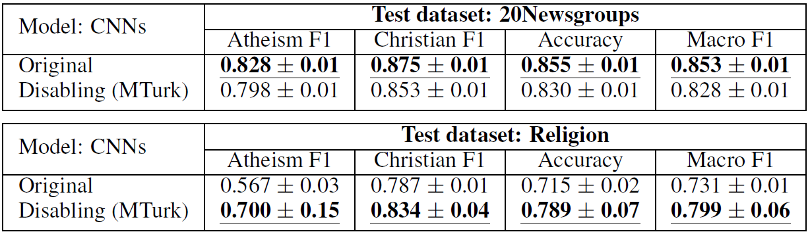

[*<< Back to the main page*](https://plkumjorn.github.io/FIND)

# Experiment 3: 20Newsgroups & Religion

## Basic information
- **Task**: Classify a given text into the right category
- **Dataset**: 20Newsgroups
- **Classes**: Atheism or Christian
- **Train/Dev/Test examples**: 863 / 216 / 717
- **Problem**: This dataset contains a lot of artifacts – tokens (e.g., person names, punctuation marks) which are not relevant, but strongly co-occur with one of the classes.
- **Out-of-domain test set**: Religion (1819 examples)
- For more details, please see section 7 in the paper.

## Word Clouds & Annotations

### Model 1: 20Newsgroup_standard_CNN_20200508185211

<table><tbody><tr class="center-row"><td><b>Feature 0</b></td><td><b>Feature 1</b></td><td><b>Feature 2</b></td><td><b>Feature 3</b></td><td><b>Feature 4</b></td><td><b>Feature 5</b></td><td><b>Feature 6</b></td><td><b>Feature 7</b></td><td><b>Feature 8</b></td><td><b>Feature 9</b></td><td><b>Feature 10</b></td><td><b>Feature 11</b></td><td><b>Feature 12</b></td><td><b>Feature 13</b></td><td><b>Feature 14</b></td><td><b>Feature 15</b></td><td><b>Feature 16</b></td><td><b>Feature 17</b></td><td><b>Feature 18</b></td><td><b>Feature 19</b></td><td><b>Feature 20</b></td><td><b>Feature 21</b></td><td><b>Feature 22</b></td><td><b>Feature 23</b></td><td><b>Feature 24</b></td><td><b>Feature 25</b></td><td><b>Feature 26</b></td><td><b>Feature 27</b></td><td><b>Feature 28</b></td><td><b>Feature 29</b></td></tr><tr><td></td><td></td><td></td><td></td><td></td><td></td><td></td><td></td><td></td><td></td><td></td><td></td><td></td><td></td><td></td><td></td><td></td><td></td><td></td><td></td><td></td><td></td><td></td><td></td><td></td><td></td><td></td><td></td><td></td><td></td></tr><tr><td>&emsp;&emsp;<b>Model weights</b>:
<b>&emsp;&emsp;&emsp;- Atheism = -0.136</b>
&emsp;&emsp;&emsp;- Christian = -0.265</td><td>&emsp;&emsp;<b>Model weights</b>:
&emsp;&emsp;&emsp;- Atheism = -0.404
<b>&emsp;&emsp;&emsp;- Christian = -0.203</b></td><td>&emsp;&emsp;<b>Model weights</b>:
<b>&emsp;&emsp;&emsp;- Atheism = 0.429</b>
&emsp;&emsp;&emsp;- Christian = -0.169</td><td>&emsp;&emsp;<b>Model weights</b>:
<b>&emsp;&emsp;&emsp;- Atheism = 0.014</b>
&emsp;&emsp;&emsp;- Christian = -0.210</td><td>&emsp;&emsp;<b>Model weights</b>:
&emsp;&emsp;&emsp;- Atheism = -0.353
<b>&emsp;&emsp;&emsp;- Christian = 0.384</b></td><td>&emsp;&emsp;<b>Model weights</b>:
<b>&emsp;&emsp;&emsp;- Atheism = 0.068</b>
&emsp;&emsp;&emsp;- Christian = -0.383</td><td>&emsp;&emsp;<b>Model weights</b>:
&emsp;&emsp;&emsp;- Atheism = -0.027
<b>&emsp;&emsp;&emsp;- Christian = 0.457</b></td><td>&emsp;&emsp;<b>Model weights</b>:
<b>&emsp;&emsp;&emsp;- Atheism = 0.137</b>
&emsp;&emsp;&emsp;- Christian = -0.083</td><td>&emsp;&emsp;<b>Model weights</b>:
&emsp;&emsp;&emsp;- Atheism = -0.236
<b>&emsp;&emsp;&emsp;- Christian = -0.045</b></td><td>&emsp;&emsp;<b>Model weights</b>:
&emsp;&emsp;&emsp;- Atheism = -0.180
<b>&emsp;&emsp;&emsp;- Christian = 0.051</b></td><td>&emsp;&emsp;<b>Model weights</b>:
<b>&emsp;&emsp;&emsp;- Atheism = -0.293</b>
&emsp;&emsp;&emsp;- Christian = -0.424</td><td>&emsp;&emsp;<b>Model weights</b>:
<b>&emsp;&emsp;&emsp;- Atheism = 0.405</b>
&emsp;&emsp;&emsp;- Christian = -0.429</td><td>&emsp;&emsp;<b>Model weights</b>:
<b>&emsp;&emsp;&emsp;- Atheism = 0.434</b>
&emsp;&emsp;&emsp;- Christian = 0.155</td><td>&emsp;&emsp;<b>Model weights</b>:
<b>&emsp;&emsp;&emsp;- Atheism = 0.161</b>
&emsp;&emsp;&emsp;- Christian = -0.005</td><td>&emsp;&emsp;<b>Model weights</b>:
<b>&emsp;&emsp;&emsp;- Atheism = 0.365</b>
&emsp;&emsp;&emsp;- Christian = -0.187</td><td>&emsp;&emsp;<b>Model weights</b>:
<b>&emsp;&emsp;&emsp;- Atheism = 0.418</b>
&emsp;&emsp;&emsp;- Christian = 0.040</td><td>&emsp;&emsp;<b>Model weights</b>:
&emsp;&emsp;&emsp;- Atheism = -0.214
<b>&emsp;&emsp;&emsp;- Christian = 0.021</b></td><td>&emsp;&emsp;<b>Model weights</b>:
<b>&emsp;&emsp;&emsp;- Atheism = 0.014</b>
&emsp;&emsp;&emsp;- Christian = -0.367</td><td>&emsp;&emsp;<b>Model weights</b>:
<b>&emsp;&emsp;&emsp;- Atheism = 0.188</b>
&emsp;&emsp;&emsp;- Christian = -0.110</td><td>&emsp;&emsp;<b>Model weights</b>:
&emsp;&emsp;&emsp;- Atheism = -0.003
<b>&emsp;&emsp;&emsp;- Christian = 0.409</b></td><td>&emsp;&emsp;<b>Model weights</b>:
&emsp;&emsp;&emsp;- Atheism = -0.364
<b>&emsp;&emsp;&emsp;- Christian = 0.495</b></td><td>&emsp;&emsp;<b>Model weights</b>:
<b>&emsp;&emsp;&emsp;- Atheism = 0.064</b>
&emsp;&emsp;&emsp;- Christian = -0.187</td><td>&emsp;&emsp;<b>Model weights</b>:
&emsp;&emsp;&emsp;- Atheism = -0.324
<b>&emsp;&emsp;&emsp;- Christian = 0.210</b></td><td>&emsp;&emsp;<b>Model weights</b>:
<b>&emsp;&emsp;&emsp;- Atheism = 0.150</b>
&emsp;&emsp;&emsp;- Christian = -0.179</td><td>&emsp;&emsp;<b>Model weights</b>:
<b>&emsp;&emsp;&emsp;- Atheism = 0.285</b>
&emsp;&emsp;&emsp;- Christian = 0.161</td><td>&emsp;&emsp;<b>Model weights</b>:
&emsp;&emsp;&emsp;- Atheism = 0.131
<b>&emsp;&emsp;&emsp;- Christian = 0.404</b></td><td>&emsp;&emsp;<b>Model weights</b>:
&emsp;&emsp;&emsp;- Atheism = -0.222
<b>&emsp;&emsp;&emsp;- Christian = 0.139</b></td><td>&emsp;&emsp;<b>Model weights</b>:
<b>&emsp;&emsp;&emsp;- Atheism = 0.475</b>
&emsp;&emsp;&emsp;- Christian = 0.179</td><td>&emsp;&emsp;<b>Model weights</b>:
&emsp;&emsp;&emsp;- Atheism = -0.142
<b>&emsp;&emsp;&emsp;- Christian = 0.093</b></td><td>&emsp;&emsp;<b>Model weights</b>:
&emsp;&emsp;&emsp;- Atheism = -0.031
<b>&emsp;&emsp;&emsp;- Christian = 0.492</b></td></tr><tr><td><b>&emsp;&emsp;Human answers</b>:
&emsp;&emsp;&emsp;- Atheism = 1
&emsp;&emsp;&emsp;- Christian = 1
<b>&emsp;&emsp;&emsp;- Neither = 8</b></td><td><b>&emsp;&emsp;Human answers</b>:
&emsp;&emsp;&emsp;- Atheism = 0
&emsp;&emsp;&emsp;- Christian = 1
<b>&emsp;&emsp;&emsp;- Neither = 9</b></td><td><b>&emsp;&emsp;Human answers</b>:
<b>&emsp;&emsp;&emsp;- Atheism = 6</b>
&emsp;&emsp;&emsp;- Christian = 0
&emsp;&emsp;&emsp;- Neither = 4</td><td><b>&emsp;&emsp;Human answers</b>:
&emsp;&emsp;&emsp;- Atheism = 0
&emsp;&emsp;&emsp;- Christian = 4
<b>&emsp;&emsp;&emsp;- Neither = 6</b></td><td><b>&emsp;&emsp;Human answers</b>:
&emsp;&emsp;&emsp;- Atheism = 1
&emsp;&emsp;&emsp;- Christian = 1
<b>&emsp;&emsp;&emsp;- Neither = 8</b></td><td><b>&emsp;&emsp;Human answers</b>:
<b>&emsp;&emsp;&emsp;- Atheism = 10</b>
&emsp;&emsp;&emsp;- Christian = 0
&emsp;&emsp;&emsp;- Neither = 0</td><td><b>&emsp;&emsp;Human answers</b>:
&emsp;&emsp;&emsp;- Atheism = 0
<b>&emsp;&emsp;&emsp;- Christian = 7</b>
&emsp;&emsp;&emsp;- Neither = 3</td><td><b>&emsp;&emsp;Human answers</b>:
&emsp;&emsp;&emsp;- Atheism = 0
&emsp;&emsp;&emsp;- Christian = 0
<b>&emsp;&emsp;&emsp;- Neither = 10</b></td><td><b>&emsp;&emsp;Human answers</b>:
&emsp;&emsp;&emsp;- Atheism = 0
&emsp;&emsp;&emsp;- Christian = 2
<b>&emsp;&emsp;&emsp;- Neither = 8</b></td><td><b>&emsp;&emsp;Human answers</b>:
&emsp;&emsp;&emsp;- Atheism = 0
&emsp;&emsp;&emsp;- Christian = 1
<b>&emsp;&emsp;&emsp;- Neither = 9</b></td><td><b>&emsp;&emsp;Human answers</b>:
<b>&emsp;&emsp;&emsp;- Atheism = 10</b>
&emsp;&emsp;&emsp;- Christian = 0
&emsp;&emsp;&emsp;- Neither = 0</td><td><b>&emsp;&emsp;Human answers</b>:
&emsp;&emsp;&emsp;- Atheism = 1
&emsp;&emsp;&emsp;- Christian = 0
<b>&emsp;&emsp;&emsp;- Neither = 9</b></td><td><b>&emsp;&emsp;Human answers</b>:
&emsp;&emsp;&emsp;- Atheism = 4
&emsp;&emsp;&emsp;- Christian = 0
<b>&emsp;&emsp;&emsp;- Neither = 6</b></td><td><b>&emsp;&emsp;Human answers</b>:
&emsp;&emsp;&emsp;- Atheism = 2
&emsp;&emsp;&emsp;- Christian = 0
<b>&emsp;&emsp;&emsp;- Neither = 8</b></td><td><b>&emsp;&emsp;Human answers</b>:
&emsp;&emsp;&emsp;- Atheism = 0
&emsp;&emsp;&emsp;- Christian = 1
<b>&emsp;&emsp;&emsp;- Neither = 9</b></td><td><b>&emsp;&emsp;Human answers</b>:
&emsp;&emsp;&emsp;- Atheism = 0
&emsp;&emsp;&emsp;- Christian = 0
<b>&emsp;&emsp;&emsp;- Neither = 10</b></td><td><b>&emsp;&emsp;Human answers</b>:
&emsp;&emsp;&emsp;- Atheism = 1
<b>&emsp;&emsp;&emsp;- Christian = 9</b>
&emsp;&emsp;&emsp;- Neither = 0</td><td><b>&emsp;&emsp;Human answers</b>:
&emsp;&emsp;&emsp;- Atheism = 0
&emsp;&emsp;&emsp;- Christian = 0
<b>&emsp;&emsp;&emsp;- Neither = 10</b></td><td><b>&emsp;&emsp;Human answers</b>:
<b>&emsp;&emsp;&emsp;- Atheism = 10</b>
&emsp;&emsp;&emsp;- Christian = 0
&emsp;&emsp;&emsp;- Neither = 0</td><td><b>&emsp;&emsp;Human answers</b>:
&emsp;&emsp;&emsp;- Atheism = 0
<b>&emsp;&emsp;&emsp;- Christian = 10</b>
&emsp;&emsp;&emsp;- Neither = 0</td><td><b>&emsp;&emsp;Human answers</b>:
&emsp;&emsp;&emsp;- Atheism = 0
<b>&emsp;&emsp;&emsp;- Christian = 10</b>
&emsp;&emsp;&emsp;- Neither = 0</td><td><b>&emsp;&emsp;Human answers</b>:
&emsp;&emsp;&emsp;- Atheism = 1
&emsp;&emsp;&emsp;- Christian = 0
<b>&emsp;&emsp;&emsp;- Neither = 9</b></td><td><b>&emsp;&emsp;Human answers</b>:
&emsp;&emsp;&emsp;- Atheism = 0
<b>&emsp;&emsp;&emsp;- Christian = 10</b>
&emsp;&emsp;&emsp;- Neither = 0</td><td><b>&emsp;&emsp;Human answers</b>:
&emsp;&emsp;&emsp;- Atheism = 2
&emsp;&emsp;&emsp;- Christian = 2
<b>&emsp;&emsp;&emsp;- Neither = 6</b></td><td><b>&emsp;&emsp;Human answers</b>:
&emsp;&emsp;&emsp;- Atheism = 0
&emsp;&emsp;&emsp;- Christian = 2
<b>&emsp;&emsp;&emsp;- Neither = 8</b></td><td><b>&emsp;&emsp;Human answers</b>:
&emsp;&emsp;&emsp;- Atheism = 0
<b>&emsp;&emsp;&emsp;- Christian = 10</b>
&emsp;&emsp;&emsp;- Neither = 0</td><td><b>&emsp;&emsp;Human answers</b>:
&emsp;&emsp;&emsp;- Atheism = 0
<b>&emsp;&emsp;&emsp;- Christian = 10</b>
&emsp;&emsp;&emsp;- Neither = 0</td><td><b>&emsp;&emsp;Human answers</b>:
&emsp;&emsp;&emsp;- Atheism = 0
&emsp;&emsp;&emsp;- Christian = 0
<b>&emsp;&emsp;&emsp;- Neither = 10</b></td><td><b>&emsp;&emsp;Human answers</b>:
&emsp;&emsp;&emsp;- Atheism = 0
<b>&emsp;&emsp;&emsp;- Christian = 10</b>
&emsp;&emsp;&emsp;- Neither = 0</td><td><b>&emsp;&emsp;Human answers</b>:
&emsp;&emsp;&emsp;- Atheism = 0
<b>&emsp;&emsp;&emsp;- Christian = 10</b>
&emsp;&emsp;&emsp;- Neither = 0</td></tr><tr><td>&emsp;&emsp;<b>Decision:</b>
&emsp;&emsp;&emsp;<b style="color:red">- MTurk: Disabled</b></td><td>&emsp;&emsp;<b>Decision:</b>
&emsp;&emsp;&emsp;<b style="color:red">- MTurk: Disabled</b></td><td>&emsp;&emsp;<b>Decision:</b>
&emsp;&emsp;&emsp;<b style="color:green">- MTurk: Enabled</b></td><td>&emsp;&emsp;<b>Decision:</b>
&emsp;&emsp;&emsp;<b style="color:red">- MTurk: Disabled</b></td><td>&emsp;&emsp;<b>Decision:</b>
&emsp;&emsp;&emsp;<b style="color:red">- MTurk: Disabled</b></td><td>&emsp;&emsp;<b>Decision:</b>
&emsp;&emsp;&emsp;<b style="color:green">- MTurk: Enabled</b></td><td>&emsp;&emsp;<b>Decision:</b>
&emsp;&emsp;&emsp;<b style="color:green">- MTurk: Enabled</b></td><td>&emsp;&emsp;<b>Decision:</b>
&emsp;&emsp;&emsp;<b style="color:red">- MTurk: Disabled</b></td><td>&emsp;&emsp;<b>Decision:</b>
&emsp;&emsp;&emsp;<b style="color:red">- MTurk: Disabled</b></td><td>&emsp;&emsp;<b>Decision:</b>
&emsp;&emsp;&emsp;<b style="color:red">- MTurk: Disabled</b></td><td>&emsp;&emsp;<b>Decision:</b>
&emsp;&emsp;&emsp;<b style="color:green">- MTurk: Enabled</b></td><td>&emsp;&emsp;<b>Decision:</b>
&emsp;&emsp;&emsp;<b style="color:red">- MTurk: Disabled</b></td><td>&emsp;&emsp;<b>Decision:</b>
&emsp;&emsp;&emsp;<b style="color:red">- MTurk: Disabled</b></td><td>&emsp;&emsp;<b>Decision:</b>
&emsp;&emsp;&emsp;<b style="color:red">- MTurk: Disabled</b></td><td>&emsp;&emsp;<b>Decision:</b>
&emsp;&emsp;&emsp;<b style="color:red">- MTurk: Disabled</b></td><td>&emsp;&emsp;<b>Decision:</b>
&emsp;&emsp;&emsp;<b style="color:red">- MTurk: Disabled</b></td><td>&emsp;&emsp;<b>Decision:</b>
&emsp;&emsp;&emsp;<b style="color:green">- MTurk: Enabled</b></td><td>&emsp;&emsp;<b>Decision:</b>
&emsp;&emsp;&emsp;<b style="color:red">- MTurk: Disabled</b></td><td>&emsp;&emsp;<b>Decision:</b>
&emsp;&emsp;&emsp;<b style="color:green">- MTurk: Enabled</b></td><td>&emsp;&emsp;<b>Decision:</b>
&emsp;&emsp;&emsp;<b style="color:green">- MTurk: Enabled</b></td><td>&emsp;&emsp;<b>Decision:</b>
&emsp;&emsp;&emsp;<b style="color:green">- MTurk: Enabled</b></td><td>&emsp;&emsp;<b>Decision:</b>
&emsp;&emsp;&emsp;<b style="color:red">- MTurk: Disabled</b></td><td>&emsp;&emsp;<b>Decision:</b>
&emsp;&emsp;&emsp;<b style="color:green">- MTurk: Enabled</b></td><td>&emsp;&emsp;<b>Decision:</b>
&emsp;&emsp;&emsp;<b style="color:red">- MTurk: Disabled</b></td><td>&emsp;&emsp;<b>Decision:</b>
&emsp;&emsp;&emsp;<b style="color:red">- MTurk: Disabled</b></td><td>&emsp;&emsp;<b>Decision:</b>
&emsp;&emsp;&emsp;<b style="color:green">- MTurk: Enabled</b></td><td>&emsp;&emsp;<b>Decision:</b>
&emsp;&emsp;&emsp;<b style="color:green">- MTurk: Enabled</b></td><td>&emsp;&emsp;<b>Decision:</b>
&emsp;&emsp;&emsp;<b style="color:red">- MTurk: Disabled</b></td><td>&emsp;&emsp;<b>Decision:</b>
&emsp;&emsp;&emsp;<b style="color:green">- MTurk: Enabled</b></td><td>&emsp;&emsp;<b>Decision:</b>
&emsp;&emsp;&emsp;<b style="color:green">- MTurk: Enabled</b></td></tr></tbody></table>

### Model 2: 20Newsgroup_standard_CNN_20200508185727

<table><tbody><tr class="center-row"><td><b>Feature 0</b></td><td><b>Feature 1</b></td><td><b>Feature 2</b></td><td><b>Feature 3</b></td><td><b>Feature 4</b></td><td><b>Feature 5</b></td><td><b>Feature 6</b></td><td><b>Feature 7</b></td><td><b>Feature 8</b></td><td><b>Feature 9</b></td><td><b>Feature 10</b></td><td><b>Feature 11</b></td><td><b>Feature 12</b></td><td><b>Feature 13</b></td><td><b>Feature 14</b></td><td><b>Feature 15</b></td><td><b>Feature 16</b></td><td><b>Feature 17</b></td><td><b>Feature 18</b></td><td><b>Feature 19</b></td><td><b>Feature 20</b></td><td><b>Feature 21</b></td><td><b>Feature 22</b></td><td><b>Feature 23</b></td><td><b>Feature 24</b></td><td><b>Feature 25</b></td><td><b>Feature 26</b></td><td><b>Feature 27</b></td><td><b>Feature 28</b></td><td><b>Feature 29</b></td></tr><tr><td></td><td></td><td></td><td></td><td></td><td></td><td></td><td></td><td></td><td></td><td></td><td></td><td></td><td></td><td></td><td></td><td></td><td></td><td></td><td></td><td></td><td></td><td></td><td></td><td></td><td></td><td></td><td></td><td></td><td></td></tr><tr><td>&emsp;&emsp;<b>Model weights</b>:
&emsp;&emsp;&emsp;- Atheism = -0.373
<b>&emsp;&emsp;&emsp;- Christian = -0.175</b></td><td>&emsp;&emsp;<b>Model weights</b>:
&emsp;&emsp;&emsp;- Atheism = -0.128
<b>&emsp;&emsp;&emsp;- Christian = 0.192</b></td><td>&emsp;&emsp;<b>Model weights</b>:
<b>&emsp;&emsp;&emsp;- Atheism = 0.180</b>
&emsp;&emsp;&emsp;- Christian = -0.163</td><td>&emsp;&emsp;<b>Model weights</b>:
<b>&emsp;&emsp;&emsp;- Atheism = -0.047</b>
&emsp;&emsp;&emsp;- Christian = -0.224</td><td>&emsp;&emsp;<b>Model weights</b>:
<b>&emsp;&emsp;&emsp;- Atheism = 0.115</b>
&emsp;&emsp;&emsp;- Christian = -0.291</td><td>&emsp;&emsp;<b>Model weights</b>:
&emsp;&emsp;&emsp;- Atheism = 0.037
<b>&emsp;&emsp;&emsp;- Christian = 0.445</b></td><td>&emsp;&emsp;<b>Model weights</b>:
<b>&emsp;&emsp;&emsp;- Atheism = 0.068</b>
&emsp;&emsp;&emsp;- Christian = -0.326</td><td>&emsp;&emsp;<b>Model weights</b>:
<b>&emsp;&emsp;&emsp;- Atheism = 0.036</b>
&emsp;&emsp;&emsp;- Christian = -0.490</td><td>&emsp;&emsp;<b>Model weights</b>:
&emsp;&emsp;&emsp;- Atheism = -0.224
<b>&emsp;&emsp;&emsp;- Christian = -0.071</b></td><td>&emsp;&emsp;<b>Model weights</b>:
&emsp;&emsp;&emsp;- Atheism = 0.184
<b>&emsp;&emsp;&emsp;- Christian = 0.301</b></td><td>&emsp;&emsp;<b>Model weights</b>:
&emsp;&emsp;&emsp;- Atheism = 0.011
<b>&emsp;&emsp;&emsp;- Christian = 0.259</b></td><td>&emsp;&emsp;<b>Model weights</b>:
&emsp;&emsp;&emsp;- Atheism = -0.252
<b>&emsp;&emsp;&emsp;- Christian = -0.163</b></td><td>&emsp;&emsp;<b>Model weights</b>:
&emsp;&emsp;&emsp;- Atheism = -0.183
<b>&emsp;&emsp;&emsp;- Christian = -0.025</b></td><td>&emsp;&emsp;<b>Model weights</b>:
&emsp;&emsp;&emsp;- Atheism = 0.134
<b>&emsp;&emsp;&emsp;- Christian = 0.301</b></td><td>&emsp;&emsp;<b>Model weights</b>:
&emsp;&emsp;&emsp;- Atheism = -0.083
<b>&emsp;&emsp;&emsp;- Christian = 0.436</b></td><td>&emsp;&emsp;<b>Model weights</b>:
&emsp;&emsp;&emsp;- Atheism = 0.126
<b>&emsp;&emsp;&emsp;- Christian = 0.314</b></td><td>&emsp;&emsp;<b>Model weights</b>:
<b>&emsp;&emsp;&emsp;- Atheism = -0.238</b>
&emsp;&emsp;&emsp;- Christian = -0.505</td><td>&emsp;&emsp;<b>Model weights</b>:
&emsp;&emsp;&emsp;- Atheism = -0.475
<b>&emsp;&emsp;&emsp;- Christian = 0.429</b></td><td>&emsp;&emsp;<b>Model weights</b>:
<b>&emsp;&emsp;&emsp;- Atheism = -0.033</b>
&emsp;&emsp;&emsp;- Christian = -0.216</td><td>&emsp;&emsp;<b>Model weights</b>:
<b>&emsp;&emsp;&emsp;- Atheism = 0.415</b>
&emsp;&emsp;&emsp;- Christian = -0.172</td><td>&emsp;&emsp;<b>Model weights</b>:
<b>&emsp;&emsp;&emsp;- Atheism = 0.219</b>
&emsp;&emsp;&emsp;- Christian = -0.003</td><td>&emsp;&emsp;<b>Model weights</b>:
&emsp;&emsp;&emsp;- Atheism = -0.429
<b>&emsp;&emsp;&emsp;- Christian = -0.165</b></td><td>&emsp;&emsp;<b>Model weights</b>:
&emsp;&emsp;&emsp;- Atheism = -0.415
<b>&emsp;&emsp;&emsp;- Christian = -0.054</b></td><td>&emsp;&emsp;<b>Model weights</b>:
<b>&emsp;&emsp;&emsp;- Atheism = 0.169</b>
&emsp;&emsp;&emsp;- Christian = -0.334</td><td>&emsp;&emsp;<b>Model weights</b>:
<b>&emsp;&emsp;&emsp;- Atheism = 0.211</b>
&emsp;&emsp;&emsp;- Christian = -0.450</td><td>&emsp;&emsp;<b>Model weights</b>:
<b>&emsp;&emsp;&emsp;- Atheism = 0.347</b>
&emsp;&emsp;&emsp;- Christian = 0.035</td><td>&emsp;&emsp;<b>Model weights</b>:
&emsp;&emsp;&emsp;- Atheism = -0.073
<b>&emsp;&emsp;&emsp;- Christian = 0.066</b></td><td>&emsp;&emsp;<b>Model weights</b>:
<b>&emsp;&emsp;&emsp;- Atheism = -0.233</b>
&emsp;&emsp;&emsp;- Christian = -0.503</td><td>&emsp;&emsp;<b>Model weights</b>:
<b>&emsp;&emsp;&emsp;- Atheism = 0.142</b>
&emsp;&emsp;&emsp;- Christian = -0.136</td><td>&emsp;&emsp;<b>Model weights</b>:
&emsp;&emsp;&emsp;- Atheism = -0.012
<b>&emsp;&emsp;&emsp;- Christian = 0.213</b></td></tr><tr><td><b>&emsp;&emsp;Human answers</b>:
&emsp;&emsp;&emsp;- Atheism = 0
<b>&emsp;&emsp;&emsp;- Christian = 10</b>
&emsp;&emsp;&emsp;- Neither = 0</td><td><b>&emsp;&emsp;Human answers</b>:
&emsp;&emsp;&emsp;- Atheism = 0
<b>&emsp;&emsp;&emsp;- Christian = 10</b>
&emsp;&emsp;&emsp;- Neither = 0</td><td><b>&emsp;&emsp;Human answers</b>:
&emsp;&emsp;&emsp;- Atheism = 0
<b>&emsp;&emsp;&emsp;- Christian = 7</b>
&emsp;&emsp;&emsp;- Neither = 3</td><td><b>&emsp;&emsp;Human answers</b>:
<b>&emsp;&emsp;&emsp;- Atheism = 10</b>
&emsp;&emsp;&emsp;- Christian = 0
&emsp;&emsp;&emsp;- Neither = 0</td><td><b>&emsp;&emsp;Human answers</b>:
&emsp;&emsp;&emsp;- Atheism = 2
&emsp;&emsp;&emsp;- Christian = 0
<b>&emsp;&emsp;&emsp;- Neither = 8</b></td><td><b>&emsp;&emsp;Human answers</b>:
&emsp;&emsp;&emsp;- Atheism = 0
<b>&emsp;&emsp;&emsp;- Christian = 5</b>
<b>&emsp;&emsp;&emsp;- Neither = 5</b></td><td><b>&emsp;&emsp;Human answers</b>:
&emsp;&emsp;&emsp;- Atheism = 1
&emsp;&emsp;&emsp;- Christian = 0
<b>&emsp;&emsp;&emsp;- Neither = 9</b></td><td><b>&emsp;&emsp;Human answers</b>:
&emsp;&emsp;&emsp;- Atheism = 0
&emsp;&emsp;&emsp;- Christian = 0
<b>&emsp;&emsp;&emsp;- Neither = 10</b></td><td><b>&emsp;&emsp;Human answers</b>:
&emsp;&emsp;&emsp;- Atheism = 0
<b>&emsp;&emsp;&emsp;- Christian = 9</b>
&emsp;&emsp;&emsp;- Neither = 1</td><td><b>&emsp;&emsp;Human answers</b>:
&emsp;&emsp;&emsp;- Atheism = 0
<b>&emsp;&emsp;&emsp;- Christian = 10</b>
&emsp;&emsp;&emsp;- Neither = 0</td><td><b>&emsp;&emsp;Human answers</b>:
&emsp;&emsp;&emsp;- Atheism = 4
<b>&emsp;&emsp;&emsp;- Christian = 5</b>
&emsp;&emsp;&emsp;- Neither = 1</td><td><b>&emsp;&emsp;Human answers</b>:
&emsp;&emsp;&emsp;- Atheism = 0
<b>&emsp;&emsp;&emsp;- Christian = 10</b>
&emsp;&emsp;&emsp;- Neither = 0</td><td><b>&emsp;&emsp;Human answers</b>:
&emsp;&emsp;&emsp;- Atheism = 0
<b>&emsp;&emsp;&emsp;- Christian = 10</b>
&emsp;&emsp;&emsp;- Neither = 0</td><td><b>&emsp;&emsp;Human answers</b>:
&emsp;&emsp;&emsp;- Atheism = 0
&emsp;&emsp;&emsp;- Christian = 0
<b>&emsp;&emsp;&emsp;- Neither = 10</b></td><td><b>&emsp;&emsp;Human answers</b>:
&emsp;&emsp;&emsp;- Atheism = 0
&emsp;&emsp;&emsp;- Christian = 3
<b>&emsp;&emsp;&emsp;- Neither = 7</b></td><td><b>&emsp;&emsp;Human answers</b>:
&emsp;&emsp;&emsp;- Atheism = 0
<b>&emsp;&emsp;&emsp;- Christian = 10</b>
&emsp;&emsp;&emsp;- Neither = 0</td><td><b>&emsp;&emsp;Human answers</b>:
&emsp;&emsp;&emsp;- Atheism = 4
&emsp;&emsp;&emsp;- Christian = 0
<b>&emsp;&emsp;&emsp;- Neither = 6</b></td><td><b>&emsp;&emsp;Human answers</b>:
&emsp;&emsp;&emsp;- Atheism = 0
&emsp;&emsp;&emsp;- Christian = 0
<b>&emsp;&emsp;&emsp;- Neither = 10</b></td><td><b>&emsp;&emsp;Human answers</b>:
<b>&emsp;&emsp;&emsp;- Atheism = 6</b>
&emsp;&emsp;&emsp;- Christian = 0
&emsp;&emsp;&emsp;- Neither = 4</td><td><b>&emsp;&emsp;Human answers</b>:
&emsp;&emsp;&emsp;- Atheism = 0
&emsp;&emsp;&emsp;- Christian = 0
<b>&emsp;&emsp;&emsp;- Neither = 10</b></td><td><b>&emsp;&emsp;Human answers</b>:
<b>&emsp;&emsp;&emsp;- Atheism = 10</b>
&emsp;&emsp;&emsp;- Christian = 0
&emsp;&emsp;&emsp;- Neither = 0</td><td><b>&emsp;&emsp;Human answers</b>:
&emsp;&emsp;&emsp;- Atheism = 0
&emsp;&emsp;&emsp;- Christian = 2
<b>&emsp;&emsp;&emsp;- Neither = 8</b></td><td><b>&emsp;&emsp;Human answers</b>:
&emsp;&emsp;&emsp;- Atheism = 0
<b>&emsp;&emsp;&emsp;- Christian = 10</b>
&emsp;&emsp;&emsp;- Neither = 0</td><td><b>&emsp;&emsp;Human answers</b>:
<b>&emsp;&emsp;&emsp;- Atheism = 10</b>
&emsp;&emsp;&emsp;- Christian = 0
&emsp;&emsp;&emsp;- Neither = 0</td><td><b>&emsp;&emsp;Human answers</b>:
<b>&emsp;&emsp;&emsp;- Atheism = 9</b>
&emsp;&emsp;&emsp;- Christian = 0
&emsp;&emsp;&emsp;- Neither = 1</td><td><b>&emsp;&emsp;Human answers</b>:
<b>&emsp;&emsp;&emsp;- Atheism = 10</b>
&emsp;&emsp;&emsp;- Christian = 0
&emsp;&emsp;&emsp;- Neither = 0</td><td><b>&emsp;&emsp;Human answers</b>:
&emsp;&emsp;&emsp;- Atheism = 0
&emsp;&emsp;&emsp;- Christian = 1
<b>&emsp;&emsp;&emsp;- Neither = 9</b></td><td><b>&emsp;&emsp;Human answers</b>:
&emsp;&emsp;&emsp;- Atheism = 0
&emsp;&emsp;&emsp;- Christian = 0
<b>&emsp;&emsp;&emsp;- Neither = 10</b></td><td><b>&emsp;&emsp;Human answers</b>:
&emsp;&emsp;&emsp;- Atheism = 1
&emsp;&emsp;&emsp;- Christian = 0
<b>&emsp;&emsp;&emsp;- Neither = 9</b></td><td><b>&emsp;&emsp;Human answers</b>:
&emsp;&emsp;&emsp;- Atheism = 0
<b>&emsp;&emsp;&emsp;- Christian = 9</b>
&emsp;&emsp;&emsp;- Neither = 1</td></tr><tr><td>&emsp;&emsp;<b>Decision:</b>
&emsp;&emsp;&emsp;<b style="color:green">- MTurk: Enabled</b></td><td>&emsp;&emsp;<b>Decision:</b>
&emsp;&emsp;&emsp;<b style="color:green">- MTurk: Enabled</b></td><td>&emsp;&emsp;<b>Decision:</b>
&emsp;&emsp;&emsp;<b style="color:red">- MTurk: Disabled</b></td><td>&emsp;&emsp;<b>Decision:</b>
&emsp;&emsp;&emsp;<b style="color:green">- MTurk: Enabled</b></td><td>&emsp;&emsp;<b>Decision:</b>
&emsp;&emsp;&emsp;<b style="color:red">- MTurk: Disabled</b></td><td>&emsp;&emsp;<b>Decision:</b>
&emsp;&emsp;&emsp;<b style="color:red">- MTurk: Disabled</b></td><td>&emsp;&emsp;<b>Decision:</b>
&emsp;&emsp;&emsp;<b style="color:red">- MTurk: Disabled</b></td><td>&emsp;&emsp;<b>Decision:</b>
&emsp;&emsp;&emsp;<b style="color:red">- MTurk: Disabled</b></td><td>&emsp;&emsp;<b>Decision:</b>
&emsp;&emsp;&emsp;<b style="color:green">- MTurk: Enabled</b></td><td>&emsp;&emsp;<b>Decision:</b>
&emsp;&emsp;&emsp;<b style="color:green">- MTurk: Enabled</b></td><td>&emsp;&emsp;<b>Decision:</b>
&emsp;&emsp;&emsp;<b style="color:green">- MTurk: Enabled</b></td><td>&emsp;&emsp;<b>Decision:</b>
&emsp;&emsp;&emsp;<b style="color:green">- MTurk: Enabled</b></td><td>&emsp;&emsp;<b>Decision:</b>
&emsp;&emsp;&emsp;<b style="color:green">- MTurk: Enabled</b></td><td>&emsp;&emsp;<b>Decision:</b>
&emsp;&emsp;&emsp;<b style="color:red">- MTurk: Disabled</b></td><td>&emsp;&emsp;<b>Decision:</b>
&emsp;&emsp;&emsp;<b style="color:red">- MTurk: Disabled</b></td><td>&emsp;&emsp;<b>Decision:</b>
&emsp;&emsp;&emsp;<b style="color:green">- MTurk: Enabled</b></td><td>&emsp;&emsp;<b>Decision:</b>
&emsp;&emsp;&emsp;<b style="color:red">- MTurk: Disabled</b></td><td>&emsp;&emsp;<b>Decision:</b>
&emsp;&emsp;&emsp;<b style="color:red">- MTurk: Disabled</b></td><td>&emsp;&emsp;<b>Decision:</b>
&emsp;&emsp;&emsp;<b style="color:green">- MTurk: Enabled</b></td><td>&emsp;&emsp;<b>Decision:</b>
&emsp;&emsp;&emsp;<b style="color:red">- MTurk: Disabled</b></td><td>&emsp;&emsp;<b>Decision:</b>
&emsp;&emsp;&emsp;<b style="color:green">- MTurk: Enabled</b></td><td>&emsp;&emsp;<b>Decision:</b>
&emsp;&emsp;&emsp;<b style="color:red">- MTurk: Disabled</b></td><td>&emsp;&emsp;<b>Decision:</b>
&emsp;&emsp;&emsp;<b style="color:green">- MTurk: Enabled</b></td><td>&emsp;&emsp;<b>Decision:</b>
&emsp;&emsp;&emsp;<b style="color:green">- MTurk: Enabled</b></td><td>&emsp;&emsp;<b>Decision:</b>
&emsp;&emsp;&emsp;<b style="color:green">- MTurk: Enabled</b></td><td>&emsp;&emsp;<b>Decision:</b>
&emsp;&emsp;&emsp;<b style="color:green">- MTurk: Enabled</b></td><td>&emsp;&emsp;<b>Decision:</b>
&emsp;&emsp;&emsp;<b style="color:red">- MTurk: Disabled</b></td><td>&emsp;&emsp;<b>Decision:</b>
&emsp;&emsp;&emsp;<b style="color:red">- MTurk: Disabled</b></td><td>&emsp;&emsp;<b>Decision:</b>
&emsp;&emsp;&emsp;<b style="color:red">- MTurk: Disabled</b></td><td>&emsp;&emsp;<b>Decision:</b>
&emsp;&emsp;&emsp;<b style="color:green">- MTurk: Enabled</b></td></tr></tbody></table>

### Model 3: 20Newsgroup_standard_CNN_20200508191406

<table><tbody><tr class="center-row"><td><b>Feature 0</b></td><td><b>Feature 1</b></td><td><b>Feature 2</b></td><td><b>Feature 3</b></td><td><b>Feature 4</b></td><td><b>Feature 5</b></td><td><b>Feature 6</b></td><td><b>Feature 7</b></td><td><b>Feature 8</b></td><td><b>Feature 9</b></td><td><b>Feature 10</b></td><td><b>Feature 11</b></td><td><b>Feature 12</b></td><td><b>Feature 13</b></td><td><b>Feature 14</b></td><td><b>Feature 15</b></td><td><b>Feature 16</b></td><td><b>Feature 17</b></td><td><b>Feature 18</b></td><td><b>Feature 19</b></td><td><b>Feature 20</b></td><td><b>Feature 21</b></td><td><b>Feature 22</b></td><td><b>Feature 23</b></td><td><b>Feature 24</b></td><td><b>Feature 25</b></td><td><b>Feature 26</b></td><td><b>Feature 27</b></td><td><b>Feature 28</b></td><td><b>Feature 29</b></td></tr><tr><td></td><td></td><td></td><td></td><td></td><td></td><td></td><td></td><td></td><td></td><td></td><td></td><td></td><td></td><td></td><td></td><td></td><td></td><td></td><td></td><td></td><td></td><td></td><td></td><td></td><td></td><td></td><td></td><td></td><td></td></tr><tr><td>&emsp;&emsp;<b>Model weights</b>:
<b>&emsp;&emsp;&emsp;- Atheism = -0.107</b>
&emsp;&emsp;&emsp;- Christian = -0.399</td><td>&emsp;&emsp;<b>Model weights</b>:
&emsp;&emsp;&emsp;- Atheism = -0.399
<b>&emsp;&emsp;&emsp;- Christian = -0.205</b></td><td>&emsp;&emsp;<b>Model weights</b>:
<b>&emsp;&emsp;&emsp;- Atheism = 0.472</b>
&emsp;&emsp;&emsp;- Christian = -0.073</td><td>&emsp;&emsp;<b>Model weights</b>:
&emsp;&emsp;&emsp;- Atheism = -0.171
<b>&emsp;&emsp;&emsp;- Christian = 0.372</b></td><td>&emsp;&emsp;<b>Model weights</b>:
&emsp;&emsp;&emsp;- Atheism = -0.426
<b>&emsp;&emsp;&emsp;- Christian = -0.092</b></td><td>&emsp;&emsp;<b>Model weights</b>:
<b>&emsp;&emsp;&emsp;- Atheism = 0.031</b>
&emsp;&emsp;&emsp;- Christian = -0.155</td><td>&emsp;&emsp;<b>Model weights</b>:
<b>&emsp;&emsp;&emsp;- Atheism = 0.403</b>
&emsp;&emsp;&emsp;- Christian = 0.048</td><td>&emsp;&emsp;<b>Model weights</b>:
&emsp;&emsp;&emsp;- Atheism = -0.476
<b>&emsp;&emsp;&emsp;- Christian = 0.082</b></td><td>&emsp;&emsp;<b>Model weights</b>:
&emsp;&emsp;&emsp;- Atheism = -0.392
<b>&emsp;&emsp;&emsp;- Christian = 0.302</b></td><td>&emsp;&emsp;<b>Model weights</b>:
&emsp;&emsp;&emsp;- Atheism = 0.221
<b>&emsp;&emsp;&emsp;- Christian = 0.381</b></td><td>&emsp;&emsp;<b>Model weights</b>:
&emsp;&emsp;&emsp;- Atheism = -0.181
<b>&emsp;&emsp;&emsp;- Christian = 0.213</b></td><td>&emsp;&emsp;<b>Model weights</b>:
<b>&emsp;&emsp;&emsp;- Atheism = 0.432</b>
&emsp;&emsp;&emsp;- Christian = -0.210</td><td>&emsp;&emsp;<b>Model weights</b>:
<b>&emsp;&emsp;&emsp;- Atheism = -0.013</b>
&emsp;&emsp;&emsp;- Christian = -0.312</td><td>&emsp;&emsp;<b>Model weights</b>:
&emsp;&emsp;&emsp;- Atheism = -0.255
<b>&emsp;&emsp;&emsp;- Christian = 0.156</b></td><td>&emsp;&emsp;<b>Model weights</b>:
&emsp;&emsp;&emsp;- Atheism = -0.167
<b>&emsp;&emsp;&emsp;- Christian = 0.320</b></td><td>&emsp;&emsp;<b>Model weights</b>:
&emsp;&emsp;&emsp;- Atheism = -0.459
<b>&emsp;&emsp;&emsp;- Christian = 0.148</b></td><td>&emsp;&emsp;<b>Model weights</b>:
<b>&emsp;&emsp;&emsp;- Atheism = 0.002</b>
&emsp;&emsp;&emsp;- Christian = -0.352</td><td>&emsp;&emsp;<b>Model weights</b>:
&emsp;&emsp;&emsp;- Atheism = -0.305
<b>&emsp;&emsp;&emsp;- Christian = 0.234</b></td><td>&emsp;&emsp;<b>Model weights</b>:
&emsp;&emsp;&emsp;- Atheism = -0.273
<b>&emsp;&emsp;&emsp;- Christian = 0.070</b></td><td>&emsp;&emsp;<b>Model weights</b>:
&emsp;&emsp;&emsp;- Atheism = -0.314
<b>&emsp;&emsp;&emsp;- Christian = -0.148</b></td><td>&emsp;&emsp;<b>Model weights</b>:
<b>&emsp;&emsp;&emsp;- Atheism = 0.306</b>
&emsp;&emsp;&emsp;- Christian = -0.361</td><td>&emsp;&emsp;<b>Model weights</b>:
&emsp;&emsp;&emsp;- Atheism = -0.341
<b>&emsp;&emsp;&emsp;- Christian = -0.067</b></td><td>&emsp;&emsp;<b>Model weights</b>:
<b>&emsp;&emsp;&emsp;- Atheism = 0.329</b>
&emsp;&emsp;&emsp;- Christian = -0.273</td><td>&emsp;&emsp;<b>Model weights</b>:
<b>&emsp;&emsp;&emsp;- Atheism = 0.132</b>
&emsp;&emsp;&emsp;- Christian = -0.271</td><td>&emsp;&emsp;<b>Model weights</b>:
<b>&emsp;&emsp;&emsp;- Atheism = 0.489</b>
&emsp;&emsp;&emsp;- Christian = -0.337</td><td>&emsp;&emsp;<b>Model weights</b>:
<b>&emsp;&emsp;&emsp;- Atheism = 0.131</b>
&emsp;&emsp;&emsp;- Christian = -0.096</td><td>&emsp;&emsp;<b>Model weights</b>:
&emsp;&emsp;&emsp;- Atheism = -0.211
<b>&emsp;&emsp;&emsp;- Christian = 0.317</b></td><td>&emsp;&emsp;<b>Model weights</b>:
<b>&emsp;&emsp;&emsp;- Atheism = 0.229</b>
&emsp;&emsp;&emsp;- Christian = -0.279</td><td>&emsp;&emsp;<b>Model weights</b>:
<b>&emsp;&emsp;&emsp;- Atheism = 0.466</b>
&emsp;&emsp;&emsp;- Christian = 0.255</td><td>&emsp;&emsp;<b>Model weights</b>:
&emsp;&emsp;&emsp;- Atheism = -0.365
<b>&emsp;&emsp;&emsp;- Christian = 0.046</b></td></tr><tr><td><b>&emsp;&emsp;Human answers</b>:
&emsp;&emsp;&emsp;- Atheism = 0
&emsp;&emsp;&emsp;- Christian = 0
<b>&emsp;&emsp;&emsp;- Neither = 10</b></td><td><b>&emsp;&emsp;Human answers</b>:
&emsp;&emsp;&emsp;- Atheism = 0
<b>&emsp;&emsp;&emsp;- Christian = 10</b>
&emsp;&emsp;&emsp;- Neither = 0</td><td><b>&emsp;&emsp;Human answers</b>:
&emsp;&emsp;&emsp;- Atheism = 0
&emsp;&emsp;&emsp;- Christian = 2
<b>&emsp;&emsp;&emsp;- Neither = 8</b></td><td><b>&emsp;&emsp;Human answers</b>:
&emsp;&emsp;&emsp;- Atheism = 0
&emsp;&emsp;&emsp;- Christian = 1
<b>&emsp;&emsp;&emsp;- Neither = 9</b></td><td><b>&emsp;&emsp;Human answers</b>:
&emsp;&emsp;&emsp;- Atheism = 0
<b>&emsp;&emsp;&emsp;- Christian = 9</b>
&emsp;&emsp;&emsp;- Neither = 1</td><td><b>&emsp;&emsp;Human answers</b>:
<b>&emsp;&emsp;&emsp;- Atheism = 9</b>
&emsp;&emsp;&emsp;- Christian = 0
&emsp;&emsp;&emsp;- Neither = 1</td><td><b>&emsp;&emsp;Human answers</b>:
&emsp;&emsp;&emsp;- Atheism = 0
&emsp;&emsp;&emsp;- Christian = 1
<b>&emsp;&emsp;&emsp;- Neither = 9</b></td><td><b>&emsp;&emsp;Human answers</b>:
&emsp;&emsp;&emsp;- Atheism = 0
<b>&emsp;&emsp;&emsp;- Christian = 10</b>
&emsp;&emsp;&emsp;- Neither = 0</td><td><b>&emsp;&emsp;Human answers</b>:
&emsp;&emsp;&emsp;- Atheism = 0
&emsp;&emsp;&emsp;- Christian = 2
<b>&emsp;&emsp;&emsp;- Neither = 8</b></td><td><b>&emsp;&emsp;Human answers</b>:
&emsp;&emsp;&emsp;- Atheism = 0
<b>&emsp;&emsp;&emsp;- Christian = 10</b>
&emsp;&emsp;&emsp;- Neither = 0</td><td><b>&emsp;&emsp;Human answers</b>:
&emsp;&emsp;&emsp;- Atheism = 1
&emsp;&emsp;&emsp;- Christian = 2
<b>&emsp;&emsp;&emsp;- Neither = 7</b></td><td><b>&emsp;&emsp;Human answers</b>:
&emsp;&emsp;&emsp;- Atheism = 0
&emsp;&emsp;&emsp;- Christian = 0
<b>&emsp;&emsp;&emsp;- Neither = 10</b></td><td><b>&emsp;&emsp;Human answers</b>:
&emsp;&emsp;&emsp;- Atheism = 1
&emsp;&emsp;&emsp;- Christian = 0
<b>&emsp;&emsp;&emsp;- Neither = 9</b></td><td><b>&emsp;&emsp;Human answers</b>:
&emsp;&emsp;&emsp;- Atheism = 0
<b>&emsp;&emsp;&emsp;- Christian = 10</b>
&emsp;&emsp;&emsp;- Neither = 0</td><td><b>&emsp;&emsp;Human answers</b>:
&emsp;&emsp;&emsp;- Atheism = 0
<b>&emsp;&emsp;&emsp;- Christian = 10</b>
&emsp;&emsp;&emsp;- Neither = 0</td><td><b>&emsp;&emsp;Human answers</b>:
&emsp;&emsp;&emsp;- Atheism = 0
<b>&emsp;&emsp;&emsp;- Christian = 9</b>
&emsp;&emsp;&emsp;- Neither = 1</td><td><b>&emsp;&emsp;Human answers</b>:
&emsp;&emsp;&emsp;- Atheism = 0
&emsp;&emsp;&emsp;- Christian = 0
<b>&emsp;&emsp;&emsp;- Neither = 10</b></td><td><b>&emsp;&emsp;Human answers</b>:
&emsp;&emsp;&emsp;- Atheism = 0
<b>&emsp;&emsp;&emsp;- Christian = 10</b>
&emsp;&emsp;&emsp;- Neither = 0</td><td><b>&emsp;&emsp;Human answers</b>:
&emsp;&emsp;&emsp;- Atheism = 0
<b>&emsp;&emsp;&emsp;- Christian = 10</b>
&emsp;&emsp;&emsp;- Neither = 0</td><td><b>&emsp;&emsp;Human answers</b>:
&emsp;&emsp;&emsp;- Atheism = 0
<b>&emsp;&emsp;&emsp;- Christian = 10</b>
&emsp;&emsp;&emsp;- Neither = 0</td><td><b>&emsp;&emsp;Human answers</b>:
&emsp;&emsp;&emsp;- Atheism = 1
&emsp;&emsp;&emsp;- Christian = 0
<b>&emsp;&emsp;&emsp;- Neither = 9</b></td><td><b>&emsp;&emsp;Human answers</b>:
&emsp;&emsp;&emsp;- Atheism = 1
<b>&emsp;&emsp;&emsp;- Christian = 9</b>
&emsp;&emsp;&emsp;- Neither = 0</td><td><b>&emsp;&emsp;Human answers</b>:
<b>&emsp;&emsp;&emsp;- Atheism = 6</b>
&emsp;&emsp;&emsp;- Christian = 0
&emsp;&emsp;&emsp;- Neither = 4</td><td><b>&emsp;&emsp;Human answers</b>:
<b>&emsp;&emsp;&emsp;- Atheism = 9</b>
&emsp;&emsp;&emsp;- Christian = 0
&emsp;&emsp;&emsp;- Neither = 1</td><td><b>&emsp;&emsp;Human answers</b>:
&emsp;&emsp;&emsp;- Atheism = 1
&emsp;&emsp;&emsp;- Christian = 0
<b>&emsp;&emsp;&emsp;- Neither = 9</b></td><td><b>&emsp;&emsp;Human answers</b>:
<b>&emsp;&emsp;&emsp;- Atheism = 10</b>
&emsp;&emsp;&emsp;- Christian = 0
&emsp;&emsp;&emsp;- Neither = 0</td><td><b>&emsp;&emsp;Human answers</b>:
&emsp;&emsp;&emsp;- Atheism = 1
<b>&emsp;&emsp;&emsp;- Christian = 8</b>
&emsp;&emsp;&emsp;- Neither = 1</td><td><b>&emsp;&emsp;Human answers</b>:
<b>&emsp;&emsp;&emsp;- Atheism = 10</b>
&emsp;&emsp;&emsp;- Christian = 0
&emsp;&emsp;&emsp;- Neither = 0</td><td><b>&emsp;&emsp;Human answers</b>:
&emsp;&emsp;&emsp;- Atheism = 2
&emsp;&emsp;&emsp;- Christian = 1
<b>&emsp;&emsp;&emsp;- Neither = 7</b></td><td><b>&emsp;&emsp;Human answers</b>:
&emsp;&emsp;&emsp;- Atheism = 0
<b>&emsp;&emsp;&emsp;- Christian = 10</b>
&emsp;&emsp;&emsp;- Neither = 0</td></tr><tr><td>&emsp;&emsp;<b>Decision:</b>
&emsp;&emsp;&emsp;<b style="color:red">- MTurk: Disabled</b></td><td>&emsp;&emsp;<b>Decision:</b>
&emsp;&emsp;&emsp;<b style="color:green">- MTurk: Enabled</b></td><td>&emsp;&emsp;<b>Decision:</b>
&emsp;&emsp;&emsp;<b style="color:red">- MTurk: Disabled</b></td><td>&emsp;&emsp;<b>Decision:</b>
&emsp;&emsp;&emsp;<b style="color:red">- MTurk: Disabled</b></td><td>&emsp;&emsp;<b>Decision:</b>
&emsp;&emsp;&emsp;<b style="color:green">- MTurk: Enabled</b></td><td>&emsp;&emsp;<b>Decision:</b>
&emsp;&emsp;&emsp;<b style="color:green">- MTurk: Enabled</b></td><td>&emsp;&emsp;<b>Decision:</b>
&emsp;&emsp;&emsp;<b style="color:red">- MTurk: Disabled</b></td><td>&emsp;&emsp;<b>Decision:</b>
&emsp;&emsp;&emsp;<b style="color:green">- MTurk: Enabled</b></td><td>&emsp;&emsp;<b>Decision:</b>
&emsp;&emsp;&emsp;<b style="color:red">- MTurk: Disabled</b></td><td>&emsp;&emsp;<b>Decision:</b>
&emsp;&emsp;&emsp;<b style="color:green">- MTurk: Enabled</b></td><td>&emsp;&emsp;<b>Decision:</b>
&emsp;&emsp;&emsp;<b style="color:red">- MTurk: Disabled</b></td><td>&emsp;&emsp;<b>Decision:</b>
&emsp;&emsp;&emsp;<b style="color:red">- MTurk: Disabled</b></td><td>&emsp;&emsp;<b>Decision:</b>
&emsp;&emsp;&emsp;<b style="color:red">- MTurk: Disabled</b></td><td>&emsp;&emsp;<b>Decision:</b>
&emsp;&emsp;&emsp;<b style="color:green">- MTurk: Enabled</b></td><td>&emsp;&emsp;<b>Decision:</b>
&emsp;&emsp;&emsp;<b style="color:green">- MTurk: Enabled</b></td><td>&emsp;&emsp;<b>Decision:</b>
&emsp;&emsp;&emsp;<b style="color:green">- MTurk: Enabled</b></td><td>&emsp;&emsp;<b>Decision:</b>
&emsp;&emsp;&emsp;<b style="color:red">- MTurk: Disabled</b></td><td>&emsp;&emsp;<b>Decision:</b>
&emsp;&emsp;&emsp;<b style="color:green">- MTurk: Enabled</b></td><td>&emsp;&emsp;<b>Decision:</b>
&emsp;&emsp;&emsp;<b style="color:green">- MTurk: Enabled</b></td><td>&emsp;&emsp;<b>Decision:</b>
&emsp;&emsp;&emsp;<b style="color:green">- MTurk: Enabled</b></td><td>&emsp;&emsp;<b>Decision:</b>
&emsp;&emsp;&emsp;<b style="color:red">- MTurk: Disabled</b></td><td>&emsp;&emsp;<b>Decision:</b>
&emsp;&emsp;&emsp;<b style="color:green">- MTurk: Enabled</b></td><td>&emsp;&emsp;<b>Decision:</b>
&emsp;&emsp;&emsp;<b style="color:green">- MTurk: Enabled</b></td><td>&emsp;&emsp;<b>Decision:</b>
&emsp;&emsp;&emsp;<b style="color:green">- MTurk: Enabled</b></td><td>&emsp;&emsp;<b>Decision:</b>
&emsp;&emsp;&emsp;<b style="color:red">- MTurk: Disabled</b></td><td>&emsp;&emsp;<b>Decision:</b>
&emsp;&emsp;&emsp;<b style="color:green">- MTurk: Enabled</b></td><td>&emsp;&emsp;<b>Decision:</b>
&emsp;&emsp;&emsp;<b style="color:green">- MTurk: Enabled</b></td><td>&emsp;&emsp;<b>Decision:</b>
&emsp;&emsp;&emsp;<b style="color:green">- MTurk: Enabled</b></td><td>&emsp;&emsp;<b>Decision:</b>
&emsp;&emsp;&emsp;<b style="color:red">- MTurk: Disabled</b></td><td>&emsp;&emsp;<b>Decision:</b>
&emsp;&emsp;&emsp;<b style="color:green">- MTurk: Enabled</b></td></tr></tbody></table>

## Results

*Results (Average ± SD) of Experiment 3: 20Newsgroups & Religion, CNNs; Boldface numbers are the best scores in the columns. They are further underlined if they are significantly better than the scores of all the other models (based on approximate randomization test with α = 0.05)*

## Downloads
- [Wordclouds and annotations](https://drive.google.com/file/d/1uWCiRq39q-Q51XfW67O8pTDHNqMlwDxI/view?usp=sharing)
- The dataset of this experiment as well as other experiments can be downloaded [here](https://drive.google.com/file/d/1yKgNqbli_loWakg0NpZkmfi3jBj_N7FK/view?usp=sharing).
- If you want to use the original trained models in the experiments, please contact [Piyawat](https://www.doc.ic.ac.uk/~pl1515/) (pl1515 [at] imperial [dot] ac [dot] uk).

[*<< Back to the main page*](https://plkumjorn.github.io/FIND)