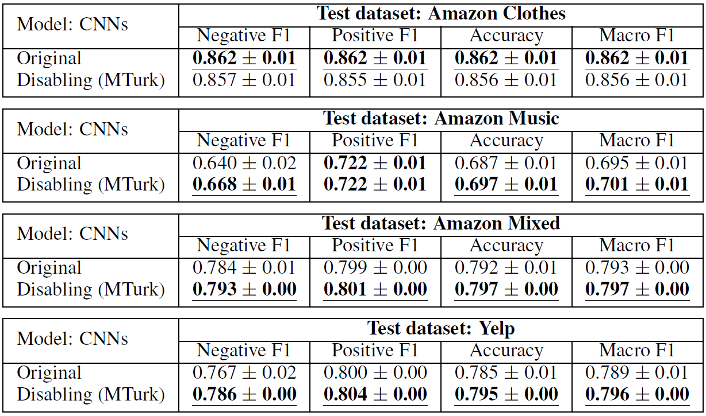

[*<< Back to the main page*](https://plkumjorn.github.io/FIND)

# Experiment 3: Amazon Clothes

## Basic information
- **Task**: Sentiment analysis (of product reviews)
- **Dataset**: Amazon Clothes
- **Classes**: Negative or Positive
- **Train/Dev/Test examples**: 3000 / 300 / 10000
- **Problem**: The models trained using this dataset may not generalize well to other domains of review texts 
- **Out-of-domain test sets**: Amazon Music (8302 examples), Amazon Mixed (100000 examples), Yelp (38000 examples)
- For more details, please see section 7 in the paper.

## Word Clouds & Annotations

### Model 1: AmazonClothes_CNN_20200509013036

<table><tbody><tr class="center-row"><td><b>Feature 0</b></td><td><b>Feature 1</b></td><td><b>Feature 2</b></td><td><b>Feature 3</b></td><td><b>Feature 4</b></td><td><b>Feature 5</b></td><td><b>Feature 6</b></td><td><b>Feature 7</b></td><td><b>Feature 8</b></td><td><b>Feature 9</b></td><td><b>Feature 10</b></td><td><b>Feature 11</b></td><td><b>Feature 12</b></td><td><b>Feature 13</b></td><td><b>Feature 14</b></td><td><b>Feature 15</b></td><td><b>Feature 16</b></td><td><b>Feature 17</b></td><td><b>Feature 18</b></td><td><b>Feature 19</b></td><td><b>Feature 20</b></td><td><b>Feature 21</b></td><td><b>Feature 22</b></td><td><b>Feature 23</b></td><td><b>Feature 24</b></td><td><b>Feature 25</b></td><td><b>Feature 26</b></td><td><b>Feature 27</b></td><td><b>Feature 28</b></td><td><b>Feature 29</b></td></tr><tr><td></td><td></td><td></td><td></td><td></td><td></td><td></td><td></td><td></td><td></td><td></td><td></td><td></td><td></td><td></td><td></td><td></td><td></td><td></td><td></td><td></td><td></td><td></td><td></td><td></td><td></td><td></td><td></td><td></td><td></td></tr><tr><td>&emsp;&emsp;<b>Model weights</b>:
<b>&emsp;&emsp;&emsp;- Negative = -0.064</b>
&emsp;&emsp;&emsp;- Positive = -0.308</td><td>&emsp;&emsp;<b>Model weights</b>:
<b>&emsp;&emsp;&emsp;- Negative = -0.032</b>
&emsp;&emsp;&emsp;- Positive = -0.270</td><td>&emsp;&emsp;<b>Model weights</b>:
<b>&emsp;&emsp;&emsp;- Negative = 0.409</b>
&emsp;&emsp;&emsp;- Positive = -0.039</td><td>&emsp;&emsp;<b>Model weights</b>:
&emsp;&emsp;&emsp;- Negative = -0.438
<b>&emsp;&emsp;&emsp;- Positive = 0.272</b></td><td>&emsp;&emsp;<b>Model weights</b>:
&emsp;&emsp;&emsp;- Negative = -0.092
<b>&emsp;&emsp;&emsp;- Positive = 0.343</b></td><td>&emsp;&emsp;<b>Model weights</b>:
&emsp;&emsp;&emsp;- Negative = -0.446
<b>&emsp;&emsp;&emsp;- Positive = -0.106</b></td><td>&emsp;&emsp;<b>Model weights</b>:
<b>&emsp;&emsp;&emsp;- Negative = 0.294</b>
&emsp;&emsp;&emsp;- Positive = -0.005</td><td>&emsp;&emsp;<b>Model weights</b>:
<b>&emsp;&emsp;&emsp;- Negative = 0.239</b>
&emsp;&emsp;&emsp;- Positive = -0.406</td><td>&emsp;&emsp;<b>Model weights</b>:
&emsp;&emsp;&emsp;- Negative = -0.341
<b>&emsp;&emsp;&emsp;- Positive = 0.284</b></td><td>&emsp;&emsp;<b>Model weights</b>:
&emsp;&emsp;&emsp;- Negative = -0.312
<b>&emsp;&emsp;&emsp;- Positive = -0.088</b></td><td>&emsp;&emsp;<b>Model weights</b>:
<b>&emsp;&emsp;&emsp;- Negative = 0.185</b>
&emsp;&emsp;&emsp;- Positive = -0.139</td><td>&emsp;&emsp;<b>Model weights</b>:
&emsp;&emsp;&emsp;- Negative = -0.213
<b>&emsp;&emsp;&emsp;- Positive = 0.047</b></td><td>&emsp;&emsp;<b>Model weights</b>:
<b>&emsp;&emsp;&emsp;- Negative = -0.040</b>
&emsp;&emsp;&emsp;- Positive = -0.316</td><td>&emsp;&emsp;<b>Model weights</b>:
&emsp;&emsp;&emsp;- Negative = -0.346
<b>&emsp;&emsp;&emsp;- Positive = 0.094</b></td><td>&emsp;&emsp;<b>Model weights</b>:
<b>&emsp;&emsp;&emsp;- Negative = 0.165</b>
&emsp;&emsp;&emsp;- Positive = -0.408</td><td>&emsp;&emsp;<b>Model weights</b>:
<b>&emsp;&emsp;&emsp;- Negative = 0.362</b>
&emsp;&emsp;&emsp;- Positive = -0.289</td><td>&emsp;&emsp;<b>Model weights</b>:
<b>&emsp;&emsp;&emsp;- Negative = 0.426</b>
&emsp;&emsp;&emsp;- Positive = -0.333</td><td>&emsp;&emsp;<b>Model weights</b>:
&emsp;&emsp;&emsp;- Negative = -0.333
<b>&emsp;&emsp;&emsp;- Positive = -0.044</b></td><td>&emsp;&emsp;<b>Model weights</b>:
<b>&emsp;&emsp;&emsp;- Negative = 0.514</b>
&emsp;&emsp;&emsp;- Positive = -0.521</td><td>&emsp;&emsp;<b>Model weights</b>:
&emsp;&emsp;&emsp;- Negative = -0.459
<b>&emsp;&emsp;&emsp;- Positive = -0.040</b></td><td>&emsp;&emsp;<b>Model weights</b>:
&emsp;&emsp;&emsp;- Negative = 0.069
<b>&emsp;&emsp;&emsp;- Positive = 0.415</b></td><td>&emsp;&emsp;<b>Model weights</b>:
&emsp;&emsp;&emsp;- Negative = -0.355
<b>&emsp;&emsp;&emsp;- Positive = 0.325</b></td><td>&emsp;&emsp;<b>Model weights</b>:
&emsp;&emsp;&emsp;- Negative = -0.522
<b>&emsp;&emsp;&emsp;- Positive = -0.212</b></td><td>&emsp;&emsp;<b>Model weights</b>:
<b>&emsp;&emsp;&emsp;- Negative = 0.068</b>
&emsp;&emsp;&emsp;- Positive = -0.263</td><td>&emsp;&emsp;<b>Model weights</b>:
&emsp;&emsp;&emsp;- Negative = -0.257
<b>&emsp;&emsp;&emsp;- Positive = 0.324</b></td><td>&emsp;&emsp;<b>Model weights</b>:
&emsp;&emsp;&emsp;- Negative = -0.152
<b>&emsp;&emsp;&emsp;- Positive = 0.197</b></td><td>&emsp;&emsp;<b>Model weights</b>:
&emsp;&emsp;&emsp;- Negative = -0.068
<b>&emsp;&emsp;&emsp;- Positive = 0.280</b></td><td>&emsp;&emsp;<b>Model weights</b>:
&emsp;&emsp;&emsp;- Negative = -0.084
<b>&emsp;&emsp;&emsp;- Positive = 0.584</b></td><td>&emsp;&emsp;<b>Model weights</b>:
<b>&emsp;&emsp;&emsp;- Negative = 0.205</b>
&emsp;&emsp;&emsp;- Positive = -0.376</td><td>&emsp;&emsp;<b>Model weights</b>:
<b>&emsp;&emsp;&emsp;- Negative = 0.098</b>
&emsp;&emsp;&emsp;- Positive = -0.435</td></tr><tr><td><b>&emsp;&emsp;Human answers</b>:
<b>&emsp;&emsp;&emsp;- Negative = 9</b>
&emsp;&emsp;&emsp;- Positive = 1
&emsp;&emsp;&emsp;- Neither = 0</td><td><b>&emsp;&emsp;Human answers</b>:
&emsp;&emsp;&emsp;- Negative = 3
&emsp;&emsp;&emsp;- Positive = 3
<b>&emsp;&emsp;&emsp;- Neither = 4</b></td><td><b>&emsp;&emsp;Human answers</b>:
<b>&emsp;&emsp;&emsp;- Negative = 6</b>
&emsp;&emsp;&emsp;- Positive = 3
&emsp;&emsp;&emsp;- Neither = 1</td><td><b>&emsp;&emsp;Human answers</b>:
&emsp;&emsp;&emsp;- Negative = 1
&emsp;&emsp;&emsp;- Positive = 4
<b>&emsp;&emsp;&emsp;- Neither = 5</b></td><td><b>&emsp;&emsp;Human answers</b>:
&emsp;&emsp;&emsp;- Negative = 2
<b>&emsp;&emsp;&emsp;- Positive = 7</b>
&emsp;&emsp;&emsp;- Neither = 1</td><td><b>&emsp;&emsp;Human answers</b>:
&emsp;&emsp;&emsp;- Negative = 1
&emsp;&emsp;&emsp;- Positive = 0
<b>&emsp;&emsp;&emsp;- Neither = 9</b></td><td><b>&emsp;&emsp;Human answers</b>:
<b>&emsp;&emsp;&emsp;- Negative = 5</b>
&emsp;&emsp;&emsp;- Positive = 3
&emsp;&emsp;&emsp;- Neither = 2</td><td><b>&emsp;&emsp;Human answers</b>:
<b>&emsp;&emsp;&emsp;- Negative = 6</b>
&emsp;&emsp;&emsp;- Positive = 2
&emsp;&emsp;&emsp;- Neither = 2</td><td><b>&emsp;&emsp;Human answers</b>:
&emsp;&emsp;&emsp;- Negative = 2
<b>&emsp;&emsp;&emsp;- Positive = 5</b>
&emsp;&emsp;&emsp;- Neither = 3</td><td><b>&emsp;&emsp;Human answers</b>:
&emsp;&emsp;&emsp;- Negative = 3
<b>&emsp;&emsp;&emsp;- Positive = 7</b>
&emsp;&emsp;&emsp;- Neither = 0</td><td><b>&emsp;&emsp;Human answers</b>:
<b>&emsp;&emsp;&emsp;- Negative = 5</b>
&emsp;&emsp;&emsp;- Positive = 2
&emsp;&emsp;&emsp;- Neither = 3</td><td><b>&emsp;&emsp;Human answers</b>:
&emsp;&emsp;&emsp;- Negative = 0
<b>&emsp;&emsp;&emsp;- Positive = 9</b>
&emsp;&emsp;&emsp;- Neither = 1</td><td><b>&emsp;&emsp;Human answers</b>:
<b>&emsp;&emsp;&emsp;- Negative = 8</b>
&emsp;&emsp;&emsp;- Positive = 2
&emsp;&emsp;&emsp;- Neither = 0</td><td><b>&emsp;&emsp;Human answers</b>:
&emsp;&emsp;&emsp;- Negative = 1
&emsp;&emsp;&emsp;- Positive = 4
<b>&emsp;&emsp;&emsp;- Neither = 5</b></td><td><b>&emsp;&emsp;Human answers</b>:
<b>&emsp;&emsp;&emsp;- Negative = 9</b>
&emsp;&emsp;&emsp;- Positive = 1
&emsp;&emsp;&emsp;- Neither = 0</td><td><b>&emsp;&emsp;Human answers</b>:
<b>&emsp;&emsp;&emsp;- Negative = 6</b>
&emsp;&emsp;&emsp;- Positive = 1
&emsp;&emsp;&emsp;- Neither = 3</td><td><b>&emsp;&emsp;Human answers</b>:
<b>&emsp;&emsp;&emsp;- Negative = 7</b>
&emsp;&emsp;&emsp;- Positive = 1
&emsp;&emsp;&emsp;- Neither = 2</td><td><b>&emsp;&emsp;Human answers</b>:
&emsp;&emsp;&emsp;- Negative = 2
<b>&emsp;&emsp;&emsp;- Positive = 7</b>
&emsp;&emsp;&emsp;- Neither = 1</td><td><b>&emsp;&emsp;Human answers</b>:
<b>&emsp;&emsp;&emsp;- Negative = 7</b>
&emsp;&emsp;&emsp;- Positive = 2
&emsp;&emsp;&emsp;- Neither = 1</td><td><b>&emsp;&emsp;Human answers</b>:
&emsp;&emsp;&emsp;- Negative = 1
<b>&emsp;&emsp;&emsp;- Positive = 7</b>
&emsp;&emsp;&emsp;- Neither = 2</td><td><b>&emsp;&emsp;Human answers</b>:
&emsp;&emsp;&emsp;- Negative = 1
<b>&emsp;&emsp;&emsp;- Positive = 9</b>
&emsp;&emsp;&emsp;- Neither = 0</td><td><b>&emsp;&emsp;Human answers</b>:
&emsp;&emsp;&emsp;- Negative = 0
<b>&emsp;&emsp;&emsp;- Positive = 10</b>
&emsp;&emsp;&emsp;- Neither = 0</td><td><b>&emsp;&emsp;Human answers</b>:
&emsp;&emsp;&emsp;- Negative = 1
<b>&emsp;&emsp;&emsp;- Positive = 7</b>
&emsp;&emsp;&emsp;- Neither = 2</td><td><b>&emsp;&emsp;Human answers</b>:
&emsp;&emsp;&emsp;- Negative = 3
&emsp;&emsp;&emsp;- Positive = 0
<b>&emsp;&emsp;&emsp;- Neither = 7</b></td><td><b>&emsp;&emsp;Human answers</b>:
&emsp;&emsp;&emsp;- Negative = 1
<b>&emsp;&emsp;&emsp;- Positive = 6</b>
&emsp;&emsp;&emsp;- Neither = 3</td><td><b>&emsp;&emsp;Human answers</b>:
&emsp;&emsp;&emsp;- Negative = 0
<b>&emsp;&emsp;&emsp;- Positive = 5</b>
<b>&emsp;&emsp;&emsp;- Neither = 5</b></td><td><b>&emsp;&emsp;Human answers</b>:
<b>&emsp;&emsp;&emsp;- Negative = 5</b>
&emsp;&emsp;&emsp;- Positive = 2
&emsp;&emsp;&emsp;- Neither = 3</td><td><b>&emsp;&emsp;Human answers</b>:
&emsp;&emsp;&emsp;- Negative = 0
<b>&emsp;&emsp;&emsp;- Positive = 5</b>
<b>&emsp;&emsp;&emsp;- Neither = 5</b></td><td><b>&emsp;&emsp;Human answers</b>:
<b>&emsp;&emsp;&emsp;- Negative = 7</b>
&emsp;&emsp;&emsp;- Positive = 0
&emsp;&emsp;&emsp;- Neither = 3</td><td><b>&emsp;&emsp;Human answers</b>:
<b>&emsp;&emsp;&emsp;- Negative = 7</b>
&emsp;&emsp;&emsp;- Positive = 1
&emsp;&emsp;&emsp;- Neither = 2</td></tr><tr><td>&emsp;&emsp;<b>Decision:</b>
&emsp;&emsp;&emsp;<b style="color:green">- MTurk: Enabled</b></td><td>&emsp;&emsp;<b>Decision:</b>
&emsp;&emsp;&emsp;<b style="color:red">- MTurk: Disabled</b></td><td>&emsp;&emsp;<b>Decision:</b>
&emsp;&emsp;&emsp;<b style="color:green">- MTurk: Enabled</b></td><td>&emsp;&emsp;<b>Decision:</b>
&emsp;&emsp;&emsp;<b style="color:red">- MTurk: Disabled</b></td><td>&emsp;&emsp;<b>Decision:</b>
&emsp;&emsp;&emsp;<b style="color:green">- MTurk: Enabled</b></td><td>&emsp;&emsp;<b>Decision:</b>
&emsp;&emsp;&emsp;<b style="color:red">- MTurk: Disabled</b></td><td>&emsp;&emsp;<b>Decision:</b>
&emsp;&emsp;&emsp;<b style="color:green">- MTurk: Enabled</b></td><td>&emsp;&emsp;<b>Decision:</b>
&emsp;&emsp;&emsp;<b style="color:green">- MTurk: Enabled</b></td><td>&emsp;&emsp;<b>Decision:</b>
&emsp;&emsp;&emsp;<b style="color:green">- MTurk: Enabled</b></td><td>&emsp;&emsp;<b>Decision:</b>
&emsp;&emsp;&emsp;<b style="color:green">- MTurk: Enabled</b></td><td>&emsp;&emsp;<b>Decision:</b>
&emsp;&emsp;&emsp;<b style="color:green">- MTurk: Enabled</b></td><td>&emsp;&emsp;<b>Decision:</b>
&emsp;&emsp;&emsp;<b style="color:green">- MTurk: Enabled</b></td><td>&emsp;&emsp;<b>Decision:</b>
&emsp;&emsp;&emsp;<b style="color:green">- MTurk: Enabled</b></td><td>&emsp;&emsp;<b>Decision:</b>
&emsp;&emsp;&emsp;<b style="color:red">- MTurk: Disabled</b></td><td>&emsp;&emsp;<b>Decision:</b>
&emsp;&emsp;&emsp;<b style="color:green">- MTurk: Enabled</b></td><td>&emsp;&emsp;<b>Decision:</b>
&emsp;&emsp;&emsp;<b style="color:green">- MTurk: Enabled</b></td><td>&emsp;&emsp;<b>Decision:</b>
&emsp;&emsp;&emsp;<b style="color:green">- MTurk: Enabled</b></td><td>&emsp;&emsp;<b>Decision:</b>
&emsp;&emsp;&emsp;<b style="color:green">- MTurk: Enabled</b></td><td>&emsp;&emsp;<b>Decision:</b>
&emsp;&emsp;&emsp;<b style="color:green">- MTurk: Enabled</b></td><td>&emsp;&emsp;<b>Decision:</b>
&emsp;&emsp;&emsp;<b style="color:green">- MTurk: Enabled</b></td><td>&emsp;&emsp;<b>Decision:</b>
&emsp;&emsp;&emsp;<b style="color:green">- MTurk: Enabled</b></td><td>&emsp;&emsp;<b>Decision:</b>
&emsp;&emsp;&emsp;<b style="color:green">- MTurk: Enabled</b></td><td>&emsp;&emsp;<b>Decision:</b>
&emsp;&emsp;&emsp;<b style="color:green">- MTurk: Enabled</b></td><td>&emsp;&emsp;<b>Decision:</b>
&emsp;&emsp;&emsp;<b style="color:red">- MTurk: Disabled</b></td><td>&emsp;&emsp;<b>Decision:</b>
&emsp;&emsp;&emsp;<b style="color:green">- MTurk: Enabled</b></td><td>&emsp;&emsp;<b>Decision:</b>
&emsp;&emsp;&emsp;<b style="color:red">- MTurk: Disabled</b></td><td>&emsp;&emsp;<b>Decision:</b>
&emsp;&emsp;&emsp;<b style="color:red">- MTurk: Disabled</b></td><td>&emsp;&emsp;<b>Decision:</b>
&emsp;&emsp;&emsp;<b style="color:red">- MTurk: Disabled</b></td><td>&emsp;&emsp;<b>Decision:</b>
&emsp;&emsp;&emsp;<b style="color:green">- MTurk: Enabled</b></td><td>&emsp;&emsp;<b>Decision:</b>
&emsp;&emsp;&emsp;<b style="color:green">- MTurk: Enabled</b></td></tr></tbody></table>

### Model 2: AmazonClothes_CNN_20200509013945

<table><tbody><tr class="center-row"><td><b>Feature 0</b></td><td><b>Feature 1</b></td><td><b>Feature 2</b></td><td><b>Feature 3</b></td><td><b>Feature 4</b></td><td><b>Feature 5</b></td><td><b>Feature 6</b></td><td><b>Feature 7</b></td><td><b>Feature 8</b></td><td><b>Feature 9</b></td><td><b>Feature 10</b></td><td><b>Feature 11</b></td><td><b>Feature 12</b></td><td><b>Feature 13</b></td><td><b>Feature 14</b></td><td><b>Feature 15</b></td><td><b>Feature 16</b></td><td><b>Feature 17</b></td><td><b>Feature 18</b></td><td><b>Feature 19</b></td><td><b>Feature 20</b></td><td><b>Feature 21</b></td><td><b>Feature 22</b></td><td><b>Feature 23</b></td><td><b>Feature 24</b></td><td><b>Feature 25</b></td><td><b>Feature 26</b></td><td><b>Feature 27</b></td><td><b>Feature 28</b></td><td><b>Feature 29</b></td></tr><tr><td></td><td></td><td></td><td></td><td></td><td></td><td></td><td></td><td></td><td></td><td></td><td></td><td></td><td></td><td></td><td></td><td></td><td></td><td></td><td></td><td></td><td></td><td></td><td></td><td></td><td></td><td></td><td></td><td></td><td></td></tr><tr><td>&emsp;&emsp;<b>Model weights</b>:
&emsp;&emsp;&emsp;- Negative = -0.246
<b>&emsp;&emsp;&emsp;- Positive = 0.095</b></td><td>&emsp;&emsp;<b>Model weights</b>:
<b>&emsp;&emsp;&emsp;- Negative = -0.070</b>
&emsp;&emsp;&emsp;- Positive = -0.250</td><td>&emsp;&emsp;<b>Model weights</b>:
<b>&emsp;&emsp;&emsp;- Negative = 0.049</b>
&emsp;&emsp;&emsp;- Positive = -0.474</td><td>&emsp;&emsp;<b>Model weights</b>:
<b>&emsp;&emsp;&emsp;- Negative = 0.325</b>
&emsp;&emsp;&emsp;- Positive = -0.408</td><td>&emsp;&emsp;<b>Model weights</b>:
<b>&emsp;&emsp;&emsp;- Negative = 0.269</b>
&emsp;&emsp;&emsp;- Positive = -0.400</td><td>&emsp;&emsp;<b>Model weights</b>:
<b>&emsp;&emsp;&emsp;- Negative = 0.430</b>
&emsp;&emsp;&emsp;- Positive = 0.157</td><td>&emsp;&emsp;<b>Model weights</b>:
&emsp;&emsp;&emsp;- Negative = -0.457
<b>&emsp;&emsp;&emsp;- Positive = -0.158</b></td><td>&emsp;&emsp;<b>Model weights</b>:
&emsp;&emsp;&emsp;- Negative = -0.314
<b>&emsp;&emsp;&emsp;- Positive = -0.057</b></td><td>&emsp;&emsp;<b>Model weights</b>:
&emsp;&emsp;&emsp;- Negative = -0.440
<b>&emsp;&emsp;&emsp;- Positive = 0.239</b></td><td>&emsp;&emsp;<b>Model weights</b>:
&emsp;&emsp;&emsp;- Negative = -0.095
<b>&emsp;&emsp;&emsp;- Positive = 0.297</b></td><td>&emsp;&emsp;<b>Model weights</b>:
<b>&emsp;&emsp;&emsp;- Negative = 0.361</b>
&emsp;&emsp;&emsp;- Positive = -0.435</td><td>&emsp;&emsp;<b>Model weights</b>:
&emsp;&emsp;&emsp;- Negative = -0.244
<b>&emsp;&emsp;&emsp;- Positive = 0.208</b></td><td>&emsp;&emsp;<b>Model weights</b>:
&emsp;&emsp;&emsp;- Negative = -0.502
<b>&emsp;&emsp;&emsp;- Positive = 0.197</b></td><td>&emsp;&emsp;<b>Model weights</b>:
&emsp;&emsp;&emsp;- Negative = -0.339
<b>&emsp;&emsp;&emsp;- Positive = 0.396</b></td><td>&emsp;&emsp;<b>Model weights</b>:
&emsp;&emsp;&emsp;- Negative = -0.372
<b>&emsp;&emsp;&emsp;- Positive = 0.303</b></td><td>&emsp;&emsp;<b>Model weights</b>:
&emsp;&emsp;&emsp;- Negative = -0.278
<b>&emsp;&emsp;&emsp;- Positive = 0.394</b></td><td>&emsp;&emsp;<b>Model weights</b>:
&emsp;&emsp;&emsp;- Negative = -0.239
<b>&emsp;&emsp;&emsp;- Positive = 0.334</b></td><td>&emsp;&emsp;<b>Model weights</b>:
<b>&emsp;&emsp;&emsp;- Negative = 0.443</b>
&emsp;&emsp;&emsp;- Positive = 0.037</td><td>&emsp;&emsp;<b>Model weights</b>:
&emsp;&emsp;&emsp;- Negative = 0.042
<b>&emsp;&emsp;&emsp;- Positive = 0.378</b></td><td>&emsp;&emsp;<b>Model weights</b>:
<b>&emsp;&emsp;&emsp;- Negative = -0.134</b>
&emsp;&emsp;&emsp;- Positive = -0.451</td><td>&emsp;&emsp;<b>Model weights</b>:
<b>&emsp;&emsp;&emsp;- Negative = 0.197</b>
&emsp;&emsp;&emsp;- Positive = -0.271</td><td>&emsp;&emsp;<b>Model weights</b>:
<b>&emsp;&emsp;&emsp;- Negative = 0.137</b>
&emsp;&emsp;&emsp;- Positive = -0.223</td><td>&emsp;&emsp;<b>Model weights</b>:
&emsp;&emsp;&emsp;- Negative = -0.274
<b>&emsp;&emsp;&emsp;- Positive = 0.347</b></td><td>&emsp;&emsp;<b>Model weights</b>:
<b>&emsp;&emsp;&emsp;- Negative = 0.321</b>
&emsp;&emsp;&emsp;- Positive = -0.134</td><td>&emsp;&emsp;<b>Model weights</b>:
<b>&emsp;&emsp;&emsp;- Negative = 0.270</b>
&emsp;&emsp;&emsp;- Positive = -0.360</td><td>&emsp;&emsp;<b>Model weights</b>:
&emsp;&emsp;&emsp;- Negative = -0.082
<b>&emsp;&emsp;&emsp;- Positive = 0.422</b></td><td>&emsp;&emsp;<b>Model weights</b>:
<b>&emsp;&emsp;&emsp;- Negative = 0.460</b>
&emsp;&emsp;&emsp;- Positive = 0.018</td><td>&emsp;&emsp;<b>Model weights</b>:
<b>&emsp;&emsp;&emsp;- Negative = 0.415</b>
&emsp;&emsp;&emsp;- Positive = -0.044</td><td>&emsp;&emsp;<b>Model weights</b>:
<b>&emsp;&emsp;&emsp;- Negative = 0.020</b>
&emsp;&emsp;&emsp;- Positive = -0.325</td><td>&emsp;&emsp;<b>Model weights</b>:
<b>&emsp;&emsp;&emsp;- Negative = 0.155</b>
&emsp;&emsp;&emsp;- Positive = -0.369</td></tr><tr><td><b>&emsp;&emsp;Human answers</b>:
&emsp;&emsp;&emsp;- Negative = 0
<b>&emsp;&emsp;&emsp;- Positive = 10</b>
&emsp;&emsp;&emsp;- Neither = 0</td><td><b>&emsp;&emsp;Human answers</b>:
<b>&emsp;&emsp;&emsp;- Negative = 8</b>
&emsp;&emsp;&emsp;- Positive = 1
&emsp;&emsp;&emsp;- Neither = 1</td><td><b>&emsp;&emsp;Human answers</b>:
<b>&emsp;&emsp;&emsp;- Negative = 10</b>
&emsp;&emsp;&emsp;- Positive = 0
&emsp;&emsp;&emsp;- Neither = 0</td><td><b>&emsp;&emsp;Human answers</b>:
<b>&emsp;&emsp;&emsp;- Negative = 6</b>
&emsp;&emsp;&emsp;- Positive = 2
&emsp;&emsp;&emsp;- Neither = 2</td><td><b>&emsp;&emsp;Human answers</b>:
&emsp;&emsp;&emsp;- Negative = 1
&emsp;&emsp;&emsp;- Positive = 2
<b>&emsp;&emsp;&emsp;- Neither = 7</b></td><td><b>&emsp;&emsp;Human answers</b>:
<b>&emsp;&emsp;&emsp;- Negative = 10</b>
&emsp;&emsp;&emsp;- Positive = 0
&emsp;&emsp;&emsp;- Neither = 0</td><td><b>&emsp;&emsp;Human answers</b>:
&emsp;&emsp;&emsp;- Negative = 0
<b>&emsp;&emsp;&emsp;- Positive = 10</b>
&emsp;&emsp;&emsp;- Neither = 0</td><td><b>&emsp;&emsp;Human answers</b>:
&emsp;&emsp;&emsp;- Negative = 0
<b>&emsp;&emsp;&emsp;- Positive = 10</b>
&emsp;&emsp;&emsp;- Neither = 0</td><td><b>&emsp;&emsp;Human answers</b>:
&emsp;&emsp;&emsp;- Negative = 0
<b>&emsp;&emsp;&emsp;- Positive = 10</b>
&emsp;&emsp;&emsp;- Neither = 0</td><td><b>&emsp;&emsp;Human answers</b>:
&emsp;&emsp;&emsp;- Negative = 0
<b>&emsp;&emsp;&emsp;- Positive = 10</b>
&emsp;&emsp;&emsp;- Neither = 0</td><td><b>&emsp;&emsp;Human answers</b>:
<b>&emsp;&emsp;&emsp;- Negative = 10</b>
&emsp;&emsp;&emsp;- Positive = 0
&emsp;&emsp;&emsp;- Neither = 0</td><td><b>&emsp;&emsp;Human answers</b>:
&emsp;&emsp;&emsp;- Negative = 0
<b>&emsp;&emsp;&emsp;- Positive = 10</b>
&emsp;&emsp;&emsp;- Neither = 0</td><td><b>&emsp;&emsp;Human answers</b>:
&emsp;&emsp;&emsp;- Negative = 0
<b>&emsp;&emsp;&emsp;- Positive = 9</b>
&emsp;&emsp;&emsp;- Neither = 1</td><td><b>&emsp;&emsp;Human answers</b>:
&emsp;&emsp;&emsp;- Negative = 0
<b>&emsp;&emsp;&emsp;- Positive = 9</b>
&emsp;&emsp;&emsp;- Neither = 1</td><td><b>&emsp;&emsp;Human answers</b>:
&emsp;&emsp;&emsp;- Negative = 0
<b>&emsp;&emsp;&emsp;- Positive = 9</b>
&emsp;&emsp;&emsp;- Neither = 1</td><td><b>&emsp;&emsp;Human answers</b>:
&emsp;&emsp;&emsp;- Negative = 0
&emsp;&emsp;&emsp;- Positive = 4
<b>&emsp;&emsp;&emsp;- Neither = 6</b></td><td><b>&emsp;&emsp;Human answers</b>:
&emsp;&emsp;&emsp;- Negative = 0
<b>&emsp;&emsp;&emsp;- Positive = 10</b>
&emsp;&emsp;&emsp;- Neither = 0</td><td><b>&emsp;&emsp;Human answers</b>:
<b>&emsp;&emsp;&emsp;- Negative = 9</b>
&emsp;&emsp;&emsp;- Positive = 0
&emsp;&emsp;&emsp;- Neither = 1</td><td><b>&emsp;&emsp;Human answers</b>:
&emsp;&emsp;&emsp;- Negative = 0
<b>&emsp;&emsp;&emsp;- Positive = 10</b>
&emsp;&emsp;&emsp;- Neither = 0</td><td><b>&emsp;&emsp;Human answers</b>:
<b>&emsp;&emsp;&emsp;- Negative = 10</b>
&emsp;&emsp;&emsp;- Positive = 0
&emsp;&emsp;&emsp;- Neither = 0</td><td><b>&emsp;&emsp;Human answers</b>:
<b>&emsp;&emsp;&emsp;- Negative = 8</b>
&emsp;&emsp;&emsp;- Positive = 0
&emsp;&emsp;&emsp;- Neither = 2</td><td><b>&emsp;&emsp;Human answers</b>:
<b>&emsp;&emsp;&emsp;- Negative = 7</b>
&emsp;&emsp;&emsp;- Positive = 0
&emsp;&emsp;&emsp;- Neither = 3</td><td><b>&emsp;&emsp;Human answers</b>:
&emsp;&emsp;&emsp;- Negative = 0
<b>&emsp;&emsp;&emsp;- Positive = 10</b>
&emsp;&emsp;&emsp;- Neither = 0</td><td><b>&emsp;&emsp;Human answers</b>:
<b>&emsp;&emsp;&emsp;- Negative = 9</b>
&emsp;&emsp;&emsp;- Positive = 0
&emsp;&emsp;&emsp;- Neither = 1</td><td><b>&emsp;&emsp;Human answers</b>:
<b>&emsp;&emsp;&emsp;- Negative = 8</b>
&emsp;&emsp;&emsp;- Positive = 0
&emsp;&emsp;&emsp;- Neither = 2</td><td><b>&emsp;&emsp;Human answers</b>:
&emsp;&emsp;&emsp;- Negative = 0
<b>&emsp;&emsp;&emsp;- Positive = 10</b>
&emsp;&emsp;&emsp;- Neither = 0</td><td><b>&emsp;&emsp;Human answers</b>:
<b>&emsp;&emsp;&emsp;- Negative = 7</b>
&emsp;&emsp;&emsp;- Positive = 0
&emsp;&emsp;&emsp;- Neither = 3</td><td><b>&emsp;&emsp;Human answers</b>:
<b>&emsp;&emsp;&emsp;- Negative = 7</b>
&emsp;&emsp;&emsp;- Positive = 0
&emsp;&emsp;&emsp;- Neither = 3</td><td><b>&emsp;&emsp;Human answers</b>:
<b>&emsp;&emsp;&emsp;- Negative = 10</b>
&emsp;&emsp;&emsp;- Positive = 0
&emsp;&emsp;&emsp;- Neither = 0</td><td><b>&emsp;&emsp;Human answers</b>:
<b>&emsp;&emsp;&emsp;- Negative = 9</b>
&emsp;&emsp;&emsp;- Positive = 0
&emsp;&emsp;&emsp;- Neither = 1</td></tr><tr><td>&emsp;&emsp;<b>Decision:</b>
&emsp;&emsp;&emsp;<b style="color:green">- MTurk: Enabled</b></td><td>&emsp;&emsp;<b>Decision:</b>
&emsp;&emsp;&emsp;<b style="color:green">- MTurk: Enabled</b></td><td>&emsp;&emsp;<b>Decision:</b>
&emsp;&emsp;&emsp;<b style="color:green">- MTurk: Enabled</b></td><td>&emsp;&emsp;<b>Decision:</b>
&emsp;&emsp;&emsp;<b style="color:green">- MTurk: Enabled</b></td><td>&emsp;&emsp;<b>Decision:</b>
&emsp;&emsp;&emsp;<b style="color:red">- MTurk: Disabled</b></td><td>&emsp;&emsp;<b>Decision:</b>
&emsp;&emsp;&emsp;<b style="color:green">- MTurk: Enabled</b></td><td>&emsp;&emsp;<b>Decision:</b>
&emsp;&emsp;&emsp;<b style="color:green">- MTurk: Enabled</b></td><td>&emsp;&emsp;<b>Decision:</b>
&emsp;&emsp;&emsp;<b style="color:green">- MTurk: Enabled</b></td><td>&emsp;&emsp;<b>Decision:</b>
&emsp;&emsp;&emsp;<b style="color:green">- MTurk: Enabled</b></td><td>&emsp;&emsp;<b>Decision:</b>
&emsp;&emsp;&emsp;<b style="color:green">- MTurk: Enabled</b></td><td>&emsp;&emsp;<b>Decision:</b>
&emsp;&emsp;&emsp;<b style="color:green">- MTurk: Enabled</b></td><td>&emsp;&emsp;<b>Decision:</b>
&emsp;&emsp;&emsp;<b style="color:green">- MTurk: Enabled</b></td><td>&emsp;&emsp;<b>Decision:</b>
&emsp;&emsp;&emsp;<b style="color:green">- MTurk: Enabled</b></td><td>&emsp;&emsp;<b>Decision:</b>
&emsp;&emsp;&emsp;<b style="color:green">- MTurk: Enabled</b></td><td>&emsp;&emsp;<b>Decision:</b>
&emsp;&emsp;&emsp;<b style="color:green">- MTurk: Enabled</b></td><td>&emsp;&emsp;<b>Decision:</b>
&emsp;&emsp;&emsp;<b style="color:red">- MTurk: Disabled</b></td><td>&emsp;&emsp;<b>Decision:</b>
&emsp;&emsp;&emsp;<b style="color:green">- MTurk: Enabled</b></td><td>&emsp;&emsp;<b>Decision:</b>
&emsp;&emsp;&emsp;<b style="color:green">- MTurk: Enabled</b></td><td>&emsp;&emsp;<b>Decision:</b>
&emsp;&emsp;&emsp;<b style="color:green">- MTurk: Enabled</b></td><td>&emsp;&emsp;<b>Decision:</b>
&emsp;&emsp;&emsp;<b style="color:green">- MTurk: Enabled</b></td><td>&emsp;&emsp;<b>Decision:</b>
&emsp;&emsp;&emsp;<b style="color:green">- MTurk: Enabled</b></td><td>&emsp;&emsp;<b>Decision:</b>
&emsp;&emsp;&emsp;<b style="color:green">- MTurk: Enabled</b></td><td>&emsp;&emsp;<b>Decision:</b>
&emsp;&emsp;&emsp;<b style="color:green">- MTurk: Enabled</b></td><td>&emsp;&emsp;<b>Decision:</b>
&emsp;&emsp;&emsp;<b style="color:green">- MTurk: Enabled</b></td><td>&emsp;&emsp;<b>Decision:</b>
&emsp;&emsp;&emsp;<b style="color:green">- MTurk: Enabled</b></td><td>&emsp;&emsp;<b>Decision:</b>
&emsp;&emsp;&emsp;<b style="color:green">- MTurk: Enabled</b></td><td>&emsp;&emsp;<b>Decision:</b>
&emsp;&emsp;&emsp;<b style="color:green">- MTurk: Enabled</b></td><td>&emsp;&emsp;<b>Decision:</b>
&emsp;&emsp;&emsp;<b style="color:green">- MTurk: Enabled</b></td><td>&emsp;&emsp;<b>Decision:</b>
&emsp;&emsp;&emsp;<b style="color:green">- MTurk: Enabled</b></td><td>&emsp;&emsp;<b>Decision:</b>
&emsp;&emsp;&emsp;<b style="color:green">- MTurk: Enabled</b></td></tr></tbody></table>

### Model 3: AmazonClothes_CNN_20200509015329

<table><tbody><tr class="center-row"><td><b>Feature 0</b></td><td><b>Feature 1</b></td><td><b>Feature 2</b></td><td><b>Feature 3</b></td><td><b>Feature 4</b></td><td><b>Feature 5</b></td><td><b>Feature 6</b></td><td><b>Feature 7</b></td><td><b>Feature 8</b></td><td><b>Feature 9</b></td><td><b>Feature 10</b></td><td><b>Feature 11</b></td><td><b>Feature 12</b></td><td><b>Feature 13</b></td><td><b>Feature 14</b></td><td><b>Feature 15</b></td><td><b>Feature 16</b></td><td><b>Feature 17</b></td><td><b>Feature 18</b></td><td><b>Feature 19</b></td><td><b>Feature 20</b></td><td><b>Feature 21</b></td><td><b>Feature 22</b></td><td><b>Feature 23</b></td><td><b>Feature 24</b></td><td><b>Feature 25</b></td><td><b>Feature 26</b></td><td><b>Feature 27</b></td><td><b>Feature 28</b></td><td><b>Feature 29</b></td></tr><tr><td></td><td></td><td></td><td></td><td></td><td></td><td></td><td></td><td></td><td></td><td></td><td></td><td></td><td></td><td></td><td></td><td></td><td></td><td></td><td></td><td></td><td></td><td></td><td></td><td></td><td></td><td></td><td></td><td></td><td></td></tr><tr><td>&emsp;&emsp;<b>Model weights</b>:
&emsp;&emsp;&emsp;- Negative = -0.438
<b>&emsp;&emsp;&emsp;- Positive = 0.013</b></td><td>&emsp;&emsp;<b>Model weights</b>:
&emsp;&emsp;&emsp;- Negative = -0.311
<b>&emsp;&emsp;&emsp;- Positive = 0.448</b></td><td>&emsp;&emsp;<b>Model weights</b>:
<b>&emsp;&emsp;&emsp;- Negative = 0.399</b>
&emsp;&emsp;&emsp;- Positive = 0.122</td><td>&emsp;&emsp;<b>Model weights</b>:
<b>&emsp;&emsp;&emsp;- Negative = 0.147</b>
&emsp;&emsp;&emsp;- Positive = -0.294</td><td>&emsp;&emsp;<b>Model weights</b>:
<b>&emsp;&emsp;&emsp;- Negative = 0.178</b>
&emsp;&emsp;&emsp;- Positive = -0.413</td><td>&emsp;&emsp;<b>Model weights</b>:
&emsp;&emsp;&emsp;- Negative = -0.391
<b>&emsp;&emsp;&emsp;- Positive = -0.144</b></td><td>&emsp;&emsp;<b>Model weights</b>:
<b>&emsp;&emsp;&emsp;- Negative = 0.447</b>
&emsp;&emsp;&emsp;- Positive = -0.097</td><td>&emsp;&emsp;<b>Model weights</b>:
<b>&emsp;&emsp;&emsp;- Negative = 0.033</b>
&emsp;&emsp;&emsp;- Positive = -0.199</td><td>&emsp;&emsp;<b>Model weights</b>:
<b>&emsp;&emsp;&emsp;- Negative = -0.194</b>
&emsp;&emsp;&emsp;- Positive = -0.432</td><td>&emsp;&emsp;<b>Model weights</b>:
<b>&emsp;&emsp;&emsp;- Negative = 0.108</b>
&emsp;&emsp;&emsp;- Positive = -0.044</td><td>&emsp;&emsp;<b>Model weights</b>:
&emsp;&emsp;&emsp;- Negative = -0.128
<b>&emsp;&emsp;&emsp;- Positive = 0.074</b></td><td>&emsp;&emsp;<b>Model weights</b>:
&emsp;&emsp;&emsp;- Negative = 0.088
<b>&emsp;&emsp;&emsp;- Positive = 0.380</b></td><td>&emsp;&emsp;<b>Model weights</b>:
&emsp;&emsp;&emsp;- Negative = -0.072
<b>&emsp;&emsp;&emsp;- Positive = 0.345</b></td><td>&emsp;&emsp;<b>Model weights</b>:
<b>&emsp;&emsp;&emsp;- Negative = -0.021</b>
&emsp;&emsp;&emsp;- Positive = -0.436</td><td>&emsp;&emsp;<b>Model weights</b>:
&emsp;&emsp;&emsp;- Negative = -0.462
<b>&emsp;&emsp;&emsp;- Positive = 0.037</b></td><td>&emsp;&emsp;<b>Model weights</b>:
<b>&emsp;&emsp;&emsp;- Negative = 0.283</b>
&emsp;&emsp;&emsp;- Positive = 0.090</td><td>&emsp;&emsp;<b>Model weights</b>:
&emsp;&emsp;&emsp;- Negative = -0.052
<b>&emsp;&emsp;&emsp;- Positive = 0.286</b></td><td>&emsp;&emsp;<b>Model weights</b>:
&emsp;&emsp;&emsp;- Negative = -0.317
<b>&emsp;&emsp;&emsp;- Positive = 0.245</b></td><td>&emsp;&emsp;<b>Model weights</b>:
<b>&emsp;&emsp;&emsp;- Negative = 0.338</b>
&emsp;&emsp;&emsp;- Positive = -0.486</td><td>&emsp;&emsp;<b>Model weights</b>:
<b>&emsp;&emsp;&emsp;- Negative = -0.245</b>
&emsp;&emsp;&emsp;- Positive = -0.483</td><td>&emsp;&emsp;<b>Model weights</b>:
&emsp;&emsp;&emsp;- Negative = -0.352
<b>&emsp;&emsp;&emsp;- Positive = 0.409</b></td><td>&emsp;&emsp;<b>Model weights</b>:
<b>&emsp;&emsp;&emsp;- Negative = 0.400</b>
&emsp;&emsp;&emsp;- Positive = 0.072</td><td>&emsp;&emsp;<b>Model weights</b>:
&emsp;&emsp;&emsp;- Negative = -0.093
<b>&emsp;&emsp;&emsp;- Positive = 0.261</b></td><td>&emsp;&emsp;<b>Model weights</b>:
&emsp;&emsp;&emsp;- Negative = -0.163
<b>&emsp;&emsp;&emsp;- Positive = 0.091</b></td><td>&emsp;&emsp;<b>Model weights</b>:
<b>&emsp;&emsp;&emsp;- Negative = 0.148</b>
&emsp;&emsp;&emsp;- Positive = -0.116</td><td>&emsp;&emsp;<b>Model weights</b>:
<b>&emsp;&emsp;&emsp;- Negative = 0.213</b>
&emsp;&emsp;&emsp;- Positive = -0.135</td><td>&emsp;&emsp;<b>Model weights</b>:
&emsp;&emsp;&emsp;- Negative = -0.414
<b>&emsp;&emsp;&emsp;- Positive = -0.075</b></td><td>&emsp;&emsp;<b>Model weights</b>:
<b>&emsp;&emsp;&emsp;- Negative = -0.259</b>
&emsp;&emsp;&emsp;- Positive = -0.499</td><td>&emsp;&emsp;<b>Model weights</b>:
<b>&emsp;&emsp;&emsp;- Negative = 0.377</b>
&emsp;&emsp;&emsp;- Positive = -0.262</td><td>&emsp;&emsp;<b>Model weights</b>:
&emsp;&emsp;&emsp;- Negative = -0.293
<b>&emsp;&emsp;&emsp;- Positive = 0.523</b></td></tr><tr><td><b>&emsp;&emsp;Human answers</b>:
&emsp;&emsp;&emsp;- Negative = 0
<b>&emsp;&emsp;&emsp;- Positive = 10</b>
&emsp;&emsp;&emsp;- Neither = 0</td><td><b>&emsp;&emsp;Human answers</b>:
&emsp;&emsp;&emsp;- Negative = 1
&emsp;&emsp;&emsp;- Positive = 4
<b>&emsp;&emsp;&emsp;- Neither = 5</b></td><td><b>&emsp;&emsp;Human answers</b>:
&emsp;&emsp;&emsp;- Negative = 4
&emsp;&emsp;&emsp;- Positive = 1
<b>&emsp;&emsp;&emsp;- Neither = 5</b></td><td><b>&emsp;&emsp;Human answers</b>:
&emsp;&emsp;&emsp;- Negative = 1
&emsp;&emsp;&emsp;- Positive = 0
<b>&emsp;&emsp;&emsp;- Neither = 9</b></td><td><b>&emsp;&emsp;Human answers</b>:
<b>&emsp;&emsp;&emsp;- Negative = 9</b>
&emsp;&emsp;&emsp;- Positive = 1
&emsp;&emsp;&emsp;- Neither = 0</td><td><b>&emsp;&emsp;Human answers</b>:
&emsp;&emsp;&emsp;- Negative = 1
&emsp;&emsp;&emsp;- Positive = 4
<b>&emsp;&emsp;&emsp;- Neither = 5</b></td><td><b>&emsp;&emsp;Human answers</b>:
<b>&emsp;&emsp;&emsp;- Negative = 8</b>
&emsp;&emsp;&emsp;- Positive = 1
&emsp;&emsp;&emsp;- Neither = 1</td><td><b>&emsp;&emsp;Human answers</b>:
<b>&emsp;&emsp;&emsp;- Negative = 8</b>
&emsp;&emsp;&emsp;- Positive = 2
&emsp;&emsp;&emsp;- Neither = 0</td><td><b>&emsp;&emsp;Human answers</b>:
&emsp;&emsp;&emsp;- Negative = 0
&emsp;&emsp;&emsp;- Positive = 0
<b>&emsp;&emsp;&emsp;- Neither = 10</b></td><td><b>&emsp;&emsp;Human answers</b>:
<b>&emsp;&emsp;&emsp;- Negative = 9</b>
&emsp;&emsp;&emsp;- Positive = 1
&emsp;&emsp;&emsp;- Neither = 0</td><td><b>&emsp;&emsp;Human answers</b>:
&emsp;&emsp;&emsp;- Negative = 1
<b>&emsp;&emsp;&emsp;- Positive = 9</b>
&emsp;&emsp;&emsp;- Neither = 0</td><td><b>&emsp;&emsp;Human answers</b>:
&emsp;&emsp;&emsp;- Negative = 0
<b>&emsp;&emsp;&emsp;- Positive = 10</b>
&emsp;&emsp;&emsp;- Neither = 0</td><td><b>&emsp;&emsp;Human answers</b>:
&emsp;&emsp;&emsp;- Negative = 0
<b>&emsp;&emsp;&emsp;- Positive = 10</b>
&emsp;&emsp;&emsp;- Neither = 0</td><td><b>&emsp;&emsp;Human answers</b>:
<b>&emsp;&emsp;&emsp;- Negative = 9</b>
&emsp;&emsp;&emsp;- Positive = 0
&emsp;&emsp;&emsp;- Neither = 1</td><td><b>&emsp;&emsp;Human answers</b>:
&emsp;&emsp;&emsp;- Negative = 0
<b>&emsp;&emsp;&emsp;- Positive = 8</b>
&emsp;&emsp;&emsp;- Neither = 2</td><td><b>&emsp;&emsp;Human answers</b>:
&emsp;&emsp;&emsp;- Negative = 1
&emsp;&emsp;&emsp;- Positive = 0
<b>&emsp;&emsp;&emsp;- Neither = 9</b></td><td><b>&emsp;&emsp;Human answers</b>:
&emsp;&emsp;&emsp;- Negative = 1
<b>&emsp;&emsp;&emsp;- Positive = 7</b>
&emsp;&emsp;&emsp;- Neither = 2</td><td><b>&emsp;&emsp;Human answers</b>:
&emsp;&emsp;&emsp;- Negative = 0
<b>&emsp;&emsp;&emsp;- Positive = 10</b>
&emsp;&emsp;&emsp;- Neither = 0</td><td><b>&emsp;&emsp;Human answers</b>:
<b>&emsp;&emsp;&emsp;- Negative = 6</b>
&emsp;&emsp;&emsp;- Positive = 0
&emsp;&emsp;&emsp;- Neither = 4</td><td><b>&emsp;&emsp;Human answers</b>:
<b>&emsp;&emsp;&emsp;- Negative = 6</b>
&emsp;&emsp;&emsp;- Positive = 0
&emsp;&emsp;&emsp;- Neither = 4</td><td><b>&emsp;&emsp;Human answers</b>:
&emsp;&emsp;&emsp;- Negative = 0
&emsp;&emsp;&emsp;- Positive = 1
<b>&emsp;&emsp;&emsp;- Neither = 9</b></td><td><b>&emsp;&emsp;Human answers</b>:
<b>&emsp;&emsp;&emsp;- Negative = 9</b>
&emsp;&emsp;&emsp;- Positive = 0
&emsp;&emsp;&emsp;- Neither = 1</td><td><b>&emsp;&emsp;Human answers</b>:
&emsp;&emsp;&emsp;- Negative = 0
<b>&emsp;&emsp;&emsp;- Positive = 10</b>
&emsp;&emsp;&emsp;- Neither = 0</td><td><b>&emsp;&emsp;Human answers</b>:
&emsp;&emsp;&emsp;- Negative = 0
<b>&emsp;&emsp;&emsp;- Positive = 8</b>
&emsp;&emsp;&emsp;- Neither = 2</td><td><b>&emsp;&emsp;Human answers</b>:
<b>&emsp;&emsp;&emsp;- Negative = 8</b>
&emsp;&emsp;&emsp;- Positive = 0
&emsp;&emsp;&emsp;- Neither = 2</td><td><b>&emsp;&emsp;Human answers</b>:
<b>&emsp;&emsp;&emsp;- Negative = 10</b>
&emsp;&emsp;&emsp;- Positive = 0
&emsp;&emsp;&emsp;- Neither = 0</td><td><b>&emsp;&emsp;Human answers</b>:
&emsp;&emsp;&emsp;- Negative = 0
<b>&emsp;&emsp;&emsp;- Positive = 10</b>
&emsp;&emsp;&emsp;- Neither = 0</td><td><b>&emsp;&emsp;Human answers</b>:
<b>&emsp;&emsp;&emsp;- Negative = 10</b>
&emsp;&emsp;&emsp;- Positive = 0
&emsp;&emsp;&emsp;- Neither = 0</td><td><b>&emsp;&emsp;Human answers</b>:
&emsp;&emsp;&emsp;- Negative = 2
&emsp;&emsp;&emsp;- Positive = 0
<b>&emsp;&emsp;&emsp;- Neither = 8</b></td><td><b>&emsp;&emsp;Human answers</b>:
&emsp;&emsp;&emsp;- Negative = 0
<b>&emsp;&emsp;&emsp;- Positive = 10</b>
&emsp;&emsp;&emsp;- Neither = 0</td></tr><tr><td>&emsp;&emsp;<b>Decision:</b>
&emsp;&emsp;&emsp;<b style="color:green">- MTurk: Enabled</b></td><td>&emsp;&emsp;<b>Decision:</b>
&emsp;&emsp;&emsp;<b style="color:red">- MTurk: Disabled</b></td><td>&emsp;&emsp;<b>Decision:</b>
&emsp;&emsp;&emsp;<b style="color:red">- MTurk: Disabled</b></td><td>&emsp;&emsp;<b>Decision:</b>
&emsp;&emsp;&emsp;<b style="color:red">- MTurk: Disabled</b></td><td>&emsp;&emsp;<b>Decision:</b>
&emsp;&emsp;&emsp;<b style="color:green">- MTurk: Enabled</b></td><td>&emsp;&emsp;<b>Decision:</b>
&emsp;&emsp;&emsp;<b style="color:red">- MTurk: Disabled</b></td><td>&emsp;&emsp;<b>Decision:</b>
&emsp;&emsp;&emsp;<b style="color:green">- MTurk: Enabled</b></td><td>&emsp;&emsp;<b>Decision:</b>
&emsp;&emsp;&emsp;<b style="color:green">- MTurk: Enabled</b></td><td>&emsp;&emsp;<b>Decision:</b>
&emsp;&emsp;&emsp;<b style="color:red">- MTurk: Disabled</b></td><td>&emsp;&emsp;<b>Decision:</b>
&emsp;&emsp;&emsp;<b style="color:green">- MTurk: Enabled</b></td><td>&emsp;&emsp;<b>Decision:</b>
&emsp;&emsp;&emsp;<b style="color:green">- MTurk: Enabled</b></td><td>&emsp;&emsp;<b>Decision:</b>
&emsp;&emsp;&emsp;<b style="color:green">- MTurk: Enabled</b></td><td>&emsp;&emsp;<b>Decision:</b>
&emsp;&emsp;&emsp;<b style="color:green">- MTurk: Enabled</b></td><td>&emsp;&emsp;<b>Decision:</b>
&emsp;&emsp;&emsp;<b style="color:green">- MTurk: Enabled</b></td><td>&emsp;&emsp;<b>Decision:</b>
&emsp;&emsp;&emsp;<b style="color:green">- MTurk: Enabled</b></td><td>&emsp;&emsp;<b>Decision:</b>
&emsp;&emsp;&emsp;<b style="color:red">- MTurk: Disabled</b></td><td>&emsp;&emsp;<b>Decision:</b>
&emsp;&emsp;&emsp;<b style="color:green">- MTurk: Enabled</b></td><td>&emsp;&emsp;<b>Decision:</b>
&emsp;&emsp;&emsp;<b style="color:green">- MTurk: Enabled</b></td><td>&emsp;&emsp;<b>Decision:</b>
&emsp;&emsp;&emsp;<b style="color:green">- MTurk: Enabled</b></td><td>&emsp;&emsp;<b>Decision:</b>
&emsp;&emsp;&emsp;<b style="color:green">- MTurk: Enabled</b></td><td>&emsp;&emsp;<b>Decision:</b>
&emsp;&emsp;&emsp;<b style="color:red">- MTurk: Disabled</b></td><td>&emsp;&emsp;<b>Decision:</b>
&emsp;&emsp;&emsp;<b style="color:green">- MTurk: Enabled</b></td><td>&emsp;&emsp;<b>Decision:</b>
&emsp;&emsp;&emsp;<b style="color:green">- MTurk: Enabled</b></td><td>&emsp;&emsp;<b>Decision:</b>
&emsp;&emsp;&emsp;<b style="color:green">- MTurk: Enabled</b></td><td>&emsp;&emsp;<b>Decision:</b>
&emsp;&emsp;&emsp;<b style="color:green">- MTurk: Enabled</b></td><td>&emsp;&emsp;<b>Decision:</b>
&emsp;&emsp;&emsp;<b style="color:green">- MTurk: Enabled</b></td><td>&emsp;&emsp;<b>Decision:</b>
&emsp;&emsp;&emsp;<b style="color:green">- MTurk: Enabled</b></td><td>&emsp;&emsp;<b>Decision:</b>
&emsp;&emsp;&emsp;<b style="color:green">- MTurk: Enabled</b></td><td>&emsp;&emsp;<b>Decision:</b>
&emsp;&emsp;&emsp;<b style="color:red">- MTurk: Disabled</b></td><td>&emsp;&emsp;<b>Decision:</b>
&emsp;&emsp;&emsp;<b style="color:green">- MTurk: Enabled</b></td></tr></tbody></table>

## Results

*Results (Average ± SD) of Experiment 3: Amazon Clothes, CNNs; Boldface numbers are the best scores in the columns. They are further underlined if they are significantly better than the scores of all the other models (based on approximate randomization test with α = 0.05)*

## Downloads
- [Wordclouds and annotations](https://drive.google.com/file/d/1Q6lLgSLOmGQ3LOE9XvHU0P8cHsaGbfN7/view?usp=sharing)
- The dataset of this experiment as well as other experiments can be downloaded [here](https://drive.google.com/file/d/1yKgNqbli_loWakg0NpZkmfi3jBj_N7FK/view?usp=sharing).
- If you want to use the original trained models in the experiments, please contact [Piyawat](https://www.doc.ic.ac.uk/~pl1515/) (pl1515 [at] imperial [dot] ac [dot] uk).

[*<< Back to the main page*](https://plkumjorn.github.io/FIND)